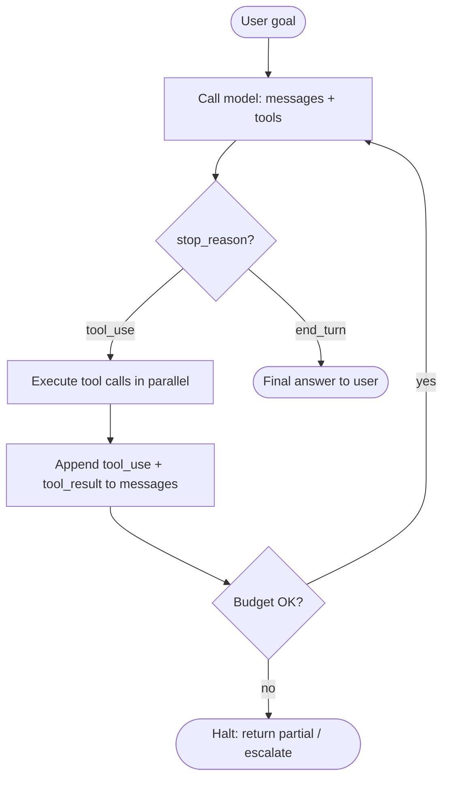

# Agents, Tool Use & Orchestration

[Chapter 2 §6](../llm-apis-and-prompts/tool-use) ended on a one-line definition: an agent is a `while` loop around the tool-use protocol. The model proposes calls, your code executes them, results go back into the messages array, and you iterate until the model says "I'm done" or you hit a budget.

In [Chapter 3](../embeddings-and-rag) the application was the driver. *Your code* decided when to retrieve, what to retrieve, and when to stop. The model only consumed what you handed it. That's **passive retrieval**.

This chapter flips the driver. The model decides which tool to call, with what arguments, and when the task is complete. You provide tools, budgets, and observability; the model provides control flow.

That's the entire shift. The rest is engineering.

## The canonical agent loop

Every box on this diagram is one of the next eight sub-pages. The loop itself is §1. The tools the loop dispatches are §2. The patterns by which the model chooses tools are §3. Parallelism and sub-agents are §4. The messages array as memory is §5. The budgets that gate the loop are §6. Whether to wrap any of this in a framework is §7. How to know whether the resulting agent is any good is §8.

## What is and isn't an "agent"

| Pattern | Driver | Tool calls | Is this an agent? |
|---|---|---|---|
| Plain chat completion | App | 0 | No |
| RAG (Chapter 3) | App | 0 (retrieval is in your code) | No |
| Single-shot tool use | Model picks 1 tool | 1 | Borderline; some call this "tool use" not "agent" |
| Loop until `end_turn` | Model | N | Yes — the minimum bar |
| Plan + execute + sub-agents | Model + sub-models | N + delegated | Yes |

The industry uses "agent" loosely. The technical bar is: **the model is in the loop, deciding the next action.** Below that bar, you have a pipeline. At or above it, you have an agent.

## By the end of this chapter

- Write a working ~100-line agent loop in pure Python with no framework.
- Design tool schemas, descriptions, and error returns the model can actually use.
- Pick the right control pattern (single-shot, ReAct, plan-and-execute) for a given task.
- Run tools in parallel and decompose tasks into sub-agents without context pollution.
- Manage agent memory across long-running tasks: working memory, scratchpads, summarization.
- Bound every loop with `max_iterations`, cost, and wall-time ceilings — and detect oscillation.
- Decide when a framework helps and when it just adds lock-in.
- Evaluate agents on task success, trajectory quality, and budget compliance — not just final-answer correctness.

## What's in this chapter

1. [The Agent Loop](./the-agent-loop) — the minimal ~100-line implementation; the engine of everything that follows.
2. [Tool Design](./tool-design) — naming, schemas, error returns, side-effects, least privilege.
3. [Planning & Control](./planning-and-control) — single-shot, ReAct, plan-and-execute, self-correction.
4. [Parallel Tools & Sub-agents](./parallel-and-subagents) — `asyncio.gather`, `Task`-style delegation, when to spawn.
5. [Memory & State](./memory-and-state) — messages array as working memory, scratchpads, summarization, context budgets.
6. [Safety & Budgets](./safety-budgets) — iteration / cost / time ceilings, prompt-injected outputs, human-in-the-loop.
7. [The Framework Landscape](./frameworks) — three named frameworks, no comparison tables.
8. [Evaluating Agents](./evaluating-agents) — task success, trajectory quality, budget compliance, regression sets.

Next: [The Agent Loop →](./the-agent-loop)
