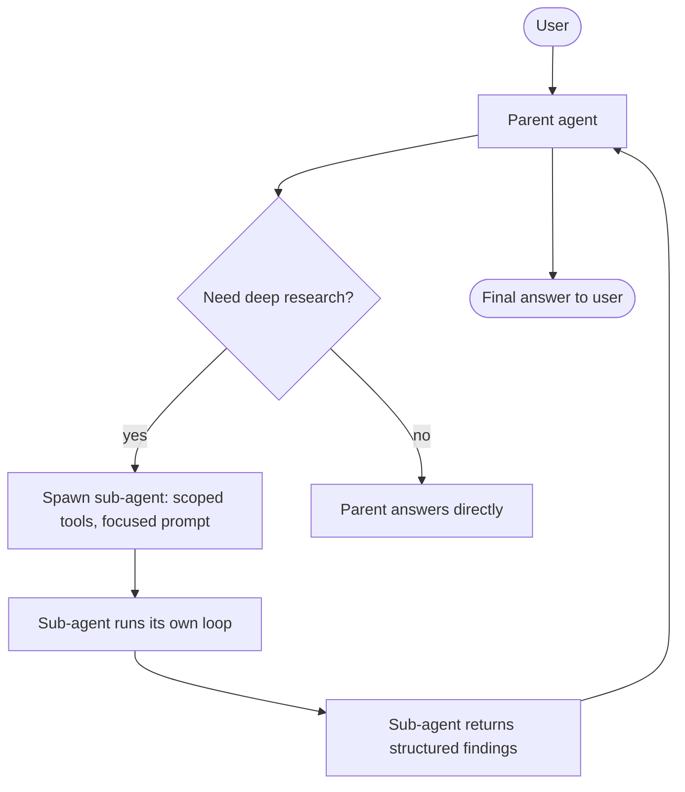

# 4. Parallel Tools & Sub-agents

Two ways to make an agent faster or more focused: run independent tools concurrently, or delegate a chunk of work to a child agent with its own context. They're often confused. They solve different problems.

## Parallel tool calls

Modern APIs (Anthropic, OpenAI, Gemini) all let the model emit *multiple* `tool_use` blocks in one assistant turn. We saw this in the [§1](./the-agent-loop) trace where the model fired off `get_time` and `search_kb` in the same turn for an obviously parallel query.

The minimal loop in §1 dispatched those serially. To actually exploit the parallelism, run the tool dispatch concurrently. Async with `anyio` / `asyncio`:

```python
import asyncio
import json

async def dispatch_one(block, dispatch):
    fn = dispatch.get(block.name)
    try:
        if fn is None:
            raise ValueError(f"unknown tool: {block.name}")
        # asyncio.to_thread runs sync tools off the event loop;
        # for native-async tools, just `await fn(**block.input)`.
        result = await asyncio.to_thread(fn, **block.input)
        return {"type": "tool_result", "tool_use_id": block.id,
                "content": json.dumps(result)}
    except Exception as e:
        return {"type": "tool_result", "tool_use_id": block.id,
                "content": f"{type(e).__name__}: {e}", "is_error": True}

async def dispatch_all(blocks, dispatch):
    tool_uses = [b for b in blocks if b.type == "tool_use"]
    return await asyncio.gather(*(dispatch_one(b, dispatch) for b in tool_uses))
```

Now if the model emits five tool calls in one turn, all five run together. The wall-clock cost is `max(t_i)`, not `sum(t_i)`.

**When parallelism wins:** independent reads (search 3 different KBs, hit 2 different APIs, fetch 4 unrelated documents). Idempotent reads with no shared state. The model usually figures out parallelism naturally for these — no prompting needed.

**When parallelism doesn't help (or hurts):**

- **Sequential dependencies.** "Find the user's manager, then look up the manager's calendar." The second call needs the first's result. Don't fight this.
- **Contended resources.** If 8 tool calls all hit the same rate-limited API, parallelism just front-loads the rate-limit error.
- **Order-sensitive mutations.** Two `update_user(...)` calls running concurrently on the same row can race. Mutating tools in parallel are usually a bug — see [§2 rule 4](./tool-design) on read-only vs. mutating.

A pragmatic ceiling: limit concurrency to ~4–8 even if the model emits more. `asyncio.Semaphore` works fine.

## Sub-agents: why and when

A sub-agent is a separately-instantiated agent — its own messages array, its own (usually narrower) tool set, its own `max_iterations` ceiling — that the parent dispatches via a single tool call. The sub-agent does its work, returns a structured result, and *its message history doesn't pollute the parent's context*.

That last point is the entire reason sub-agents exist. Watch what happens to the parent's context budget without sub-agents:

```
parent transcript = system + tools + user_goal
                  + research_step_1 (search_kb call + 8KB of chunks)
                  + research_step_2 (search_kb call + 6KB of chunks)
                  + research_step_3 (read_url call + 40KB of fetched HTML)
                  + research_step_4 (search_kb call + 7KB of chunks)
                  + ... 8 more steps ...
                  + final synthesis call    <- sees 200KB of intermediate junk
```

Every iteration replays all of it. By step 12, the parent is paying input cost for 200KB of intermediate scratch on every turn — most of which it doesn't actually need to look at again. The model also gets distracted ("lost in the middle" — [Chapter 0 §5](../how-llms-work/context-window)).

With a sub-agent:

```
parent transcript = system + tools + user_goal
                  + tool_use(delegate_research, {topic: "...", scope: "..."})
                  + tool_result("Findings: 1) ... 2) ... 3) ...")  <- 2KB summary
                  + final synthesis call    <- sees 2KB, not 200KB
```

The 200KB lived inside the sub-agent's transcript, which got garbage-collected when the sub-agent returned.



## The sub-agent contract

A sub-agent is just an internal function with the signature:

```python
def run_sub_agent(prompt: str, scoped_tools: list[dict]) -> dict:
    """Run a focused sub-task. Return a structured result."""
```

To the parent, it appears as a single tool. The parent calls it, sees one `tool_result` (the structured findings), and continues. The sub-agent's internal trajectory — possibly dozens of tool calls, hundreds of KB of intermediate text — is invisible to the parent.

**What the parent passes in:**
- A focused prompt (one paragraph at most): what the sub-agent should accomplish, what's in scope, what's out.
- A scoped tool set — typically a strict subset of what the parent has, sometimes one or two extra niche tools.
- A budget (`max_iterations`, optionally cost cap).

**What the sub-agent returns:**
- A structured result (Pydantic or schema-constrained tool call). NOT raw transcript dumps.
- An optional `confidence` or `unresolved_questions` list, so the parent can decide whether to re-delegate or escalate.

## A worked example: parent + research sub-agent

```python
# subagent.py
import json
from pydantic import BaseModel
import anthropic

client = anthropic.Anthropic()

class ResearchFindings(BaseModel):
    summary: str               # 2-4 sentence answer
    key_facts: list[str]       # 3-7 bullet facts with implicit citations
    unresolved: list[str] = [] # questions that couldn't be answered

# Sub-agent's tools — narrow, just what's needed for research.
SUBAGENT_TOOLS = [
    {"name": "search_kb", "description": "...", "input_schema": {...}},
    {
        "name": "submit_findings",
        "description": "Submit structured research findings. Call this when done.",
        "input_schema": ResearchFindings.model_json_schema(),
    },
]

def run_research_subagent(topic: str, scope: str, max_iter: int = 6) -> dict:
    """Focused research sub-agent. Returns a ResearchFindings dict."""
    sys_prompt = (
        "You are a focused research sub-agent. Your job: research a single "
        "topic deeply, then call `submit_findings` with structured results. "
        "Do not hedge; call submit_findings as soon as you have enough."
    )
    messages = [{
        "role": "user",
        "content": f"Topic: {topic}\nScope: {scope}\n\nResearch and submit findings."
    }]

    for _ in range(max_iter):
        resp = client.messages.create(
            model="claude-sonnet-4-6", max_tokens=2048,
            system=sys_prompt, tools=SUBAGENT_TOOLS, messages=messages,
        )
        messages.append({"role": "assistant", "content": resp.content})

        # Has the sub-agent submitted final findings?
        for b in resp.content:
            if b.type == "tool_use" and b.name == "submit_findings":
                return ResearchFindings.model_validate(b.input).model_dump()

        # Otherwise dispatch search_kb (or other narrow tools), feed results back.
        tool_results = []
        for b in resp.content:
            if b.type != "tool_use":
                continue
            # ... dispatch search_kb here, append results ...
        messages.append({"role": "user", "content": tool_results})

    return {"summary": "[sub-agent budget exhausted]", "key_facts": [], "unresolved": [topic]}


# Parent's tool — to the parent, the sub-agent IS just a tool.
PARENT_TOOLS = [
    {
        "name": "delegate_research",
        "description": (
            "Delegate a focused research task to a sub-agent. Use for any topic "
            "that needs more than 1-2 KB searches to nail down. The sub-agent "
            "will return structured findings without polluting your context."
        ),
        "input_schema": {
            "type": "object",
            "properties": {
                "topic": {"type": "string", "description": "What to research, 5-15 words."},
                "scope": {"type": "string", "description": "What's in/out of scope."},
            },
            "required": ["topic", "scope"],
        },
    },
    # ... other parent tools ...
]

# In the parent's dispatch:
def dispatch_parent_tool(name, args):
    if name == "delegate_research":
        return run_research_subagent(args["topic"], args["scope"])
    # ... other tools ...
```

The parent's loop is structurally unchanged from [§1](./the-agent-loop). It just has one tool whose implementation happens to spin up another agent. The composition is recursive in principle — a sub-agent can spawn a sub-sub-agent — but resist this in practice.

## Parallel tools vs. sub-agents

| | Parallel tool calls | Sub-agents |
|---|---|---|
| What it parallelizes | Independent tool executions in *one* model turn | A whole sub-task with its own loop |
| Context impact on parent | Full tool results land in parent's transcript | Only structured summary lands |
| When wrong | Sequential deps; mutating ops; rate-limited APIs | Tasks that need <3 tool calls (overhead > benefit) |
| Failure isolation | Per-tool error returns | Whole sub-agent has its own budget and bail-out |
| Latency win | Shrinks one round-trip | Shrinks one *task* (and avoids context bloat) |
| Correctness win | None | Sub-agent stays focused; parent stays clean |

## Don't build a fractal

Multi-agent diagrams look impressive. Most production "multi-agent systems" in 2026 are 1 main agent + 1–3 sub-agents, full stop. Some are even just 1 main + 1 sub. The marginal value of agent #5 in a swarm is approximately zero, and the debugging cost is steeply non-linear.

Two failure modes specific to over-agentification:

- **Sub-agents that thrash.** A research sub-agent that does the same KB searches the parent already did, because the parent didn't tell it what was already known.
- **Coordinator deadlock.** Two peer agents that each wait for the other's signal. (Don't build peer agents. Always have a clear parent-child hierarchy.)

If you're considering more than two layers or more than four agents in one system, the right move is almost always to flatten it: one parent, a handful of focused sub-agents, each with a tight tool set and a tight budget.

Next: [Memory & State →](./memory-and-state)
