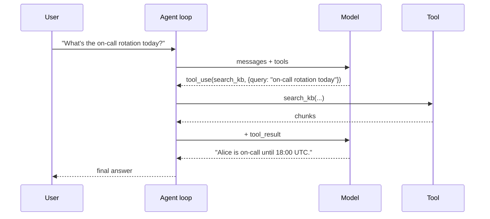
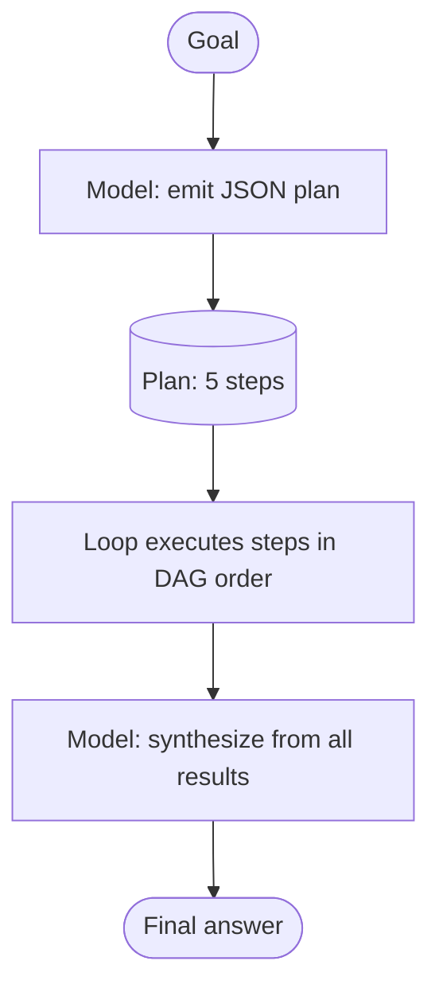

# 3. Planning & Control Patterns

The loop in [§1](./the-agent-loop) doesn't care *how* the model picks tools — it just dispatches whatever the model emits. But the way the model is asked to think between tool calls dramatically changes what it does. Three patterns cover almost every real agent.

The summary up front: **prefer the simplest pattern that works.** Anthropic's *Building effective agents* essay puts it bluntly — most production "agents" are single-shot tool use plus one or two retries. Orchestration complexity is rarely the bottleneck; tool design and prompt quality are.

## Pattern 1: Single-shot tool use

The simplest case: the model decides to call one tool, gets the result, produces the final answer. Two model calls, one tool execution.



**When to use:** every query that has a clean single-tool path. Most user-facing assistants spend 80%+ of their traffic here. Don't over-engineer.

**What it costs:** two LLM calls, one tool call, one round-trip of latency. The cheapest agent there is.

## Pattern 2: ReAct (Reason + Act)

The model interleaves natural-language reasoning ("first I need to find X, then Y") with tool calls. The "reasoning" tokens come out as plain text in each assistant turn, alongside the `tool_use` blocks.

ReAct is what modern chat models do *natively* when they have tool access. You don't need a separate prompt template ("Thought:", "Action:", "Observation:" — that's how the original 2022 paper framed it for older models). Claude, GPT-4.1, and Gemini all interleave reasoning and tool calls without prompting.

A sample transcript (abbreviated):

```
[user]      Compare on-call rotation between team-A and team-B for next week.

[assistant] I'll need rotation data for both teams. Let me search.
            tool_use(search_kb, {query: "team-A rotation next week"})

[tool]      Alice (Mon-Wed), Bob (Thu-Sun)

[assistant] Got team-A. Now team-B.
            tool_use(search_kb, {query: "team-B rotation next week"})

[tool]      Carol (Mon-Sun, full week)

[assistant] Both teams retrieved. Team-A is split Alice/Bob; team-B has Carol full
            week. team-B has less context-switching but no backup.
```

**When to use:** queries that need a few sequential lookups, where each step's choice depends on the previous result. Default for most "research" tasks.

**Why "interleave reasoning"?** Two reasons. First, generating reasoning tokens before the tool_use lets the model commit to a plan in writing, which empirically reduces wrong tool selection. Second, the reasoning text is invaluable in trajectory eval ([§8](./evaluating-agents)) — you can read what the model thought it was doing.

**What it costs:** N model calls, N-1 tool calls (where N = sequential dependency depth). Latency is the worst feature: every tool round-trip is serialized.

## Pattern 3: Plan-and-Execute

The model first generates an explicit plan (as a JSON object), then the loop executes the plan step by step. Useful for long-horizon tasks where backtracking would be expensive — or where you want to *show the user the plan before running it* (a common UX pattern for "deep research" and coding agents).

The trick is to use schema-constrained output ([Chapter 2 §5](../llm-apis-and-prompts/structured-output)) to force the plan into a structured shape:

```python
from pydantic import BaseModel
from typing import Literal

class Step(BaseModel):
    id: str
    tool: Literal["search_kb", "get_time", "compute"]
    args: dict
    depends_on: list[str] = []   # IDs of steps that must complete first

class Plan(BaseModel):
    goal: str
    steps: list[Step]

plan_tool = {
    "name": "submit_plan",
    "description": "Submit a plan as a list of steps with dependencies.",
    "input_schema": Plan.model_json_schema(),
}

# First call: force the model to emit a plan via tool_choice.
resp = client.messages.create(
    model="claude-sonnet-4-6",
    max_tokens=2048,
    tools=[plan_tool],
    tool_choice={"type": "tool", "name": "submit_plan"},
    messages=[{"role": "user", "content": user_goal}],
)
plan = Plan.model_validate(next(b for b in resp.content if b.type == "tool_use").input)
```

Then your loop walks the plan, dispatching steps in dependency order (parallel where `depends_on` allows — that's [§4](./parallel-and-subagents)). The model gets called again only at well-defined sync points ("here are all the results, now write the final answer").



**When to use:** tasks with many independent sub-tasks (parallelizable), tasks where the user wants to review/edit the plan before execution, or tasks where you need to estimate cost upfront. "Generate a deep-research report on X" — almost always plan-and-execute.

**Sharp edges:** the model might generate a bad plan, and a bad plan executes faithfully and wastes a lot of tokens. Always cap with `max_steps`. Always allow the synthesis step to flag "the plan didn't work, here's what's missing." Always evaluate the *plan quality* separately from the answer quality.

## Self-correction: the smallest useful pattern

The single most common control flow you'll need beyond the loop itself: **the model rephrases its query when a tool returns junk.**

A worked example tying back to RAG ([Chapter 3](../embeddings-and-rag)). The agent calls `search_kb`, gets zero useful chunks, and decides to retry with a different query:

```
[user]      How does our deployment pipeline handle failed health checks?

[assistant] tool_use(search_kb, {query: "deployment pipeline failed health checks"})

[tool]      [] (no chunks above similarity threshold)

[assistant] Empty results. Let me try a more specific query about the
            actual rollback mechanism.
            tool_use(search_kb, {query: "rollback on health check failure runbook"})

[tool]      <chunk id="rb-deploy-12">When health checks fail, the canary is held
            at 5% for 60s, then the deploy is reverted via `kubectl rollout undo`...

[assistant] Found it. When health checks fail, the canary holds at 5% for 60s before
            an automatic `kubectl rollout undo`...
```

Two things make this work. First, the tool returns an empty result *as data* (an empty list of chunks), not as an exception. Second, the system prompt or tool description explicitly tells the model: "If `search_kb` returns no chunks, retry once with a rephrased query before answering." This is a one-line addition to your system prompt that empirically catches a lot of "bad first attempt" failures.

The same pattern handles tool errors ([§2](./tool-design) rule 3): the error string goes back as `tool_result` content, the model reads it, and on the next iteration it adjusts. No special control flow — just a well-formed error message.

## Comparing the three patterns

| | Single-shot | ReAct | Plan-and-Execute |
|---|---|---|---|
| Model calls | 2 | N (sequential) | 2 + (synthesis) |
| Latency | Lowest | Worst (serial round-trips) | Best for parallel sub-tasks |
| Token cost | Low | Medium (each turn replays history) | Medium-high (plan + per-step + synth) |
| Complexity | None | Just the basic loop | Needs a plan executor |
| Error recovery | Re-prompt user | Self-correct in next turn | Re-plan or re-run failed step |
| Best for | Most user queries | Multi-step research with serial deps | Long-horizon, parallelizable, user-reviewable |

## The empirical default

If you're building your first agent and aren't sure which pattern to start with: **default to the basic loop and let the model do whatever it wants.** Modern frontier models naturally fall into single-shot when the task is simple and ReAct when it isn't. They don't need you to mode-select for them.

Reach for plan-and-execute only when you have a concrete reason: parallel sub-tasks worth orchestrating, a UI requirement to show the plan before running it, or a cost ceiling that needs upfront estimation.

Most production "agents" are single-shot tool use plus a tiny self-correction prompt. Don't build a planner because the architecture diagrams look impressive.

Next: [Parallel Tools & Sub-agents →](./parallel-and-subagents)
