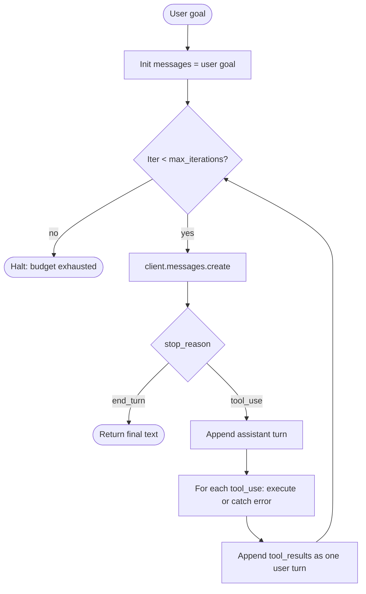

# 1. The Minimal Agent Loop

In [Chapter 2 §6](../llm-apis-and-prompts/tool-use) the model proposed exactly one tool call and we executed it. That's "tool use." The moment we put it in a loop and let the model decide when to stop, we have an agent.

## The mental model: LLM as reducer

If you've written a React app, you've used `useReducer`. The reducer is a pure function `(state, action) -> state`. The store holds state; the dispatcher feeds in actions; the reducer maps each one to a new state.

An agent is the same shape. Replace:

- **state** with the `messages` array (the entire transcript so far),
- **action** with the most recent `tool_result`,
- **reducer** with the LLM (it reads the transcript and produces the next assistant turn).

```
new_messages = LLM(messages + tool_result)
```

The fact that LLMs are stateless ([Chapter 0 §4](../how-llms-work/multi-turn)) is the whole reason this works: every iteration replays the full transcript. The transcript IS the state. The loop is the dispatcher.

That's all an agent is. The rest of this section makes it concrete.

## The loop as a flowchart



Three things to notice:

1. **The exit conditions are explicit.** `end_turn` is the model's "I'm done"; `max_iterations` is yours. There is no other way out.
2. **Tool exceptions don't crash the loop** — they get returned as `tool_result` content with `is_error: true`. The model sees the failure and can self-correct (we'll show this in §3).
3. **The assistant turn is appended whole**, with all `tool_use` blocks intact, *before* tool execution. If you only append text and drop the `tool_use` block, the next iteration's `tool_result` won't have anything to refer back to and the API will reject it.

## A complete agent in ~100 lines

Three small tools (we cap at three for the demo): `get_time`, `search_kb` (a stub for the [Chapter 3 §5](../embeddings-and-rag/retrieval-pipeline) RAG tool), and `add`.

```python
# agent.py
import json
from datetime import datetime
from zoneinfo import ZoneInfo
import anthropic

client = anthropic.Anthropic()
MODEL = "claude-sonnet-4-6"
MAX_ITERATIONS = 8

# --- 1. Tool definitions (what the MODEL sees) ---------------------------
TOOLS = [
    {
        "name": "get_time",
        "description": "Get the current local time in a given IANA timezone.",
        "input_schema": {
            "type": "object",
            "properties": {
                "timezone": {
                    "type": "string",
                    "description": "IANA name, e.g. 'Asia/Tokyo', 'America/New_York'.",
                },
            },
            "required": ["timezone"],
        },
    },
    {
        "name": "search_kb",
        "description": (
            "Search the internal knowledge base for chunks relevant to a query. "
            "Use this for factual questions about HNSW, embeddings, RAG, or this codebase."
        ),
        "input_schema": {
            "type": "object",
            "properties": {
                "query": {"type": "string", "description": "Natural-language search query."},
                "k": {"type": "integer", "default": 5, "description": "Top-k chunks to return."},
            },
            "required": ["query"],
        },
    },
    {
        "name": "add",
        "description": "Add two numbers. Use this only when arithmetic precision matters.",
        "input_schema": {
            "type": "object",
            "properties": {
                "a": {"type": "number"},
                "b": {"type": "number"},
            },
            "required": ["a", "b"],
        },
    },
]

# --- 2. Tool implementations (what YOUR CODE actually runs) --------------
def tool_get_time(timezone: str) -> dict:
    now = datetime.now(ZoneInfo(timezone))
    return {"timezone": timezone, "iso": now.isoformat(timespec="seconds")}

def tool_search_kb(query: str, k: int = 5) -> dict:
    # Stand-in for the Chapter 3 RAG pipeline. Replace with collection.query(...).
    fake = [{"id": f"kb-{i}", "text": f"chunk about '{query}' #{i}"} for i in range(k)]
    return {"query": query, "chunks": fake}

def tool_add(a: float, b: float) -> dict:
    return {"sum": a + b}

DISPATCH = {
    "get_time": tool_get_time,
    "search_kb": tool_search_kb,
    "add": tool_add,
}

# --- 3. The loop ---------------------------------------------------------
def run_agent(user_goal: str) -> str:
    messages = [{"role": "user", "content": user_goal}]

    for iteration in range(MAX_ITERATIONS):
        resp = client.messages.create(
            model=MODEL,
            max_tokens=2048,
            tools=TOOLS,
            messages=messages,
        )

        # Persist the full assistant turn — text blocks AND tool_use blocks.
        messages.append({"role": "assistant", "content": resp.content})

        if resp.stop_reason == "end_turn":
            # Final answer. Pull the last text block.
            return next(b.text for b in resp.content if b.type == "text")

        if resp.stop_reason != "tool_use":
            # max_tokens, refusal, etc. — bail out cleanly.
            return f"[stopped: {resp.stop_reason}]"

        # Dispatch every tool_use block in this turn.
        tool_results = []
        for block in resp.content:
            if block.type != "tool_use":
                continue
            fn = DISPATCH.get(block.name)
            try:
                if fn is None:
                    raise ValueError(f"unknown tool: {block.name}")
                result = fn(**block.input)
                tool_results.append({
                    "type": "tool_result",
                    "tool_use_id": block.id,
                    "content": json.dumps(result),
                })
            except Exception as e:
                # Critical: surface the error AS a tool_result so the model can self-correct.
                tool_results.append({
                    "type": "tool_result",
                    "tool_use_id": block.id,
                    "content": f"{type(e).__name__}: {e}",
                    "is_error": True,
                })

        # All tool_results from this turn go back as one user message.
        messages.append({"role": "user", "content": tool_results})

    return "[stopped: max_iterations]"


if __name__ == "__main__":
    print(run_agent("What time is it in Tokyo, and how does HNSW work?"))
```

That's the whole agent. ~100 lines. No framework. Production-ready scaffolding (cost/wall-time bounds come in [§6](./safety-budgets); we'll defer that to keep the loop readable).

## Tracing one execution

Let's walk through the example query: *"What time is it in Tokyo, and how does HNSW work?"*

**Iteration 1 — the model emits parallel tool calls.**

The model sees one user message and three tool descriptions. The query has two independent sub-questions, so it emits both tool calls in one assistant turn:

```python
resp.content = [
    TextBlock("I'll look up the time and search the knowledge base in parallel."),
    ToolUseBlock(id="toolu_01A", name="get_time",
                 input={"timezone": "Asia/Tokyo"}),
    ToolUseBlock(id="toolu_01B", name="search_kb",
                 input={"query": "HNSW algorithm", "k": 3}),
]
resp.stop_reason = "tool_use"
```

The loop appends this assistant turn whole, then dispatches both tools (sequentially in our minimal code; concurrently is [§4](./parallel-and-subagents)). Both succeed. We append a single user turn with both `tool_result` blocks.

**Iteration 2 — the model produces the final answer.**

The transcript now contains the user goal, the assistant's tool_use turn, and the tool results. The model has everything it needs:

```python
resp.content = [TextBlock("It's 14:32 in Tokyo (Asia/Tokyo). HNSW is...")]
resp.stop_reason = "end_turn"
```

The loop returns. Two model calls, two tool executions, one final answer. That's the canonical happy path.

## What can go wrong (and what the loop already handles)

- **The model calls an unknown tool.** Caught by `DISPATCH.get` → returned as an error `tool_result`. Next iteration the model sees `unknown tool: foo` and recovers (usually by picking the right tool).
- **A tool raises an exception** (bad timezone, network error). Same path: exception text goes back as an error `tool_result`. The model can retry with corrected arguments.
- **The model never stops.** `max_iterations` cuts it off. The caller gets `[stopped: max_iterations]` and can decide what to do (this is your signal that something is wrong with the prompt, the tools, or the task).
- **The model produces no text on `end_turn`.** Rare but possible. The `next()` call would raise `StopIteration` — in production, wrap it in a default. Left out for clarity.

What the loop does **not** handle yet:
- Cost ceilings, wall-time ceilings, oscillation detection — [§6](./safety-budgets).
- Streaming output — [Chapter 2 §7](../llm-apis-and-prompts/streaming).
- Prompt caching for the (stable) tools + system prompt — [Chapter 2 §8](../llm-apis-and-prompts/cost-and-latency). On long agent runs this matters more than for any other workload, because the prompt grows monotonically and the early portion is reprocessed every iteration ([Chapter 9](../kv-cache) goes deep on why).

Everything from here is engineering on top of these ~100 lines.

Next: [Tool Design →](./tool-design)
