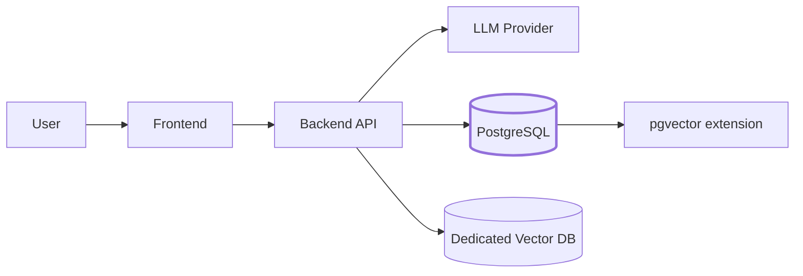

# Backend & Data for AI Apps

The previous four chapters gave you the ability to call LLMs, retrieve knowledge, and build agents. All of them quietly assumed something: that conversation history, user documents, embeddings, and tool outputs would just *be there* when you needed them. This chapter is about making that true.

If you've spent the last few years in React and Next.js, you've probably touched a database through Prisma or Drizzle and not thought much about what's underneath. AI applications push you back toward the database layer — not because the problems are exotic, but because the data shapes are: vector columns, JSONB tool-call logs, multi-turn conversation trees, per-tenant isolation for retrieval.

By the end of this chapter you'll be able to:

- Explain why PostgreSQL is the default database for AI applications in 2026.
- Write the SQL you'll actually need: CRUD, JOINs, indexes, EXPLAIN.
- Understand PostgreSQL schemas (namespaces, not table shapes) and run migrations with Alembic.
- Choose the right transaction isolation level for concurrent RAG ingestion and conversation writes.
- Use SQLAlchemy as your ORM, and know when to drop to raw SQL.
- Pick a multi-tenant isolation pattern and enforce it with Row-Level Security.
- Know when pgvector is enough and when to graduate to a dedicated vector database.

## Where the database sits

Everything flows through the backend. The database stores what the LLM can't: history, user data, embeddings, and the audit trail that tells you what happened when things go wrong.

## What's in this chapter

1. [Why PostgreSQL](./why-postgresql) — why one database covers most AI app needs.
2. [SQL Refresher](./sql-refresher) — the queries you'll actually write, with Prisma/Drizzle comparisons.
3. [Schemas & Migrations](./schemas-and-migrations) — namespaces, Alembic, and how they compare to Prisma Migrate.
4. [Transaction Isolation](./transaction-isolation) — what happens when two requests hit the same rows.
5. [ORM: SQLAlchemy](./orm-sqlalchemy) — the Python ORM you'll use daily, mapped to Prisma concepts.
6. [Multi-Tenant Isolation](./multi-tenant-isolation) — shared tables, schema-per-tenant, RLS.
7. [From pgvector to Dedicated Vector DB](./pgvector-graduation) — when to stay, when to leave, how to migrate.

Next: [Why PostgreSQL →](./why-postgresql)
