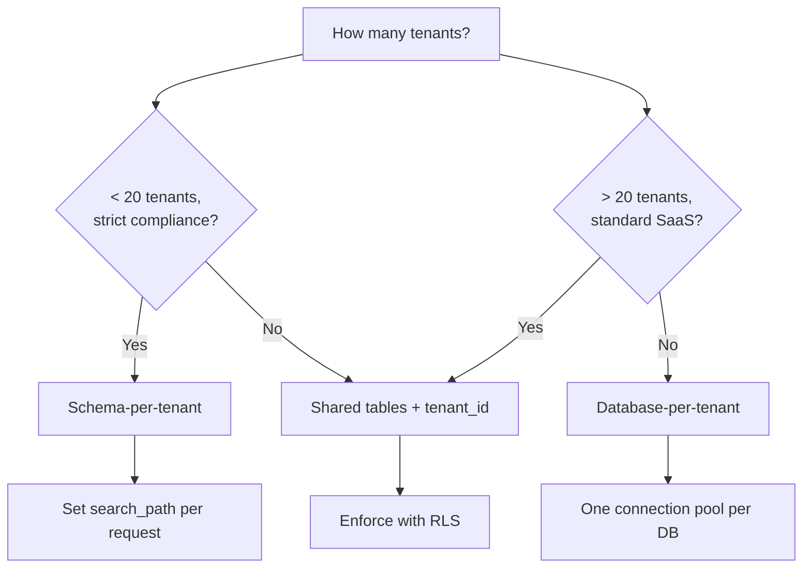

# 6. Multi-Tenant Isolation

Your AI app serves multiple users, teams, or organizations. User A must never see User B's conversations, documents, or embeddings. This is multi-tenant isolation, and getting it wrong is a data breach.

There are three patterns. You need to pick one.

## The decision tree



## Pattern 1: Shared tables + tenant_id (default for most apps)

Every table has a `tenant_id` column. Every query includes `WHERE tenant_id = :tid`.

```sql
CREATE TABLE conversations (
    id        UUID PRIMARY KEY DEFAULT gen_random_uuid(),
    tenant_id UUID NOT NULL,
    title     TEXT,
    created_at TIMESTAMPTZ DEFAULT now()
);

CREATE INDEX idx_conversations_tenant ON conversations (tenant_id);
```

**Pros**: simplest ops, one database, one migration path, easy to aggregate across tenants (analytics, billing).

**Cons**: a missing `WHERE tenant_id = ...` leaks data. Every query must include it. This is where RLS comes in.

### Row-Level Security (RLS)

RLS is Postgres's built-in mechanism for enforcing tenant boundaries *at the database level*. Even if your application code forgets the `WHERE` clause, the database won't return rows the current tenant shouldn't see.

**Step 1 — Enable RLS on the table:**

```sql
ALTER TABLE conversations ENABLE ROW LEVEL SECURITY;
```

**Step 2 — Create a policy:**

```sql
CREATE POLICY tenant_isolation ON conversations
    USING (tenant_id = current_setting('app.current_tenant')::uuid);
```

**Step 3 — Set the tenant context per request:**

```python
from sqlalchemy import text, event

@event.listens_for(engine, "connect")
def set_search_path(dbapi_conn, connection_record):
    pass  # no-op; we set tenant per request, not per connection

def with_tenant(session: Session, tenant_id: str):
    session.execute(text("SET app.current_tenant = :tid"), {"tid": tenant_id})
```

Now in your API handler:

```python
@app.post("/conversations")
async def create_conversation(request: Request):
    tenant_id = request.state.tenant_id  # extracted from auth middleware

    with Session(engine) as session:
        with_tenant(session, str(tenant_id))
        # RLS now enforces: only this tenant's rows are visible
        conv = Conversation(tenant_id=tenant_id, title="New chat")
        session.add(conv)
        session.commit()
```

**What RLS gives you**: defense in depth. Even if a developer writes `session.query(Conversation).all()` without a tenant filter, RLS ensures only the current tenant's rows come back. The policy is enforced by Postgres itself, not by your application code.

**What RLS does not give you**: protection against a missing `SET app.current_tenant`. If you forget to set the session variable, the policy comparison fails and returns no rows (safe, but broken). Use middleware to guarantee it's always set.

## Pattern 2: Schema-per-tenant

Each tenant gets their own PostgreSQL schema. All tenants share the same database and the same table definitions, but their data is physically separated into different namespaces.

```sql
CREATE SCHEMA tenant_acme;
CREATE TABLE tenant_acme.conversations ( ... );
CREATE TABLE tenant_acme.messages ( ... );

CREATE SCHEMA tenant_globex;
CREATE TABLE tenant_globex.conversations ( ... );
CREATE TABLE tenant_globex.messages ( ... );
```

In your application, set the `search_path` per request:

```python
def with_tenant_schema(session: Session, tenant_slug: str):
    schema = f"tenant_{tenant_slug}"
    session.execute(text(f"SET search_path TO {schema}, public"))
```

**Pros**: strong isolation without RLS; each tenant's data can be backed up, restored, or deleted independently; some compliance regimes accept this as "separate storage."

**Cons**: migrations must run per schema (N tenants = N migration runs); adding a tenant means creating a schema and all its tables; cross-tenant queries require explicit schema qualification; connection pool can't be shared as easily.

**When to use**: regulated industries (healthcare, finance) where auditors want to see physical separation, or when you have a small number of high-value tenants (< 20).

## Pattern 3: Database-per-tenant

The maximum isolation. Each tenant gets their own Postgres database (or even their own Postgres instance).

**When to use**: almost never in an AI app. This is for scenarios where tenants contractually require separate infrastructure (government, defense) or where tenant workloads are so different that resource isolation is mandatory.

**Why not**: operational complexity explodes. Each database needs its own connection pool, its own migration run, its own monitoring. Cross-tenant analytics becomes an ETL job. Most teams that think they need this actually need schema-per-tenant.

## Which pattern for AI apps

| Factor | Shared + RLS | Schema-per-tenant | DB-per-tenant |
|--------|:---:|:---:|:---:|
| Operational simplicity | Best | Medium | Worst |
| Number of tenants | Unlimited | < 50 realistic | < 10 realistic |
| Cross-tenant analytics | Easy | Possible | Hard |
| Compliance story | "Logical isolation" | "Separate schemas" | "Separate databases" |
| pgvector indexes | One index, all tenants | One index per schema | One index per DB |
| Migration complexity | Run once | Run N times | Run N times |

**The default**: shared tables + RLS. It's what Supabase uses, it's what most SaaS platforms use, and it scales to thousands of tenants without operational pain.

**Upgrade to schema-per-tenant** if you have < 20 tenants and compliance requires physical separation, or if per-tenant backup/restore is a hard requirement.

**Upgrade to database-per-tenant** only if contractually required.

## A note on pgvector and tenant isolation

With shared tables + RLS, all tenants' embeddings live in the same HNSW index. This is fine for search quality (HNSW doesn't care about tenant boundaries — the `WHERE tenant_id = :tid` filter is applied after the ANN search). But it means:

- The index size is proportional to *all* tenants' embeddings combined.
- You can't delete one tenant's embeddings without a `DELETE WHERE tenant_id = ...` followed by a `REINDEX`.

If per-tenant embedding volumes are very different (one tenant has 50M vectors, the rest have 10K), schema-per-tenant gives each tenant their own right-sized HNSW index.

Next: [From pgvector to Dedicated Vector DB →](./pgvector-graduation)
