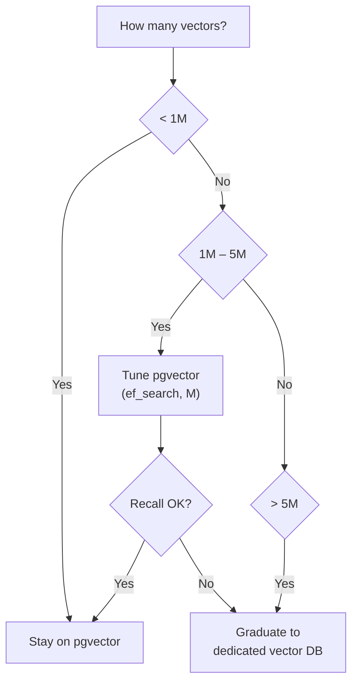

# 7. From pgvector to Dedicated Vector DB

In [Chapter 3 §3](../embeddings-and-rag/vector-search) you chose a vector database. This section is about a specific migration path: starting with pgvector (because you already have Postgres) and knowing when — and how — to graduate to a dedicated vector DB.

## pgvector: the starting position

If you followed [§1](./why-postgresql), you already have Postgres. Adding pgvector is one line:

```sql
CREATE EXTENSION IF NOT EXISTS vector;
```

A minimal setup for a RAG application:

```sql
CREATE TABLE chunks (
    id         UUID PRIMARY KEY DEFAULT gen_random_uuid(),
    tenant_id  UUID NOT NULL,
    doc_id     UUID NOT NULL,
    content    TEXT NOT NULL,
    embedding  vector(1536),
    metadata   JSONB DEFAULT '{}',
    created_at TIMESTAMPTZ DEFAULT now()
);

-- HNSW index for cosine similarity
CREATE INDEX ON chunks
    USING hnsw (embedding vector_cosine_ops)
    WITH (m = 16, ef_construction = 64);

-- Tenant filter index
CREATE INDEX ON chunks (tenant_id);
```

**Querying:**

```sql
SELECT id, content, 1 - (embedding <=> :query_vec) AS similarity
FROM chunks
WHERE tenant_id = :tid
ORDER BY embedding <=> :query_vec
LIMIT 10;
```

The `<=>` operator is cosine distance. `<->` is L2, `<#>` is negative inner product. Pick the one that matches how your embedding model was trained (usually cosine).

## When pgvector is enough

pgvector handles more than most people think:

| Metric | pgvector comfort zone |
|--------|-----------------------|
| Vector count | Up to ~5M with HNSW |
| Dimensions | Up to 2000 (covers all major embedding models) |
| QPS | 50–200 depending on hardware, index tuning, and filter complexity |
| Filtered search | Works, but the filter is applied *after* the ANN search, which can hurt recall |

For a startup with 100K–1M document chunks and moderate query traffic, pgvector is not a compromise — it's the right architecture. You avoid an entire service (vector DB), its deployment, its monitoring, and its failure modes.

**Tuning knobs:**

```sql
-- At query time: higher ef_search = better recall, more latency
SET hnsw.ef_search = 100;  -- default is 40

-- At build time: only affects future inserts
ALTER INDEX chunks_embedding_idx SET (ef_construction = 128);
```

Sweep `ef_search` from 40 to 256 against your eval set ([Chapter 3 §7](../embeddings-and-rag/evaluating-rag)) and pick the lowest value that meets your recall target.

## When to graduate

Signs that pgvector is becoming a bottleneck:

1. **Filtered recall drops.** pgvector applies `WHERE` filters *after* the HNSW traversal. If your filter is very selective (e.g., one tenant out of 10,000) and you're only asking for `LIMIT 10`, the ANN search might explore 100 candidates and discard 99 because they belong to other tenants. Dedicated vector DBs (Qdrant, Weaviate) support pre-filtering or integrated filtering that maintains recall.

2. **Vector count exceeds 5–10M.** HNSW index build time and memory usage grow. At this scale, a dedicated vector DB's optimizations (quantization, on-disk segments, sharding) start to matter.

3. **QPS requirements > 200.** Postgres is sharing its resources with your relational workload. A dedicated vector DB can be scaled independently.

4. **You need advanced features.** Multi-vector search, sparse-dense hybrid in the index layer, or built-in reranking. These exist in Qdrant and Weaviate but not in pgvector.

## The migration path

The good news: if your application layer talks to the vector DB through a clean interface, migration is a data pipeline job, not a rewrite.

**Step 1 — Abstract the vector operations:**

```python
from abc import ABC, abstractmethod

class VectorStore(ABC):
    @abstractmethod
    def upsert(self, id: str, embedding: list[float], metadata: dict) -> None: ...

    @abstractmethod
    def query(self, embedding: list[float], top_k: int, filter: dict) -> list[dict]: ...

class PgVectorStore(VectorStore):
    def __init__(self, session_factory):
        self.session_factory = session_factory

    def upsert(self, id, embedding, metadata):
        with self.session_factory() as session:
            session.execute(text("""
                INSERT INTO chunks (id, embedding, metadata)
                VALUES (:id, :emb, :meta)
                ON CONFLICT (id) DO UPDATE SET embedding = :emb, metadata = :meta
            """), {"id": id, "emb": str(embedding), "meta": json.dumps(metadata)})
            session.commit()

    def query(self, embedding, top_k, filter):
        with self.session_factory() as session:
            rows = session.execute(text("""
                SELECT id, content, metadata, 1 - (embedding <=> :q) AS score
                FROM chunks
                WHERE tenant_id = :tid
                ORDER BY embedding <=> :q
                LIMIT :k
            """), {"q": str(embedding), "tid": filter["tenant_id"], "k": top_k})
            return [dict(r._mapping) for r in rows]
```

**Step 2 — Implement the same interface for the new store:**

```python
from qdrant_client import QdrantClient, models

class QdrantVectorStore(VectorStore):
    def __init__(self, url: str, collection: str):
        self.client = QdrantClient(url=url)
        self.collection = collection

    def upsert(self, id, embedding, metadata):
        self.client.upsert(self.collection, [
            models.PointStruct(id=id, vector=embedding, payload=metadata)
        ])

    def query(self, embedding, top_k, filter):
        results = self.client.query_points(
            self.collection,
            query=embedding,
            query_filter=models.Filter(must=[
                models.FieldCondition(key="tenant_id", match=models.MatchValue(value=filter["tenant_id"]))
            ]),
            limit=top_k,
        )
        return [{"id": r.id, "score": r.score, **r.payload} for r in results.points]
```

**Step 3 — Swap at the config level:**

```python
if settings.vector_backend == "pgvector":
    store = PgVectorStore(session_factory)
else:
    store = QdrantVectorStore(settings.qdrant_url, "chunks")
```

**Step 4 — Backfill.** Run a one-time migration that reads all vectors from pgvector and upserts them into the new store. Verify with your eval set that recall is equal or better. Then cut over.

## The honest recommendation



Most AI applications never leave the "< 1M vectors" box. Build on pgvector, measure with your eval set, and graduate only when the numbers tell you to — not when a blog post tells you to.

---

This chapter gave you the data layer. You can now store conversations, embeddings, tenant-isolated data, and everything else your AI application needs. The next chapter covers what happens on the other side — how the frontend consumes your backend's streaming responses and renders them in a browser.

Next: [Building the Chat Frontend →](../chat-frontend)
