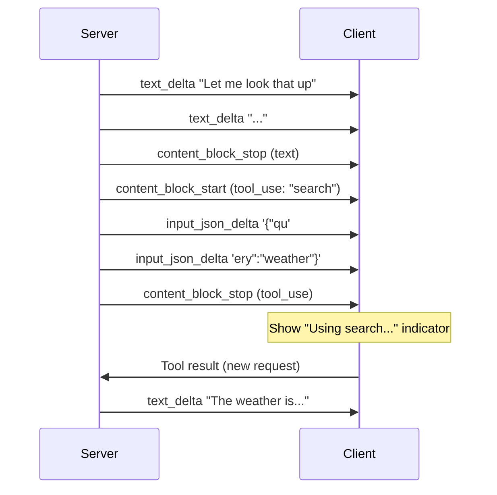

# 2. Consuming the Stream

The previous section gave you a raw SSE reader. Now you need to understand what's inside each `data:` line and turn it into something React can render. This means parsing provider-specific event shapes, accumulating text deltas, handling tool-use blocks mid-stream, and wiring it all into a hook.

## Provider Event Shapes

### Anthropic

Anthropic's streaming API emits typed events. The ones you care about:

```
data: {"type":"message_start","message":{"id":"msg_01X","role":"assistant","content":[],"model":"claude-sonnet-4-6","usage":{"input_tokens":25}}}
data: {"type":"content_block_start","index":0,"content_block":{"type":"text","text":""}}
data: {"type":"content_block_delta","index":0,"delta":{"type":"text_delta","text":"Hello"}}
data: {"type":"content_block_delta","index":0,"delta":{"type":"text_delta","text":" world"}}
data: {"type":"content_block_stop","index":0}
data: {"type":"message_delta","delta":{"stop_reason":"end_turn"},"usage":{"output_tokens":12}}
data: {"type":"message_stop"}
```

### OpenAI

OpenAI uses a different shape — a `choices` array with `delta` objects:

```
data: {"id":"chatcmpl-abc","object":"chat.completion.chunk","choices":[{"index":0,"delta":{"role":"assistant","content":""},"finish_reason":null}]}
data: {"id":"chatcmpl-abc","choices":[{"index":0,"delta":{"content":"Hello"},"finish_reason":null}]}
data: {"id":"chatcmpl-abc","choices":[{"index":0,"delta":{"content":" world"},"finish_reason":null}]}
data: {"id":"chatcmpl-abc","choices":[{"index":0,"delta":{},"finish_reason":"stop"}]}
data: [DONE]
```

Despite the different shapes, the pattern is identical: **find the text delta field, concatenate it onto a growing string.**

## A Typed Stream Reader

```typescript
type StreamEvent =
  | { type: "text"; content: string }
  | { type: "tool_use_start"; id: string; name: string }
  | { type: "tool_use_delta"; json: string }
  | { type: "tool_use_end" }
  | { type: "done"; stopReason: string }
  | { type: "error"; message: string };

function parseAnthropicEvent(raw: string): StreamEvent | null {
  try {
    const e = JSON.parse(raw);
    switch (e.type) {
      case "content_block_delta":
        if (e.delta.type === "text_delta") {
          return { type: "text", content: e.delta.text };
        }
        if (e.delta.type === "input_json_delta") {
          return { type: "tool_use_delta", json: e.delta.partial_json };
        }
        return null;
      case "content_block_start":
        if (e.content_block.type === "tool_use") {
          return { type: "tool_use_start", id: e.content_block.id, name: e.content_block.name };
        }
        return null;
      case "content_block_stop":
        return { type: "tool_use_end" };
      case "message_delta":
        return { type: "done", stopReason: e.delta.stop_reason };
      default:
        return null;
    }
  } catch {
    return { type: "error", message: `Failed to parse: ${raw.slice(0, 100)}` };
  }
}
```

You'd write an equivalent `parseOpenAIEvent` for OpenAI's shape. In practice, if your backend proxies the LLM and normalizes the stream into a single format, you only need one parser. That's the recommended approach.

## Handling Tool Use Mid-Stream

When the model decides to call a tool, the stream changes character. Instead of text deltas, you get a `tool_use` content block:



Your UI should:

1. Render text deltas normally as they arrive.
2. When a `tool_use_start` event arrives, show a status indicator ("Searching...", "Running code...").
3. Buffer the `input_json_delta` chunks — do **not** try to parse partial JSON.
4. When the tool block completes, dispatch the tool call to your backend and start a new streaming turn.

## Graceful Cancellation with AbortController

Users will click "Stop generating." You need to abort the fetch and clean up:

```typescript
const controller = new AbortController();

const response = await fetch("/api/chat", {
  method: "POST",
  body: JSON.stringify({ messages }),
  signal: controller.signal,
});

// Later, when the user clicks stop:
controller.abort();
```

The `reader.read()` call will reject with an `AbortError`. Catch it and treat the current accumulated text as the final message — don't discard what the user already saw.

## The Complete Hook: `useStreamingChat()`

```typescript
import { useState, useCallback, useRef } from "react";

interface Message {
  role: "user" | "assistant";
  content: string;
  isStreaming?: boolean;
  toolCall?: { name: string; status: "running" | "done" };
}

export function useStreamingChat() {
  const [messages, setMessages] = useState<Message[]>([]);
  const [isLoading, setIsLoading] = useState(false);
  const controllerRef = useRef<AbortController | null>(null);

  const send = useCallback(async (userMessage: string) => {
    const userMsg: Message = { role: "user", content: userMessage };
    setMessages((prev) => [...prev, userMsg]);
    setIsLoading(true);

    const controller = new AbortController();
    controllerRef.current = controller;

    // Add an empty assistant message that we'll stream into
    setMessages((prev) => [...prev, { role: "assistant", content: "", isStreaming: true }]);

    try {
      const response = await fetch("/api/chat", {
        method: "POST",
        headers: { "Content-Type": "application/json" },
        body: JSON.stringify({ messages: [...messages, userMsg].map(({ role, content }) => ({ role, content })) }),
        signal: controller.signal,
      });

      if (!response.ok) throw new Error(`HTTP ${response.status}`);
      const reader = response.body!.getReader();
      const decoder = new TextDecoder();
      let buffer = "";

      while (true) {
        const { done, value } = await reader.read();
        if (done) break;

        buffer += decoder.decode(value, { stream: true });
        const lines = buffer.split("\n");
        buffer = lines.pop()!;

        for (const line of lines) {
          if (!line.startsWith("data: ")) continue;
          const payload = line.slice(6);
          if (payload === "[DONE]") break;

          const event = parseAnthropicEvent(payload);
          if (event?.type === "text") {
            setMessages((prev) => {
              const updated = [...prev];
              const last = updated[updated.length - 1];
              updated[updated.length - 1] = { ...last, content: last.content + event.content };
              return updated;
            });
          }
        }
      }
    } catch (err: unknown) {
      if (err instanceof DOMException && err.name === "AbortError") {
        // User cancelled — keep what we have
      } else {
        setMessages((prev) => {
          const updated = [...prev];
          updated[updated.length - 1] = {
            ...updated[updated.length - 1],
            content: updated[updated.length - 1].content || "Sorry, something went wrong. Please try again.",
          };
          return updated;
        });
      }
    } finally {
      setMessages((prev) => {
        const updated = [...prev];
        updated[updated.length - 1] = { ...updated[updated.length - 1], isStreaming: false };
        return updated;
      });
      setIsLoading(false);
      controllerRef.current = null;
    }
  }, [messages]);

  const stop = useCallback(() => {
    controllerRef.current?.abort();
  }, []);

  return { messages, isLoading, send, stop };
}
```

## Error Handling

Three failure modes you'll hit in production:

1. **Network drop mid-stream.** The `reader.read()` rejects. Keep the accumulated text, mark the message as incomplete, and offer a "Retry" button that resends the last user message.

2. **Partial JSON in an event.** A `data:` line arrives split across two chunks. The buffer approach in [§1](./streaming-contract) handles this — you only process complete lines.

3. **Backend returns an error after streaming has started.** The model might emit 200 tokens then hit a context-length limit. Your stream reader should check for error events in the stream payload, not just HTTP status codes.

For retry strategy: keep it simple. Don't auto-retry streaming requests — the user is watching. Show a "Retry" button, and resend the conversation. If you're hitting rate limits, surface the error honestly rather than silently spinning.

---

You can now stream LLM responses into React state, handle tool calls mid-stream, and recover from errors. The next section covers how to turn that growing Markdown string into properly rendered HTML without the page jumping around.

Next: [Markdown Rendering →](./markdown-rendering)
