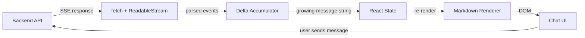

# Building the Chat Frontend

The last chapter gave you PostgreSQL, SQLAlchemy, and a data layer that can store conversations, embeddings, and tenant-isolated records. Your backend can talk to an LLM and persist the results. Now you need the other half: a browser-based UI that streams those responses to a human in real time.

If you've been writing React for a few years, most of this chapter will feel like home — state management, hooks, component composition. The unfamiliar part is the **streaming pipeline**: your backend sends tokens as Server-Sent Events, and your frontend has to parse them incrementally, accumulate partial content, handle tool-use interruptions, render Markdown as it arrives, and do all of this without janking the scroll or losing the user's place.

By the end of this chapter you'll be able to:

- Explain why LLM APIs use SSE instead of WebSockets, and when WebSocket is the right call.
- Consume an SSE stream using `fetch()` + `ReadableStream` (not `EventSource` — you'll see why).
- Parse Anthropic and OpenAI streaming event shapes and accumulate deltas into messages.
- Handle mid-stream tool calls, cancellation via `AbortController`, and network errors.
- Build a `useStreamingChat()` React hook that manages the full message lifecycle.
- Render streaming Markdown with syntax highlighting without layout thrashing.
- Structure a message list with proper scroll anchoring, optimistic updates, and loading states.
- Apply a theming system with dark mode that doesn't flash on load.

## How the pieces fit together

The backend emits a stream of SSE events. The frontend reads them through a `ReadableStream`, parses each `data:` line into a typed event, and accumulates the content deltas into a growing string held in React state. Each state update triggers a re-render that pipes the partial Markdown through a renderer. The user sees text appear token by token.

That loop — **stream, parse, accumulate, render** — is the spine of every chat frontend. The five sections below walk through each piece.

## What's in this chapter

1. [The Streaming Contract](./streaming-contract) — SSE vs WebSocket, the protocol, and how to read a stream in the browser.
2. [Consuming the Stream](./consuming-the-stream) — parsing provider event shapes, building a stream reader, handling tool calls and cancellation.
3. [Markdown Rendering](./markdown-rendering) — rendering partial Markdown with code highlighting, math, and tables without layout jank.
4. [Message List Patterns](./message-list-patterns) — scroll anchoring, optimistic updates, loading skeletons, and the message data model.
5. [Theming & Dark Mode](./theming-and-dark-mode) — CSS variables, system preference detection, and preventing the white flash.

Next: [The Streaming Contract →](./streaming-contract)
