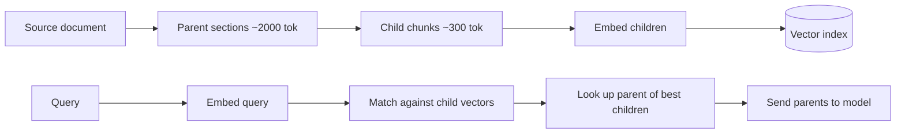

# 4. Chunking

You can't embed a 200-page PDF as a single vector — the embedding model has its own context limit (usually 512–8192 tokens), and even if it didn't, one vector for 200 pages is too coarse to retrieve anything specific. You **chunk** the document into smaller pieces and embed each one.

Chunking is **the highest-leverage knob in a RAG system**. Get it wrong and no embedding model or fancy reranker will save you.

## The fundamental tension

| Chunk size | Problem |
|---|---|
| Too small (100 tokens) | Loses context. The query "what bug did the team fix?" matches a chunk that says "we fixed the bug" but doesn't carry the surrounding details. Retrieval gets noisy. |
| Too large (4,000 tokens) | Loses precision. One chunk now talks about five topics; its embedding is a blurry average; relevant queries don't match it cleanly. |

The sweet spot for English prose is usually **300–800 tokens per chunk** with **10–20% overlap**. But the right answer depends on your content. Don't pick a number and ship — pick a number and *measure* with your eval set ([§7](./evaluating-rag)).

## Three chunking strategies

### 1. Fixed-size with overlap

The simplest approach. Slide a fixed-size window over the text with a small overlap so cross-boundary content is preserved.

```python
import tiktoken

enc = tiktoken.get_encoding("cl100k_base")

def fixed_chunks(text: str, size: int = 500, overlap: int = 50) -> list[str]:
    tokens = enc.encode(text)
    chunks = []
    step = size - overlap
    for start in range(0, len(tokens), step):
        chunk_tokens = tokens[start : start + size]
        if not chunk_tokens:
            break
        chunks.append(enc.decode(chunk_tokens))
    return chunks
```

Pros: trivial, deterministic, language-agnostic. Cons: cuts mid-sentence and mid-paragraph all the time. Often good enough — start here.

### 2. Recursive structural splitting

The improved default. Split on the strongest natural boundary first; if a piece is still too big, recurse on the next-strongest boundary.

```
priority order:  "\n\n"  →  "\n"  →  ". "  →  " "  →  ""
```

LangChain's `RecursiveCharacterTextSplitter` is the canonical implementation. The algorithm in pseudo-code:

```python
def recursive_split(text, max_size, separators=["\n\n", "\n", ". ", " ", ""]):
    if len(text) <= max_size:
        return [text]
    for sep in separators:
        if sep in text:
            parts = text.split(sep)
            chunks = []
            buf = ""
            for p in parts:
                candidate = buf + sep + p if buf else p
                if len(candidate) <= max_size:
                    buf = candidate
                else:
                    if buf:
                        chunks.append(buf)
                    if len(p) > max_size:
                        chunks.extend(recursive_split(p, max_size, separators))
                        buf = ""
                    else:
                        buf = p
            if buf:
                chunks.append(buf)
            return chunks
    return [text]
```

Pros: respects paragraphs and sentences when possible; falls back gracefully. Cons: still oblivious to document semantics.

You don't need to make `langchain` a hard dependency just for this. Either copy the recursive logic above, or import `RecursiveCharacterTextSplitter` from `langchain-text-splitters` (a tiny, dependency-light package).

### 3. Document-aware splitting

When you have **structure**, use it. Markdown headers, code symbols, JSON paths, HTML sections, transcript turns — all are stronger signals than character counts.

| Content | Signal |
|---|---|
| Markdown docs | Split on `#`, `##`, `###` headers; keep the header path as metadata |
| Code | Split on function/class boundaries (use `tree-sitter` or `ast`) |
| Transcripts | Split on speaker turn or topic shift |
| HTML | Split on `<section>`, `<article>`, `<h*>` |
| PDFs | Split on detected sections after running an OCR/layout extractor |

A header-aware Markdown splitter is short:

```python
import re

def split_markdown_by_headers(md: str) -> list[dict]:
    sections = []
    current = {"path": [], "body": []}
    for line in md.splitlines():
        m = re.match(r"^(#{1,6})\s+(.*)", line)
        if m:
            if current["body"]:
                sections.append({"heading": " > ".join(current["path"]),
                                  "text": "\n".join(current["body"])})
                current["body"] = []
            level = len(m.group(1))
            current["path"] = current["path"][:level - 1] + [m.group(2)]
        else:
            current["body"].append(line)
    if current["body"]:
        sections.append({"heading": " > ".join(current["path"]),
                          "text": "\n".join(current["body"])})
    return sections
```

The `heading` becomes searchable metadata and a great citation label.

## Sizing table

| Content type | Recommended chunk size | Overlap | Notes |
|---|---:|---:|---|
| FAQ entries | 100–300 tokens | 0 | One Q+A per chunk; structural is best |
| Long technical docs | 400–800 tokens | 50–100 | Recursive structural is the default |
| Code | one function/class per chunk | 0 | Use AST-based splitting; embed signature + body |
| Meeting transcripts | 300–500 tokens | 50 | Keep speaker labels; consider 2–3 turn windows |
| Legal/medical, dense citations | 200–400 tokens | 50 | Smaller chunks for precision |
| Books / prose narrative | 500–1000 tokens | 100 | Larger because context matters more |

These are starting points. **Always re-tune with an eval set.**

## The parent-child pattern

A common upgrade: **embed small chunks for retrieval precision, but feed the full parent section to the model for generation context.**



Why it works: the small child chunks have sharp embeddings (good for matching the query), but the big parent passages have the context the model needs to actually answer. You get retrieval precision *and* generation context.

Implementation: store `parent_id` as metadata on each child chunk; after retrieval, deduplicate by parent and fetch the parent text from a separate store (Postgres, KV, S3 — whatever).

## Tokens vs. characters

Recall from [Chapter 0 §1](../how-llms-work/tokens): Chinese, Japanese, and Korean text uses 2–3x more tokens per character than English. If you chunk by characters, a "1000-character" CJK chunk can be 2000+ tokens — past your embedding model's context limit.

**Always chunk by tokens, not characters.** Use the embedding model's tokenizer if available, otherwise `tiktoken.cl100k_base` is a reasonable proxy.

```python
def is_within(text: str, max_tokens: int) -> bool:
    return len(enc.encode(text)) <= max_tokens
```

Cheap, defensive, prevents an entire category of "why isn't this chunk being indexed" bugs.

Next: [The Retrieval Pipeline →](./retrieval-pipeline)
