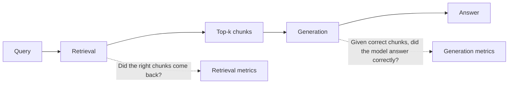

# 7. Evaluating RAG

The reason your RAG demo works in the notebook and breaks in production is that "looks right when I tried three queries" is not measurement. RAG has **two failure surfaces**, and you have to evaluate them separately.



If you only measure end-to-end answer quality, you can't tell whether a regression is in retrieval or generation, and you'll spend weeks tuning the wrong knob.

## Surface 1: Retrieval quality

The question: **for query Q, did the top-k chunks contain the gold chunk(s)?**

To measure, you need a labeled dataset of `(query, gold_chunk_ids)` pairs. Build it by hand, with users, or by having an LLM generate plausible questions for each chunk in a sample of your corpus and reviewing them.

### Recall@k

> Of the queries, how often did the top-k results include at least one gold chunk?

```python
def recall_at_k(eval_set: list[dict], retriever, k: int = 5) -> float:
    hits = 0
    for ex in eval_set:
        retrieved = retriever(ex["query"], k=k)
        retrieved_ids = {c["id"] for c in retrieved}
        if retrieved_ids & set(ex["gold_chunk_ids"]):
            hits += 1
    return hits / len(eval_set)
```

Recall@5 is the most commonly reported number. If recall@5 is below ~0.85, the rest of your pipeline can't save you — the LLM can't cite chunks it never saw.

### MRR (Mean Reciprocal Rank)

> Of the queries, on average, how high in the ranking does the *first* gold chunk appear?

```python
def mrr(eval_set: list[dict], retriever, k: int = 10) -> float:
    total = 0.0
    for ex in eval_set:
        retrieved = retriever(ex["query"], k=k)
        gold = set(ex["gold_chunk_ids"])
        for rank, c in enumerate(retrieved, start=1):
            if c["id"] in gold:
                total += 1.0 / rank
                break
    return total / len(eval_set)
```

MRR rewards getting the right answer to the top. A pipeline with recall@10 = 1.0 but MRR = 0.2 is finding the right chunk at rank 5+, which is bad — the LLM tends to pay more attention to early chunks ([Chapter 0 §5](../how-llms-work/context-window) on "lost in the middle"). Reranking ([§6](./reranking-and-hybrid)) is exactly the fix when MRR lags recall.

**NDCG** is a fancier variant that handles graded relevance (chunks rated 0–3 instead of binary). Use it if you have graded labels. Otherwise recall@k + MRR are enough.

## Surface 2: Generation quality

Given correct chunks, did the model answer correctly and **faithfully**?

Two metrics matter most:

- **Faithfulness**: every claim in the answer is supported by the chunks. The opposite of "the model invented something."
- **Answer relevance**: the answer actually addresses the question. The opposite of "the model said something true but irrelevant."

A third, often worth tracking: **citation coverage** — does `answer.sources` actually point to the chunks the answer used? You can check this mechanically if you used structured output ([Chapter 2 §5](../llm-apis-and-prompts/structured-output)).

### LLM-as-judge for faithfulness

There's no shortcut. Faithfulness can't be reduced to string matching. The standard approach: use a different (or same) model as a judge with a structured rubric.

```python
from pydantic import BaseModel
from typing import Literal

class FaithfulnessVerdict(BaseModel):
    verdict: Literal["faithful", "unfaithful"]
    unsupported_claim: str | None
    explanation: str

JUDGE_PROMPT = """You are a strict fact-checker. You will be given:
- a set of source chunks (the only ground truth)
- an answer generated using those chunks

Your job: decide whether EVERY claim in the answer is directly supported by the chunks.
- If yes, return verdict="faithful".
- If even one claim is unsupported or contradicted, return verdict="unfaithful" \
and quote the unsupported_claim verbatim.
Do not use any external knowledge."""

def judge_faithfulness(chunks: list[dict], answer: str) -> FaithfulnessVerdict:
    chunks_str = "\n\n".join(f'<chunk id="{c["id"]}">{c["text"]}</chunk>' for c in chunks)
    user = f"<chunks>\n{chunks_str}\n</chunks>\n\n<answer>{answer}</answer>"

    # ... structured output call (see Chapter 2 §5) returning FaithfulnessVerdict ...
```

Use temperature 0 for the judge ([Chapter 0 §6](../how-llms-work/sampling)). Use a strong model. Spot-check the judge against human labels on a random subsample — your judge has its own error rate, and you should know what it is.

## Off-the-shelf eval libraries

Two worth knowing:

| Library | Notes |
|---|---|
| **ragas** | Python library with the canonical RAG metrics (faithfulness, answer relevance, context precision, context recall) prepackaged as LLM-judge prompts. The fastest way to get from zero to "I have numbers." |
| **trulens** | More general LLM observability with strong RAG support. Useful if you want eval and tracing in the same tool. |

Both are wrappers around LLM-as-judge with specific prompts. Knowing what they do under the hood means you can roll your own when you outgrow them.

## The golden test set

The single most useful artifact in any LLM project. Build it once, version it, run it on every prompt or model change.

What it contains:

```python
golden_set = [
    {
        "id": "qa-001",
        "query": "How does HNSW index search work?",
        "gold_chunk_ids": ["vector-search-3", "vector-search-7"],
        "gold_answer_facts": [
            "HNSW is a multi-layer graph",
            "search has logarithmic complexity",
            "ef_search controls recall vs latency",
        ],
        "must_not_say": ["HNSW uses LSH"],   # known wrong-answer trap
    },
    # ... 50–200 more entries, drawn from real user queries when possible ...
]
```

Aim for 50–200 entries to start. Cover:

- Common queries (the head of your traffic distribution)
- Edge cases (rare entities, exact-match codes, multi-hop questions)
- Adversarial queries (questions whose answer is *not* in the corpus — to test "I don't know" behavior, see [§8](./production-patterns))
- Regression tests (any bug you fixed becomes an entry)

Run the full pipeline on the golden set before any prompt or model change ships. The numbers you watch:

- **Recall@5** — retrieval health. Should be > 0.85.
- **MRR@10** — ranking quality. Should be > 0.6.
- **Faithfulness rate** — generation health. Should be > 0.95.
- **"I don't know" rate** on the adversarial slice — should be ~1.0.

When any of these regress, you have a clear diagnosis: retrieval problem (recall, MRR) or generation problem (faithfulness, refusal).

## Forward reference

Everything in this section is an instance of a more general discipline. **Chapter 13 (Evaluation and Observability)** treats LLM evaluation as a first-class topic — distributions over outputs, judge-model calibration, regression tracking, online vs. offline eval. RAG is the easiest place to start because the failure surfaces are well-defined and the metrics are concrete; once you have a golden set for retrieval, you're 80% of the way to having one for everything else.

Next: [Production Patterns →](./production-patterns)
