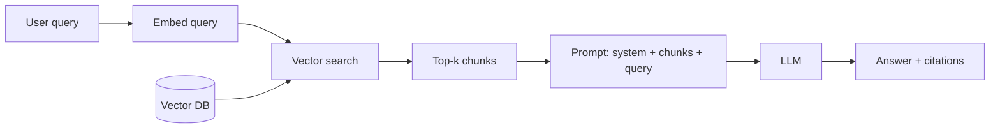

# Embeddings, Vector Search & RAG

This chapter is the architectural answer to two limits established earlier: the bounded **context window** ([Chapter 0 §5](../how-llms-work/context-window)) and **hallucination** ([Chapter 2 §9](../llm-apis-and-prompts/failure-modes)). The model can't read your private corpus, can't see anything that happened after its training cutoff, and produces plausible-sounding text whether or not it actually knows the answer.

RAG — **Retrieval-Augmented Generation** — fixes all three with the same trick: at query time, fetch the few chunks of text that are relevant to the user's question and paste them into the prompt. The model is no longer asked to *remember*, only to *read*.

By the end of this chapter you'll be able to:

- Explain why RAG exists, when it's the right tool, and when fine-tuning is.
- Generate embeddings with both a hosted API and an open model, and compute semantic similarity by hand.
- Pick a vector database for your scale and ops profile in 2026.
- Chunk a document corpus correctly — and know which knob moves the needle.
- Build an end-to-end retrieval pipeline (ingest → embed → upsert → query → answer) in ~100 lines of Python.
- Add hybrid search and reranking when pure vector search starts missing things.
- Build a labeled eval set and measure retrieval quality (recall@k, MRR) separately from generation quality (faithfulness).
- Recognize the half-dozen anti-patterns that show up in every junior RAG codebase.

## The canonical RAG flow

That's the whole architecture. Eight pages to make every box concrete.

## What's in this chapter

1. [Why RAG](./why-rag) — context window, freshness, hallucination grounding; why not just fine-tune?
2. [Embeddings 101](./embeddings) — `text -> vector`, cosine similarity, dimensions, normalization, modality.
3. [Vector Search & ANN](./vector-search) — brute-force vs. HNSW, recall/latency knobs, choosing a DB.
4. [Chunking](./chunking) — fixed vs. recursive vs. structural; the parent-child pattern.
5. [The Retrieval Pipeline](./retrieval-pipeline) — full end-to-end code, prompt template, citation pattern.
6. [Reranking & Hybrid Search](./reranking-and-hybrid) — BM25, RRF, cross-encoder rerankers.
7. [Evaluating RAG](./evaluating-rag) — retrieval metrics, generation metrics, the golden set.
8. [Production Patterns](./production-patterns) — citations, no-result handling, freshness, prompt caching, anti-patterns.

Next: [Why RAG →](./why-rag)
