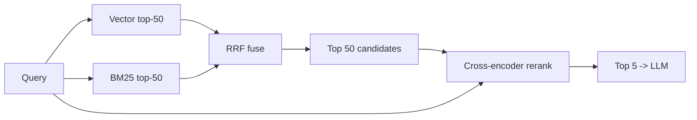

# 6. Reranking & Hybrid Search

Pure vector search misses things. Two reasons.

## Where embeddings fail

**Lexical / exact-match queries.** Embeddings capture *semantic* similarity — they're explicitly designed to ignore surface-level token differences. That's a problem when surface-level tokens are exactly what you're searching for:

```
query: "ERR_CONNECTION_REFUSED"
top vector match: "the connection was refused by the server" (semantic match — wrong document)
top BM25 match:   "fix for ERR_CONNECTION_REFUSED in chrome 118" (exact match — right document)
```

Other examples that vector search struggles with:

- Product SKUs (`SKU-A4F-22871`)
- Error codes (`E2BIG`, `OOM-killed`)
- Version numbers (`Postgres 16.2`)
- Code snippets where the exact identifier matters
- Rare proper nouns the embedding model has weak representations for

The fix is **hybrid search**: run vector and lexical search in parallel and combine the results.

## BM25 — the lexical baseline

**BM25** is the classic full-text retrieval scoring function, and it's been the industry standard for ~25 years. Every serious search engine (Elastic, Solr, Postgres FTS, Tantivy, Lucene) ships it. You don't have to understand the formula; you only need to know that **BM25 ranks by term overlap with diminishing returns and document-length normalization**. Exact matches dominate. Rare terms count more.

You get BM25 for free with most production stacks:

- Postgres has `tsvector` / `ts_rank_cd` (a BM25 variant).
- Elasticsearch / OpenSearch have BM25 by default.
- Many vector DBs (Weaviate, Qdrant, Vespa) have BM25 baked in.
- For a quick standalone Python implementation: `rank_bm25`.

## Reciprocal Rank Fusion (RRF)

Once you have two ranked lists (vector top-50, BM25 top-50), how do you merge them? **Reciprocal Rank Fusion** is the standard answer — simple, no parameter tuning, consistently good.

For each document, sum across all ranked lists:

```
RRF(d)  =  Σ over rankers r:  1 / (k + rank_r(d))
```

`k` is typically 60. Documents that appear high in *either* list win; documents in *both* lists win even more.

```python
def rrf(rankings: list[list[str]], k: int = 60) -> list[tuple[str, float]]:
    """Each ranking is a list of doc_ids in rank order."""
    scores: dict[str, float] = {}
    for ranking in rankings:
        for rank, doc_id in enumerate(ranking):
            scores[doc_id] = scores.get(doc_id, 0.0) + 1.0 / (k + rank + 1)
    return sorted(scores.items(), key=lambda x: -x[1])

vector_top  = ["d3", "d1", "d7", "d2"]
bm25_top    = ["d1", "d9", "d3", "d4"]

print(rrf([vector_top, bm25_top]))
# -> [('d1', 0.0327...), ('d3', 0.0319...), ('d7', 0.0163...), ...]
```

Twenty lines for an algorithm that meaningfully outperforms either retriever alone. RRF is one of the highest signal-to-LOC tools in retrieval.

## Cross-encoder rerankers

Vector search uses a **bi-encoder**: query and chunk are embedded separately, then compared. It's fast (precompute chunk vectors once) but the model never gets to see query and chunk *together* before scoring.

A **cross-encoder** is a different model that takes `(query, chunk)` as a single input and outputs a relevance score. It's much better at judging relevance because it can attend across both — but it's also much slower (no precomputation possible: every (query, chunk) pair needs a fresh forward pass).

The standard pattern:



Cheap, recall-oriented retrieval pulls candidates wide. The expensive but precise reranker scores only the top 50. The model sees only the top 5.

### A reranker call

```python
# Cohere's hosted reranker — one HTTPS call.
import cohere
co = cohere.Client()

candidates = [c["text"] for c in chunks]  # 50 candidates from RRF fusion

resp = co.rerank(
    model="rerank-english-v3.0",
    query="how does HNSW index search work?",
    documents=candidates,
    top_n=5,
)
top5 = [chunks[r.index] for r in resp.results]
```

For self-hosted, `BAAI/bge-reranker-v2-m3` is the open default:

```python
from sentence_transformers import CrossEncoder

reranker = CrossEncoder("BAAI/bge-reranker-v2-m3")
pairs = [[query, c["text"]] for c in chunks]
scores = reranker.predict(pairs)

ranked = [c for _, c in sorted(zip(scores, chunks), key=lambda x: -x[0])]
top5 = ranked[:5]
```

Rerank latency adds **50–200 ms** for 50 candidates on a CPU; a few ms on a GPU. Cohere's hosted reranker is ~100ms end-to-end. Whether that's worth it depends on your latency budget — measure on your eval set, not in the abstract.

## When to add what — in order

You'll rarely need all of these from day one. Add them when the eval set ([§7](./evaluating-rag)) shows you're missing things.

| Stage | Add when |
|---|---|
| 1. Vector search alone | Day one. Always start here. |
| 2. + Hybrid (BM25 + RRF) | You see exact-match queries failing, or your corpus has codes/SKUs/identifiers. |
| 3. + Cross-encoder rerank | Your top-5 is right "most of the time" but the *order* is bad, or top-3 is missing the gold chunk that's at rank 8. |
| 4. + Query rewriting | Users phrase questions in ways your corpus doesn't match (e.g., conversational pronouns, multi-hop questions). |

Don't skip step 2 to go straight to step 3. BM25 + RRF is cheap and frequently outperforms a fancy rerank-only pipeline because it fixes a different failure mode.

A thing that surprises beginners: **a careful hybrid pipeline with no rerank can outperform a vector-only pipeline with rerank.** The two stages address different bugs. Treat them as composable, not as alternatives.

Next: [Evaluating RAG →](./evaluating-rag)
