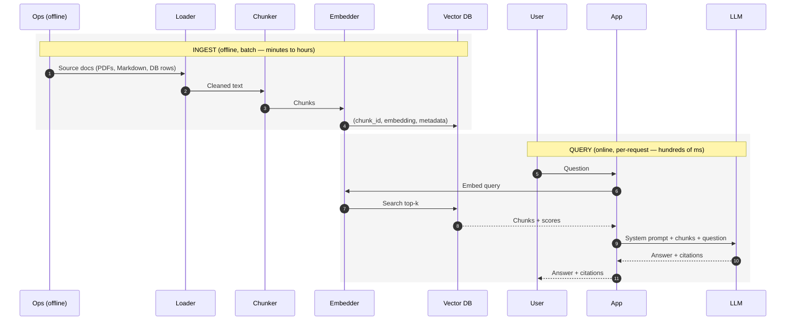

# 5. The Retrieval Pipeline

You've seen the parts. Now wire them up.

A RAG system has two distinct phases that run on completely different schedules:



Ingest is offline and re-runs only when documents change. Query is online and runs on every user request. Conflate them and you'll embed-at-query-time on every call (an [anti-pattern](./production-patterns)).

The example below uses `sentence-transformers` + `chromadb` + Anthropic's Claude. The same shape works with any combination — OpenAI embeddings + pgvector + GPT-4.1, Voyage + Pinecone + Claude, etc.

## Stage 1: Ingest

```python
# ingest.py
import uuid
from pathlib import Path
import chromadb
from chromadb.utils import embedding_functions
from langchain_text_splitters import RecursiveCharacterTextSplitter

EMBED_MODEL = "BAAI/bge-large-en-v1.5"
COLLECTION = "kb"

client = chromadb.PersistentClient(path="./chroma_db")
embed_fn = embedding_functions.SentenceTransformerEmbeddingFunction(
    model_name=EMBED_MODEL
)
collection = client.get_or_create_collection(
    name=COLLECTION,
    embedding_function=embed_fn,
    metadata={"hnsw:space": "cosine"},
)

splitter = RecursiveCharacterTextSplitter(
    chunk_size=600,        # in characters; tune in tokens for production
    chunk_overlap=80,
    separators=["\n\n", "\n", ". ", " ", ""],
)

def ingest_directory(path: str) -> None:
    docs, ids, metas = [], [], []
    for md_file in Path(path).rglob("*.md"):
        text = md_file.read_text(encoding="utf-8")
        chunks = splitter.split_text(text)
        for i, chunk in enumerate(chunks):
            docs.append(chunk)
            ids.append(f"{md_file.stem}-{i}-{uuid.uuid4().hex[:8]}")
            metas.append({
                "source": str(md_file),
                "chunk_index": i,
                "title": md_file.stem,
            })

    # Batch upserts — vector DBs are much faster in batches.
    BATCH = 256
    for i in range(0, len(docs), BATCH):
        collection.upsert(
            documents=docs[i : i + BATCH],
            ids=ids[i : i + BATCH],
            metadatas=metas[i : i + BATCH],
        )
    print(f"Indexed {len(docs)} chunks.")

if __name__ == "__main__":
    ingest_directory("./docs")
```

Two production notes baked in already:

- **Persistent client.** `chromadb.PersistentClient` writes to disk. Without it, the index is gone on process exit.
- **Batch upserts.** Embedding and indexing are throughput-bound. 256-element batches are a good default; tune to your hardware.

## Stage 2: Query and answer

```python
# query.py
import json
import anthropic
from ingest import collection  # reuse the same collection

llm = anthropic.Anthropic()
TOP_K = 5

SYSTEM_PROMPT = """You are a precise assistant that answers questions ONLY \
using the provided context. If the context does not contain the answer, \
respond exactly: "I don't know based on the provided context."

Always cite the chunk IDs you used in a `sources` array."""

def retrieve(query: str, k: int = TOP_K) -> list[dict]:
    res = collection.query(query_texts=[query], n_results=k)
    return [
        {
            "id": res["ids"][0][i],
            "text": res["documents"][0][i],
            "source": res["metadatas"][0][i].get("source"),
            "distance": res["distances"][0][i],
        }
        for i in range(len(res["ids"][0]))
    ]

def build_user_message(query: str, chunks: list[dict]) -> str:
    formatted = "\n\n".join(
        f'<chunk id="{c["id"]}" source="{c["source"]}">\n{c["text"]}\n</chunk>'
        for c in chunks
    )
    return f"<context>\n{formatted}\n</context>\n\nQuestion: {query}"

def answer(query: str) -> dict:
    chunks = retrieve(query)
    user_msg = build_user_message(query, chunks)

    resp = llm.messages.create(
        model="claude-sonnet-4-6",
        max_tokens=1024,
        system=SYSTEM_PROMPT,
        messages=[{"role": "user", "content": user_msg}],
    )
    return {
        "text": resp.content[0].text,
        "chunks": chunks,
        "usage": resp.usage.model_dump(),
    }

if __name__ == "__main__":
    out = answer("How does HNSW index search work?")
    print(out["text"])
    print("Used:", [c["id"] for c in out["chunks"]])
```

That's a working RAG system in ~80 lines. Run it on a folder of Markdown and ask questions.

## Why the chunks go in the user message

Recall the chat template from [Chapter 0 §3](../how-llms-work/completion-to-conversation): the `system` / `user` / `assistant` tags are just text the model has been trained to weight differently. Retrieved chunks live in the **user message** because:

1. They're variable per request — they shouldn't pollute the cacheable system prompt ([Chapter 2 §8](../llm-apis-and-prompts/cost-and-latency)).
2. The system prompt is the **stable contract** ("answer only from context, cite sources"). Putting context there blurs the contract with the data.
3. Wrapping context in XML-like tags (`<context>...<chunk>...</chunk>...</context>`) gives the model unambiguous boundaries it learned to respect during post-training.

The full request, conceptually, looks like ([Chapter 2 §1](../llm-apis-and-prompts/api-call-shape)):

```python
messages = [
    {"role": "user", "content": """\
<context>
  <chunk id="hnsw-3" source="vector-search.md">
  HNSW is a multi-layer graph index. The top layers are sparse...
  </chunk>
  <chunk id="hnsw-7" source="vector-search.md">
  The recall/latency knob is ef_search...
  </chunk>
</context>

Question: How does HNSW index search work?"""}
]
```

The system prompt — the "answer only from context" instruction — is sent via Anthropic's top-level `system=` parameter (or as a `role: "system"` message in OpenAI). It does not change between requests. It is the perfect candidate for prompt caching ([Chapter 2 §8](../llm-apis-and-prompts/cost-and-latency)).

## Forcing structured citations

The `text` answer is fine for a demo, but in production you almost always want citations as data, not prose. Use schema-constrained output ([Chapter 2 §5](../llm-apis-and-prompts/structured-output)):

```python
from pydantic import BaseModel
from typing import List

class GroundedAnswer(BaseModel):
    answer: str
    sources: List[str]                 # chunk IDs used
    confidence: float                  # 0..1

# Anthropic: force a tool call whose schema is GroundedAnswer.
answer_tool = {
    "name": "submit_answer",
    "description": "Submit the grounded answer.",
    "input_schema": GroundedAnswer.model_json_schema(),
}

resp = llm.messages.create(
    model="claude-sonnet-4-6",
    max_tokens=1024,
    system=SYSTEM_PROMPT,
    tools=[answer_tool],
    tool_choice={"type": "tool", "name": "submit_answer"},
    messages=[{"role": "user", "content": user_msg}],
)
tu = next(b for b in resp.content if b.type == "tool_use")
ans = GroundedAnswer.model_validate(tu.input)
print(ans.answer, ans.sources)
```

Now your downstream code gets a typed object. The UI can render the answer text and a "Sources" list of clickable chunk IDs. Eval ([§7](./evaluating-rag)) can check whether `ans.sources` matches the chunks the user actually needed.

## Cost note: prompt caching

The system prompt + tool schemas + any boilerplate are **stable across calls**. The chunks and user query are **dynamic**. If you mark the stable portion as cacheable ([Chapter 2 §8](../llm-apis-and-prompts/cost-and-latency)), you only pay full input price for the dynamic tail on each request. For RAG, this is typically a 50–80% input-cost reduction.

```python
resp = llm.messages.create(
    model="claude-sonnet-4-6",
    max_tokens=1024,
    system=[
        {"type": "text", "text": SYSTEM_PROMPT,
         "cache_control": {"type": "ephemeral"}},
    ],
    messages=[{"role": "user", "content": user_msg}],
)
```

The KV cache that makes this work is covered in **Chapter 7**.

Next: [Reranking & Hybrid Search →](./reranking-and-hybrid)
