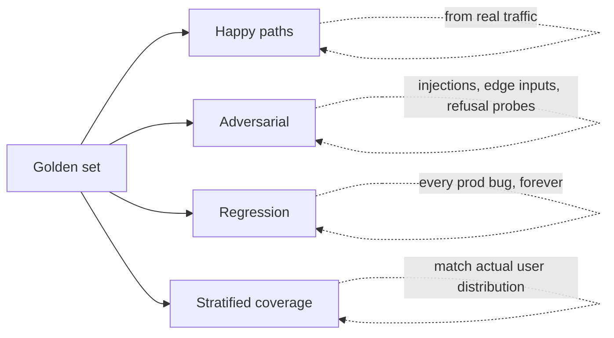

# 2. Golden Sets

The golden set is the single most useful artifact in any LLM project. It's a versioned, labeled collection of `(input, expected_output | rubric, metadata)` tuples that you re-run on every change. Everything else in this chapter — metrics, judges, online eval — is downstream of having one.

You've seen the pattern in [Ch 3 §7](../embeddings-and-rag/evaluating-rag) (the RAG golden set with `gold_chunk_ids` and `gold_answer_facts`) and [Ch 4 §8](../agents-and-orchestration/evaluating-agents) (the agent golden set with `expected_outcome`, `allowed_tools`, `max_cost_usd`). This page generalizes them.

## What goes in a golden case

A minimum-viable case has three fields and a few helpers:

```python
from pydantic import BaseModel, Field
from typing import Literal, Optional

class EvalCase(BaseModel):
    id: str                              # stable, never reused — referenced in bug reports
    category: str                        # e.g. "billing", "shipping", "adversarial"
    difficulty: Literal["easy", "medium", "hard"] = "medium"

    input: dict                          # whatever your system takes — prompt, query, tool args
    expected: Optional[dict] = None      # programmatic-check expectations (gold answer, schema, etc.)
    rubric: Optional[str] = None         # for judge-graded cases

    must_say: list[str] = Field(default_factory=list)     # facts the answer must contain
    must_not_say: list[str] = Field(default_factory=list) # known wrong-answer traps
    notes: str = ""                                       # human context: why was this case added
```

Notice what isn't in here: a single "expected output string". Generative outputs don't have one. You either have programmatic expectations (schema, must-say facts, allowed tool calls) or you have a rubric the judge applies. Often both.

Store cases as JSONL so they're append-only and git-diff-friendly:

```python
import json
from pathlib import Path

def write_golden_set(cases: list[EvalCase], path: Path) -> None:
    with path.open("w") as f:
        for c in cases:
            f.write(c.model_dump_json() + "\n")

def read_golden_set(path: Path) -> list[EvalCase]:
    return [EvalCase.model_validate_json(line) for line in path.read_text().splitlines() if line]
```

## How big

Don't agonize. Start small, grow with use.

| System type | Initial size | Grow to |
|---|---|---|
| Classifier / extractor | 100–300 | 1,000+ |
| Chat / writing | 50 | 200–500 |
| RAG | 100 | 300–1,000 |
| Agent | 30 | 100 |
| Fine-tune held-out set | 200 | 1,000+ |

The first 30 cases catch 70% of regressions. The next 100 catch most of the remaining 25%. Beyond that you're paying for diminishing returns — unless you have a regulated product where coverage matters more than dev velocity.

A useful rule: if your last three real production bugs would have been caught by your golden set, it's big enough. If they wouldn't, add them.

## What goes in (the four buckets)

Every golden set should contain four kinds of case, in roughly even proportions for a chat-style product:

**1. Happy paths.** The things users actually ask for. Sample from production traffic if you have it; otherwise list the top 20 use cases your PM thinks the product is for.

**2. Adversarial cases.** Known prompt-injection attempts ("ignore prior instructions"), edge inputs (empty string, 50KB of emoji, mixed languages), and content the system should refuse. Treat refusal as success on this slice.

**3. Failure modes / regression tests.** Every production bug becomes a permanent case. The day you fix a bug, add the input that triggered it. Tag it `regression`. It never leaves the set.

**4. Stratified coverage.** Match the actual distribution of users. If 30% of your traffic is in Spanish, your golden set is at least 20% Spanish. If 5% of users send PDFs, 5% of cases are PDFs. The set has to look like the population, not like your dev team's habits.



## Where the labels come from

Three sources, in increasing order of cost and quality.

**Synthetic from a stronger model.** Have a frontier model generate plausible queries and "gold" answers from your corpus or product spec. Fast, cheap, scales. Bias warning: the cases will be in the strong model's writing style and will reflect its idea of what users ask. Real users are weirder, terser, and angrier.

**Real production traffic.** The best signal. Sample queries (with PII removed), label the expected behavior, add to the set. Takes effort but the cases are real. This is also what closes the observability loop ([§6](./observability)) — production logs become next quarter's golden set.

**Human-labeled.** Gold standard for the rubric-graded subset and for calibrating the judge ([§4](./llm-as-judge)). Don't try to label all 500 cases by hand. Label 30–50 high-value cases very carefully and use them as the calibration set against your judge model.

A good golden set blends all three. Synthetic for breadth, production for realism, human-labeled for rubric calibration.

## How to maintain it

The golden set is a living artifact, not a one-shot artifact.

**Version under git.** Same repo as the code that uses it. Every commit of the set is reproducible. PRs that touch the set are reviewed like code.

**Tag every case with a creation reason.** "Added because of bug #4231." "Added during retriever rewrite." "Added from quarterly traffic resample." This is what lets you audit drift later.

**Resample from production every quarter.** User behavior drifts. The questions people asked six months ago are not the questions they ask today. Every quarter, sample 20 fresh production cases, label them, and add to the set. Retire cases that no longer reflect anything (rare; mostly you keep adding).

**Audit the distribution.** Once a quarter, count cases by category. If 80% of your set is "happy path English" and your production traffic is 40% Spanish, you have a calibration problem. Rebalance.

**Keep the regression slice forever.** Don't delete old failure cases just because the model got better. The whole point of a regression test is that it tells you when the new system reintroduces the old bug.

## The PII and "trained on test" rule

Two non-negotiable safety rules:

**1. PII gets stripped before any case enters the set.** Names, emails, phone numbers, account IDs, addresses. Use a deterministic redactor so the same input always redacts the same way (otherwise judge calls become nondeterministic for unrelated reasons).

**2. The eval set never enters training data.** Ever. If you fine-tune ([Ch 9](../fine-tuning)), your held-out eval set must be cryptographically separated from your training data — different files, hash-checked, written into the training pipeline as an explicit deny-list. Training on your test set inflates your scores, your model looks better than it is, and you ship a worse model into production thinking it's an improvement. Every team learns this the hard way once. Don't be that team.

A practical separation: keep the golden set in a `golden/` directory, generate training data into a `train/` directory, and run a CI check that asserts the intersection of input hashes is empty.

```python
import hashlib

def case_hash(case: EvalCase) -> str:
    return hashlib.sha256(json.dumps(case.input, sort_keys=True).encode()).hexdigest()

def assert_disjoint(golden: list[EvalCase], train: list[dict]) -> None:
    g = {case_hash(c) for c in golden}
    t = {hashlib.sha256(json.dumps(x["input"], sort_keys=True).encode()).hexdigest() for x in train}
    leaked = g & t
    if leaked:
        raise RuntimeError(f"Training set leaks {len(leaked)} eval cases: {list(leaked)[:5]}")
```

Wire it into CI on the fine-tuning pipeline.

## Versioning, the boring but critical part

Every reported number is `(metric, model_version, prompt_version, golden_set_version, timestamp)`. If any of those isn't pinned, the number is meaningless.

Version pins:

- The golden set: git SHA of the JSONL file.
- The prompt: hash of the rendered system prompt + tool schema.
- The model: provider model ID, including the date suffix (e.g. `claude-sonnet-4-5-20260315`).
- The judge: same as model — including its version.
- The rubric: hash of the rubric prompt.

Stuff this into a `RunMetadata` object and log it next to every metric:

```python
class RunMetadata(BaseModel):
    golden_set_sha: str
    prompt_hash: str
    model_id: str
    judge_id: str | None
    rubric_hash: str | None
    timestamp: str
```

When someone asks "did the new prompt help?" you don't argue from memory. You diff two `RunMetadata`s and the metrics next to them.

Next: [Metrics →](./metrics)
