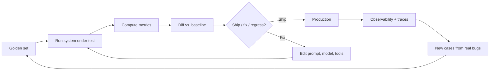

# Evaluation & Observability

This is where the promise from [Chapter 0 §6](../how-llms-work/sampling) gets cashed out: **stop expecting unit tests, start expecting distributions.** Ten chapters have forward-referenced this one. Now we make it operational.

If you've read the rest of the book, you already know the shape of the problem:

- LLMs are non-deterministic. Same prompt, different outputs ([Ch 0 §6](../how-llms-work/sampling)).
- Hallucination, injection, and refusal rates are distributions, not booleans ([Ch 2 §9](../llm-apis-and-prompts/failure-modes)).
- RAG fails on two surfaces, retrieval and generation, and you measure each ([Ch 3 §7](../embeddings-and-rag/evaluating-rag)).
- Agent outputs are trajectories. You measure success rate, trajectory quality, and budget compliance separately ([Ch 4 §8](../agents-and-orchestration/evaluating-agents)).
- Fine-tuning needs a held-out regression set or you have no idea if your tune helped or hurt ([Ch 9](../fine-tuning)).

Each of those was a special case. This chapter is the general theory: chat, RAG, agents, fine-tunes, classifiers — they're all the same problem. Non-deterministic outputs, evaluated as distributions over a labeled set, with regression discipline.

## The eval flywheel

Eval is a loop. Production observability feeds back into the golden set. The golden set drives offline regression testing. Every prompt, model, or tool change runs the loop before merge. The flywheel is what lets you change anything safely.

## By the end of this chapter you'll be able to

- Build a golden set for any LLM-powered feature in your product.
- Pick the right metric (programmatic, model-graded, human-graded) for the task.
- Write an LLM-as-judge prompt that calibrates against humans, not vibes.
- Wire offline eval into CI and online eval into shadow traffic and canaries.
- Log the right fields on every LLM call so you can answer "why did this regress?" without guessing.
- Pick a tools posture (managed platform vs. roll-your-own) without getting locked in.
- Ship LLM features without "I tried three prompts and it looked good" being the test plan.

## What's in this chapter

1. [The Eval Mindset](./the-eval-mindset) — distributions over equality; why traditional QA fails; the scientific-method analogy.
2. [Golden Sets](./golden-sets) — building, sizing, drift, versioning your labeled regression set.
3. [Metrics](./metrics) — programmatic, model-graded, rubric-graded; pick by task; cost vs. signal.
4. [LLM-as-Judge](./llm-as-judge) — the canonical pattern, biases, calibration against humans, prompt template.
5. [Online vs. Offline Eval](./online-vs-offline) — CI eval, shadow traffic, canaries, A/B tests.
6. [Observability](./observability) — tracing, logs, structured events, what to log on every call.
7. [Tools & Platforms](./tools) — opinionated, capped at 3 named tools, oriented to 2026.
8. [Closing](./closing) — the end of the book.

The reader the rest of this chapter assumes is the one who finished Chapter 10: someone who can call models, build RAG, ship agents, fine-tune, and self-host. The thing they can't yet do is **know whether any of it actually works**. That's what this chapter is for.

Next: [The Eval Mindset →](./the-eval-mindset)
