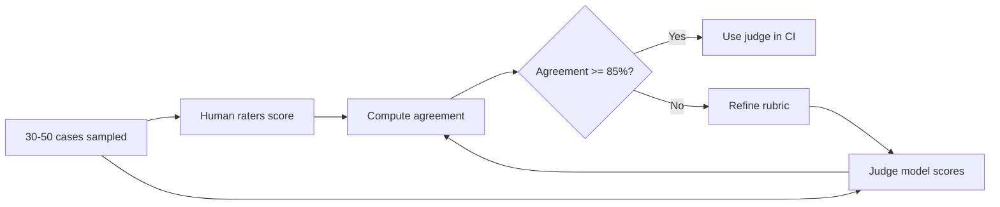

# 4. LLM-as-Judge

The pattern: use a separate LLM call to evaluate the output of the system-under-test. The judge takes the input, the criterion or rubric, and the candidate response, and emits a structured verdict. You aggregate verdicts across the golden set into a rate.

You've seen specific instances: faithfulness grading in [Ch 3 §7](../embeddings-and-rag/evaluating-rag), trajectory grading in [Ch 4 §8](../agents-and-orchestration/evaluating-agents). This page is the general pattern, with the failure modes called out.

## Why it works (and where it doesn't)

LLM-as-judge works because grading "does this answer satisfy this rubric" is a much easier task than producing the answer in the first place. A judge can recognize good summaries even if it's not a great summary writer. The asymmetry between recognition and generation is real and reliable enough to build on.

It doesn't work when:

- The rubric requires knowledge the judge doesn't have. A judge can't grade factual correctness on topics it's also wrong about.
- The output quality exceeds the judge's own ceiling. A small judge grading a frontier-model output will often miss subtleties.
- The rubric is vague. Judges hallucinate scores when given fuzzy criteria. Specific, testable rubrics; not "is this good".

## The canonical pattern

Always force the judge into structured output ([Ch 2 §5](../llm-apis-and-prompts/structured-output)) so the verdict is parseable, not free text.

```python
from pydantic import BaseModel, Field
from typing import Literal
from anthropic import Anthropic

client = Anthropic()

class JudgeVerdict(BaseModel):
    score: int = Field(ge=1, le=5, description="1=fails rubric, 5=fully satisfies")
    passes: bool = Field(description="True if score >= 4 and no rubric dimension is 1.")
    reasoning: str = Field(description="One paragraph. Cite specific text from the candidate.")

JUDGE_SYSTEM = """You are a strict evaluator. You will be given an input, a rubric, and a candidate response.
Score the candidate against the rubric on a 1-5 scale. Be specific in your reasoning and quote the candidate verbatim where relevant.
Do not reward verbosity. A short, complete answer is better than a long, padded one.
If you are unsure, score lower, not higher."""

def judge(input_text: str, rubric: str, candidate: str) -> JudgeVerdict:
    user = (
        f"<input>{input_text}</input>\n\n"
        f"<rubric>{rubric}</rubric>\n\n"
        f"<candidate>{candidate}</candidate>"
    )
    resp = client.messages.create(
        model="claude-haiku-4-5-20260201",
        max_tokens=512,
        temperature=0,
        system=JUDGE_SYSTEM,
        tools=[{
            "name": "submit_verdict",
            "description": "Submit a verdict against the rubric.",
            "input_schema": JudgeVerdict.model_json_schema(),
        }],
        tool_choice={"type": "tool", "name": "submit_verdict"},
        messages=[{"role": "user", "content": user}],
    )
    return JudgeVerdict.model_validate(resp.content[0].input)
```

Notes:

- **Temperature 0.** Judging should be as deterministic as possible.
- **Forced tool use.** No free-text verdicts. The judge must produce parseable JSON.
- **Different model family** than the system under test, when possible (mitigates self-preference; see below).
- **Cheap model is fine** for most rubrics. Reserve frontier models for nuanced rubrics where the judge's own ceiling matters.

## Two patterns

### Single-output judging

Judge the candidate against an absolute rubric. Score 1–5. Use when:

- You're tracking a metric over time and need a comparable absolute score.
- You don't have a baseline to compare against (e.g. first version of a feature).
- The rubric has clear, testable dimensions.

Drawback: absolute scores drift across runs and across model versions. Calibrate quarterly.

### Pairwise comparison

Judge candidate A vs. candidate B. The judge picks a winner, with reasoning.

```python
class PairwiseVerdict(BaseModel):
    winner: Literal["A", "B", "tie"]
    margin: Literal["clear", "slight", "tie"]
    reasoning: str
```

Pairwise is **more reliable than absolute scoring**. Humans are better at "which is better" than "how good is this on a 1-5 scale" — judges inherit the same property. Use pairwise for:

- A/B-style comparisons (new prompt vs. old prompt, new model vs. old model, fine-tune vs. base — [Ch 9](../fine-tuning)).
- Win-rate as a top-line metric ("the new prompt wins 64% of pairwise comparisons against the old one").

Drawback: position bias is severe (see below). Always run both orderings.

## Known biases

These are *real and measurable*. Plan around them.

| Bias | What it does | Counter |
|---|---|---|
| **Verbosity** | Judges prefer longer answers, even when shorter is enough. | Add "shorter is better when sufficient" to the rubric. Track output token count as a separate metric. |
| **Position** (pairwise only) | Judges prefer whichever was shown first (sometimes second — model-dependent). | Run both orderings A-vs-B and B-vs-A, average. If results disagree, count as tie. |
| **Self-preference** | A model prefers outputs in its own writing style. | Use a judge from a different family than the model being judged. Don't have GPT grade GPT exclusively. |
| **Sycophancy** | Judges agree with hints in the prompt ("the candidate seems weak..."). | No suggestive language. The judge sees only the rubric and the candidate. |
| **Format bias** | Markdown / bullets / structured output gets rated higher than equivalent prose. | Note explicitly in the rubric that format isn't graded. |
| **Length-of-rubric bias** | A long rubric inflates scores (the judge "finds something good" in each dimension). | Three to five rubric dimensions, max. Keep it tight. |

A pairwise harness that handles position bias:

```python
def pairwise_robust(input_text: str, a: str, b: str, rubric: str) -> Literal["A", "B", "tie"]:
    v1 = judge_pairwise(input_text, rubric, candidate_first=a, candidate_second=b)
    v2 = judge_pairwise(input_text, rubric, candidate_first=b, candidate_second=a)

    # v1.winner is in terms of (a, b); v2.winner is in terms of (b, a) — flip it back
    w1 = v1.winner            # "A"=a, "B"=b
    w2 = "B" if v2.winner == "A" else "A" if v2.winner == "B" else "tie"

    if w1 == w2:
        return w1
    return "tie"
```

If you're tempted to skip the second call to save money: don't. Position bias can be 10–20% in either direction and it will silently warp your numbers.

## Calibrating against humans

Judge calibration is the difference between an eval that works and a number that drifts. The minimum loop:



Concrete process:

1. Random-sample 30–50 cases from this quarter's runs.
2. Two humans each score independently against the same rubric the judge uses.
3. Discard cases where the humans disagree with each other (rubric is too ambiguous; fix the rubric, not the judge).
4. Compare judge score to human-consensus score. Compute agreement (exact, or within ±1 on 1-5 scale).
5. If agreement is below ~85%, **iterate the rubric** until it is. Don't iterate the judge model.

Why "iterate the rubric, not the judge"? Because rubric quality compounds. A sharp rubric works across model versions, judge model swaps, and team members. A rubric that only works because GPT-4o has a particular taste is brittle.

## When the judge fights you

Three diagnostic patterns when judge results don't match intuition:

- **Judge says everything is great, humans say things are mediocre.** The rubric is too forgiving. Add a "must satisfy ALL of the following" clause. Add a "score 1 if any of these failure modes appears" backstop.
- **Judge scores swing wildly across runs.** Temperature isn't 0, or your prompt is non-deterministic in some other way (e.g. you're including a timestamp). Pin everything.
- **Judge disagrees with itself on the same case.** Position bias, format bias, or you're hitting a model that's been quietly updated. Pin the model version (e.g. `claude-haiku-4-5-20260201`, not `claude-haiku-4-5`).

## Cost note

A back-of-envelope:

```
500 cases × $0.005 per judge call    = $2.50 per eval pass
3 eval passes per PR (programmatic + judge + slice breakdown) = $7.50 per PR
40 PRs/month                          = $300/month for one product
```

That's the price of one engineer-hour. Cheaper than not having eval. Track it explicitly so it doesn't surprise anyone, but don't optimize prematurely — the cost will not be your bottleneck.

If it does become a bottleneck (you're running eval on every commit on a 5K-case set against a $0.05-per-call frontier judge):

- Drop to a cheaper judge for inner-loop CI; reserve the frontier judge for nightly runs and pre-release.
- Cache judge verdicts keyed on `(input_hash, candidate_hash, rubric_hash, judge_model_id)`. Most cases haven't changed between runs.
- Subsample. 200 cases is enough for most regression signal; you don't need to run all 5,000 every PR.

Next: [Online vs. Offline Eval →](./online-vs-offline)
