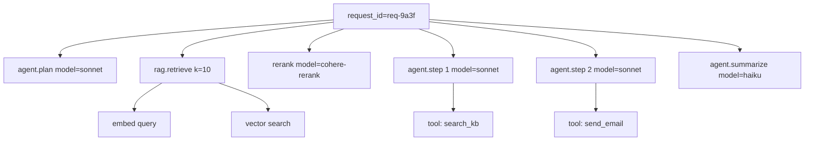

# 6. Observability

Eval tells you whether the system worked on cases you chose. Observability tells you what the system actually did in production — every call, every token, every tool use. The two are complements: offline eval is hypotheses; observability is the experimental record.

If you've shipped backend systems before, the mental model is familiar: structured logs, traces, metrics. The shape is the same. What changes is *what you log*.

## What to log on every LLM call

The minimum production set, per call:

| Field | Why |
|---|---|
| `request_id` | Stable handle for support tickets, debugging, replay. |
| `user_id`, `session_id` | Per-user / per-session aggregation. |
| `parent_span_id` | For nested calls (agents, RAG, multi-step pipelines). |
| `model`, `temperature`, `top_p`, sampling params | Reproducibility. |
| `system_prompt_hash` | Pin the prompt version. The full prompt itself is too big to log every call; the hash is enough. |
| `tool_schema_hash` | Same for tool definitions. |
| `input_messages` (or digest) | Either the full messages, or a hash if PII-sensitive. See PII section below. |
| `input_tokens`, `output_tokens` | For cost computation. |
| `output_text` (or digest) | What the model produced. |
| `stop_reason` | `end_turn`, `max_tokens`, `tool_use`, etc. — distinguishes "complete" from "truncated". |
| `latency_ttft_ms`, `latency_total_ms` | TTFT and total. Both matter ([Ch 2 §8](../llm-apis-and-prompts/cost-and-latency)). |
| `cost_usd` | Computed from tokens × per-million price. Log it directly so you can SUM in SQL. |
| `tool_calls` | Each tool name, args (or digest), result, duration. |
| `cache_hit` | Did prompt caching apply? Critical for cost analysis ([Ch 7](../kv-cache)). |
| `error_type` (if any) | Refusal, timeout, rate-limit, malformed JSON, schema-validation failure. |

Log this as structured JSON, one event per call. The exact transport doesn't matter — stdout JSON to stdout, ship to BigQuery / ClickHouse / OpenSearch / wherever your existing logs go.

```python
import json
import time
import hashlib
import structlog
from contextvars import ContextVar

log = structlog.get_logger()
request_id_var: ContextVar[str] = ContextVar("request_id")

def call_with_tracing(client, *, system: str, messages: list[dict], model: str) -> dict:
    span_id = hashlib.sha256(f"{time.time()}-{model}".encode()).hexdigest()[:16]
    started = time.perf_counter()
    ttft_ms = None

    resp = client.messages.create(
        model=model, system=system, messages=messages,
        max_tokens=1024, temperature=0,
    )
    total_ms = (time.perf_counter() - started) * 1000

    log.info(
        "llm_call",
        request_id=request_id_var.get("unknown"),
        span_id=span_id,
        model=model,
        system_prompt_hash=hashlib.sha256(system.encode()).hexdigest()[:12],
        input_tokens=resp.usage.input_tokens,
        output_tokens=resp.usage.output_tokens,
        stop_reason=resp.stop_reason,
        latency_total_ms=round(total_ms, 1),
        cache_hit=getattr(resp.usage, "cache_read_input_tokens", 0) > 0,
        cost_usd=cost_from_usage(model, resp.usage),
    )
    return resp
```

That's the minimum-viable trace event. Stuff like `parent_span_id`, tool calls, and TTFT come in once you graduate to a tracing library (see below).

## Why parent/child spans

A single user request rarely maps to one LLM call. An agent run is a tree: planner call, retrieval, reranker, model call, tool call, model call, tool call, summary. Without parent/child relationships in the logs, you can't tell why your p99 latency is 12 seconds — was it the retrieval, the rerank, or one slow tool call?



Tracing libraries (OpenTelemetry, plus LLM-specific layers like Langfuse or Phoenix) give you this tree. The mechanic is `parent_span_id` linking each call to its parent. Nested LLM calls inherit; tool calls register as child spans. You browse production traffic in a flame-graph UI and see the structure.

The `set_attribute` pattern from OpenTelemetry, in case you want to roll it without a vendor:

```python
from opentelemetry import trace

tracer = trace.get_tracer("llm")

def call_traced(client, system: str, messages: list[dict], model: str):
    with tracer.start_as_current_span("llm.call") as span:
        span.set_attribute("llm.model", model)
        span.set_attribute("llm.system_prompt_hash", hash_str(system))
        span.set_attribute("llm.input_messages_count", len(messages))
        resp = client.messages.create(model=model, system=system, messages=messages, max_tokens=1024)
        span.set_attribute("llm.input_tokens", resp.usage.input_tokens)
        span.set_attribute("llm.output_tokens", resp.usage.output_tokens)
        span.set_attribute("llm.stop_reason", resp.stop_reason)
        span.set_attribute("llm.cost_usd", cost_from_usage(model, resp.usage))
        return resp
```

OpenTelemetry semantic conventions for "GenAI" exist as of 2025; use them when they fit. Vendor-specific dashboards usually map to the same fields.

## What you can compute from these logs

A short list of dashboards every team should have:

- **Cost per user, per feature, per model.** "What's the unit economics of feature X?"
- **p50 / p95 / p99 latency.** Per model, per feature. Watch p95, not p50 — averages hide.
- **Refusal rate.** Per slice (adversarial vs. benign). Spikes mean either a model update changed safety thresholds or a new attack pattern is in production.
- **Hallucination rate.** Sample production outputs through an offline judge ([§4](./llm-as-judge)) on a schedule. Plot the rate.
- **Cache hit rate.** Per system prompt version. A drop here usually means someone broke prefix caching by inserting a timestamp into the system prompt ([Ch 7](../kv-cache)).
- **Schema validation failure rate.** For structured-output endpoints. A non-zero number is a bug.
- **Token spend per request.** Use it to track context-window creep. Conversations that grow over a session can blow your cost budget without anyone noticing.
- **Drift indicators.** Distribution of input lengths, languages, intents over time. Compare this week to last quarter. Drift here is the trigger to refresh the golden set ([§2](./golden-sets)).

These are SQL on your structured logs. You don't need a vendor to see them — you need the fields to be there.

## PII and privacy

LLM logs contain user input and model output. Often that includes PII: names, emails, account numbers, free-form descriptions of medical or legal situations.

Practical rules:

1. **Hash before storing for any user input that might contain PII.** Use a deterministic hash so the same input maps to the same hash; that's enough to detect duplicates and dedupe across sessions without storing the raw text.
2. **Keep full transcripts in a separate, restricted store** with a short retention window (e.g. 7–30 days) and access audit. This is what you replay for support tickets and incident response.
3. **Redact at write time, not read time.** A redactor that runs before logs leave the application avoids the "we accidentally logged a credit card to BigQuery" incident.
4. **Don't ship raw production transcripts into the golden set without redaction**, even for internal eval — your golden set is a checked-in artifact and shouldn't contain PII.

A minimal redactor pattern:

```python
import re

EMAIL = re.compile(r"\b[\w.\-]+@[\w.\-]+\.\w+\b")
PHONE = re.compile(r"\b\d{3}[-.]?\d{3}[-.]?\d{4}\b")
CC    = re.compile(r"\b(?:\d[ -]?){13,16}\b")

def redact(text: str) -> str:
    text = EMAIL.sub("[EMAIL]", text)
    text = PHONE.sub("[PHONE]", text)
    text = CC.sub("[CC]", text)
    return text
```

This is cheap and far better than nothing. For higher-stakes domains (health, legal), use a real PII library — there are several open-source ones — and run it on the same write path.

## Drift detection

Production traffic drifts. Your golden set was built six months ago against the questions users asked then. The distribution of cases now might not look the same.

Two simple drift signals you can compute from logs:

- **Length distribution drift.** Histogram of input token counts this week vs. baseline. If the mean shifts by 20%+, either users or your client app changed.
- **Category distribution drift.** If you have an intent classifier ([Ch 4](../agents-and-orchestration)), watch the rate of each intent over time. New intents with non-trivial volume = a use case you didn't design for.

When drift exceeds a threshold, do two things: (1) sample fresh cases from production into the golden set, (2) re-run offline eval on the new set. Old metrics on a stale set drift into irrelevance silently.

## A note on log volume

LLM traffic is verbose. A medium-traffic chat product can produce gigabytes of structured log per day. Don't store everything forever:

- **Hot store** (queryable, indexed): 7–30 days for full call records.
- **Warm store** (compressed, cheap): 90 days–1 year, sampled or aggregated.
- **Cold store** (parquet on object storage): 1+ year for legal / compliance.

Aggregations (rates, percentiles, costs) get pre-computed nightly and stored cheaply forever. The detailed events get aged out. This is the same playbook as APM, just with bigger payloads.

## What this enables

Once observability is in place, you can answer questions like:

- "Why did p95 latency double on Tuesday?" — flame graph shows it was the new tool that times out 8% of the time.
- "Which feature drives our LLM cost?" — group by feature label.
- "Did my prompt change last week regress hallucination rate?" — split refusal/hallucination rate by `system_prompt_hash`, plot over time.
- "Is anyone abusing the API?" — group by `user_id`, look at request counts and refusal rates.
- "Did the provider quietly update their model?" — model behavior shifts on a date with no code change. The logs prove it.

These are the questions you need answers to. Eval prevents bugs from shipping; observability finds the bugs that ship anyway. Both are required.

Next: [Tools & Platforms →](./tools)
