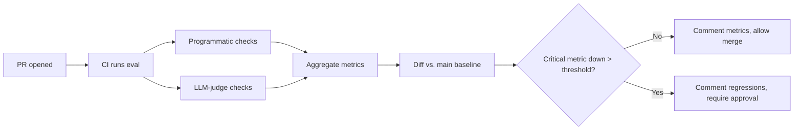
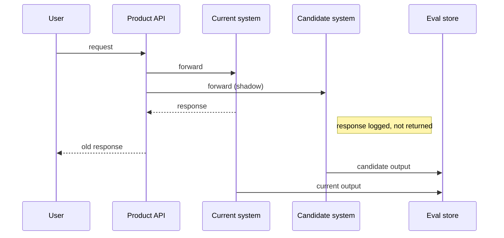
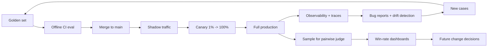

# 5. Online vs. Offline Eval

Two eval modes. They complement each other; neither replaces the other.

| | Offline | Online |
|---|---|---|
| Where | Golden set on dev / CI machines | Production traffic |
| Speed | Fast feedback (minutes) | Slow feedback (hours to days) |
| Coverage | Known cases, curated | Real distribution, unbounded |
| Cost | Cheap | Free in compute, expensive in user risk |
| Catches | Regressions on known scenarios | What the golden set didn't anticipate |
| Stage | Pre-merge | Post-merge, gradual rollout |

If you only do offline, you ship things that pass tests but flop in production. If you only do online, you find regressions by counting support tickets. **Run both.**

## Offline: the CI loop

Offline eval is a CI job. Every PR that touches prompts, models, tools, retrievers, or fine-tunes triggers it. The golden set runs end-to-end. Metrics get diffed against `main`. Regressions block merge or require sign-off.



The mechanics:

```python
import json, subprocess
from pathlib import Path

def run_eval(golden_set: Path, prompt_version: str, model_id: str) -> dict:
    cases = read_golden_set(golden_set)
    results = [run_one(c, prompt_version, model_id) for c in cases]
    return {
        "schema_valid_rate":  rate(r.metrics["schema_valid"] for r in results),
        "must_say_rate":      rate(r.metrics["must_say_all"] for r in results),
        "judge_pass_rate":    rate(r.metrics["judge_passes"]   for r in results),
        "p95_latency_ms":     percentile([r.latency_ms for r in results], 95),
        "avg_cost_usd":       sum(r.cost_usd for r in results) / len(results),
        "by_category":        slice_metrics(results, cases),
    }

def diff_vs_baseline(new: dict, baseline: dict) -> list[str]:
    regressions = []
    for k in ["schema_valid_rate", "must_say_rate", "judge_pass_rate"]:
        delta = new[k] - baseline[k]
        if delta < -0.02:    # 2pp regression threshold
            regressions.append(f"{k}: {baseline[k]:.3f} -> {new[k]:.3f} ({delta:+.3f})")
    return regressions
```

Wire `diff_vs_baseline` into a bot that comments on the PR. If the comment is empty, the PR is clean. If it lists regressions, the author has to either fix them or get explicit sign-off. This is the version of "code review" that scales for prompt and model changes.

Some teams add a "win-rate" pairwise comparison ([§4](./llm-as-judge)) that grades the new version against the baseline directly. That number — "the new prompt wins 58% of pairwise comparisons against main" — is often more legible than absolute scores.

## Online: gradual rollout

Offline tells you whether you regressed on the cases you know about. Online tells you about the cases you don't.

Three patterns, in order of risk:

### Shadow traffic (zero user risk)

Send a copy of incoming production requests to the new system. Don't return its responses to the user; just log them.



You now have a stream of `(input, current_output, candidate_output)` triples on real traffic. Run an LLM-judge pairwise comparison ([§4](./llm-as-judge)) over a few thousand of them. Win-rate against the current system on real distribution is the gold-standard offline-style metric.

Use shadow when:

- The candidate is a substantial change (new model, new RAG retriever, new fine-tune).
- The pricing is OK with paying for double traffic during the shadow window (it's not always cheap).
- The system is stateless or close to it. Stateful systems (memory, session) need careful handling — don't double-write to user state.

### Canary (1% user risk)

Roll the new system to 1% of users (or 1% of requests). Watch metrics. If green, ramp to 5%, 25%, 100%.

What to watch on the canary slice:

- Hard signals: error rate, p95 latency, refusal rate, cost per request.
- User-facing signals: thumbs-up/thumbs-down rate, "regenerate" rate, session length, completion rate, retention.
- LLM-judge signals on a sample of canary outputs (run async, post to dashboard).

Most prompt edits should be canaried, not directly merged to 100%. The cost is small; the protection is large. Ship a canary on Monday morning so you have the week to observe before the weekend.

### A/B test (controlled experiment)

When the change is big enough to matter for product strategy, run an actual A/B. Split users between variant A and variant B with a stable hash, hold the split for two weeks, measure user-facing metrics. Statistical significance applies.

The non-obvious thing: **model-graded metrics often don't correlate with user-facing metrics.** A new prompt might win 70% of pairwise judge comparisons and have zero impact on user retention. Or the reverse — a "lower-quality" output may get higher user engagement because it's more concise, or asks a follow-up question that pulls users in.

Measure both. The judge tells you about quality on dimensions you defined. The A/B tells you what users actually care about. Disagreement between them is information — usually about the rubric.

## The eval flywheel, with online + offline



The arrows that close the loop matter most. Production observability ([§6](./observability)) feeds new cases back into the golden set. Bug reports feed back as regression cases. Drift detection (this quarter's traffic doesn't look like last quarter's) triggers a golden set refresh.

The flywheel is what makes eval scale. Without it, the golden set is a one-time artifact that gets stale. With it, your test set tracks the population it's supposed to represent.

## The gold-rush rule

> If your offline eval looks great but online metrics didn't move, your offline metric is wrong.

This is the most important sentence in this chapter. It's tempting to argue with it ("but the judge said the new prompt was better!"). Don't. The user's behavior is the ground truth. If the judge says A is better and the user behaves the same, the judge is measuring something the user doesn't care about. **Update the rubric, or update the golden set, to capture what the user actually values.**

The corollary: if your online metrics moved but offline didn't change, your golden set is missing the cases that drove the change. Add them.

## Fine-tunes and the same loop

Fine-tuning ([Ch 9](../fine-tuning)) plugs into exactly this same flywheel:

- Offline: run the fine-tuned model against the golden set, diff vs. base model. Reject the tune if it regresses on critical slices, even if the average score went up. (A tune that helps one slice and hurts another is often *worse* than the base.)
- Shadow: shadow real traffic to the fine-tune. Pairwise judge against base. If win-rate is < 55%, the tune isn't paying for itself.
- Canary: ramp up, watch user-facing metrics.

The same regression-set discipline. The fine-tune is just one more candidate change to validate.

## A note on the "two-week silent regression"

Most production LLM regressions are detected late. They're not catastrophic — they're a slow shift. Hallucination rate creeps from 4% to 7%. Refusal rate ticks up. Cost per task drifts up by 15%. Nobody notices because no single user complains; the support volume just gets a little heavier.

Online eval — even the cheap kind, just dashboards on production logs — is what catches these. Set thresholds. Page on regressions. Treat a 2pp drop in faithfulness rate as a real incident, not a curiosity.

This is the operational version of the [Ch 2 §9](../llm-apis-and-prompts/failure-modes) line: hallucination, injection, and refusal rates are distributions. You manage them by tracking the distribution over time, not by looking at one bad output.

Next: [Observability →](./observability)
