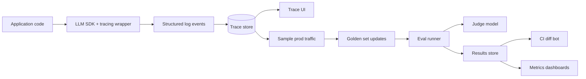

# 7. Tools & Platforms

This page goes stale faster than the rest of the chapter. The fundamentals — golden sets, judge calibration, regression discipline, structured logs — will be the same in five years. The specific tools won't be. Treat this as orientation, not endorsement.

The honest take, before any names: **the tools matter less than having the discipline.** A directory of JSONL golden cases, a Python script that runs them, a CSV of results, and a cron job that posts a diff to Slack — that's enough for many teams. Don't let "we need to pick a platform" be the reason you don't have eval.

We'll name three options, one per posture, and gesture at the rest.

## Three options, three postures

### Langfuse — open-source, self-hostable, eval + observability + prompts in one

[langfuse.com](https://langfuse.com), Apache 2.0 license, also offers a hosted tier.

**What it is.** Trace LLM calls (with parent/child spans), build datasets from production traces, run evals, manage prompt versions, view per-case results in a UI. Open-source means you can self-host on your own infra.

**Pick when.** You want eval, observability, and prompt management in one tool, and either you have data-residency constraints or you don't trust a vendor with your transcripts. Self-hosting is non-trivial but tractable; the hosted tier is fine for most teams.

**Sharp edges.** The UI is broad rather than deep — you'll outgrow specific views eventually. Self-hosted Postgres can become a bottleneck at high traffic. Prompt management can drift from your code repo if you're not careful (see [Ch 2 §3](../llm-apis-and-prompts/prompt-as-code) on prompts-as-code).

### Braintrust — commercial, eval-first, "GitHub for prompts" experience

[braintrust.dev](https://braintrust.dev), commercial, hosted-only.

**What it is.** Eval-focused platform. Strong UI for diffing prompt versions, viewing per-case results side-by-side, comparing two runs. Tight integration with judge functions and CI workflows.

**Pick when.** Your bottleneck is eval workflow, not observability. You want a polished UI that an engineer or PM can use without training. You're OK sending transcripts to a SaaS vendor.

**Sharp edges.** Closed-source; you depend on a vendor. Pricing is per-seat and per-event; budget it. Less full-featured for production tracing than dedicated observability tools.

### OpenTelemetry + your own dashboards — the "no platform" path

[opentelemetry.io](https://opentelemetry.io), open standard, ship to any backend.

**What it is.** A standard for distributed tracing with GenAI semantic conventions (as of 2025). Instrument once, point at any compatible backend (Honeycomb, Grafana Tempo, Datadog, Jaeger, etc.).

**Pick when.** You already have observability infrastructure for your non-LLM services and want LLM tracing to live alongside everything else. You want to avoid a separate vendor and a separate dashboard culture.

**Sharp edges.** OTel gives you tracing; eval is your problem. Roll your own runner (a Python script over the golden set, calling the same SDK as production). UIs aren't LLM-specific — you'll interpret traces in a backend designed for HTTP requests, which works but isn't tailored.

## Comparison at a glance

| Concern | Langfuse | Braintrust | OTel + own |
|---|---|---|---|
| Eval runner | Built-in | Built-in (strong) | DIY |
| LLM tracing | Built-in | Built-in | Standard, vendor-flexible |
| Prompt management | Built-in | Built-in | DIY |
| Cost | Free (self-host) / Usage-based (cloud) | Per-seat + per-event | Whatever your tracing backend costs |
| Lock-in | Low (open-source) | Medium (vendor) | Low (standard) |
| Self-host | Yes | No | Yes |
| Best for | All-in-one, OSS preference | Eval-centric workflow | Already-instrumented teams |

## Also-exists, in one line each

- **Phoenix (Arize)** — open-source LLM tracing and eval, strong on dataset and trace inspection.
- **LangSmith** — LangChain's first-party platform; useful if you're committed to that stack.
- **Weights & Biases** — historically training-focused; their LLM eval offerings are reasonable if you already use W&B for experiments.
- **Helicone, Traceloop** — observability-focused.
- **Ragas, Trulens** — eval libraries (mentioned in [Ch 3 §7](../embeddings-and-rag/evaluating-rag)) that slot into any platform.

You can investigate these by name. Two name-words plus "LLM eval" is enough to find the current state of any of them.

## What every platform does (so you can roll your own)

If you understand what a platform does, you can build the equivalent in a long afternoon when it's the right call. The core pieces:

Specifically:

- **A tracing wrapper** around your LLM SDK that emits structured events. ([§6](./observability))
- **A trace store** — could be your existing log store.
- **A golden-set runner** — a script that reads JSONL, runs each case, applies metrics, writes results. (The Python in [§5](./online-vs-offline) is most of it.)
- **A judge harness** — pydantic + structured output ([§4](./llm-as-judge)).
- **A diff function** — old metrics minus new metrics, threshold, fail the build.
- **A dashboard** — Grafana, Metabase, Hex, anything that talks SQL.

A team of two engineers can build this in a week. A team that uses a platform can stand it up in an afternoon and spend the time saved building product. Either is correct; what's wrong is not having the components at all.

## When to switch

Three signals you've outgrown a "spreadsheet + script" setup:

1. **You have more than one product surface running eval.** Sharing infrastructure across teams is when a platform pays for itself.
2. **Non-engineers want to look at results.** PMs and designers need a UI they can navigate. CSVs don't scale to a five-person team.
3. **You need replay.** "Re-run this exact prompt and model on this exact case from a year ago" is a real engineering workflow once you're shipping LLM features at scale. Platforms make replay easier; rolling your own version gets old.

Conversely, three signals you should *not* migrate to a platform yet:

1. **You don't have a golden set.** A platform won't build it for you. Build the set first; pick a tool second.
2. **You don't trust your judge prompt.** Calibrate against humans first ([§4](./llm-as-judge)). Then platform-ize.
3. **You're choosing a platform to feel productive.** This is procrastination. Run the script you have on the cases you have.

## Stack opinionation, 2026

If pressed for a single recommendation: **start with a Python script + JSONL + your existing log store. Add Langfuse if/when you want a real UI and you don't want to depend on a vendor; add Braintrust if your bottleneck is eval workflow speed and you're comfortable on a SaaS.** OpenTelemetry is the right answer when LLM tracing is one piece of an already-mature observability story.

The discipline this chapter taught is what matters. The tooling is interchangeable.

Next: [Closing →](./closing)
