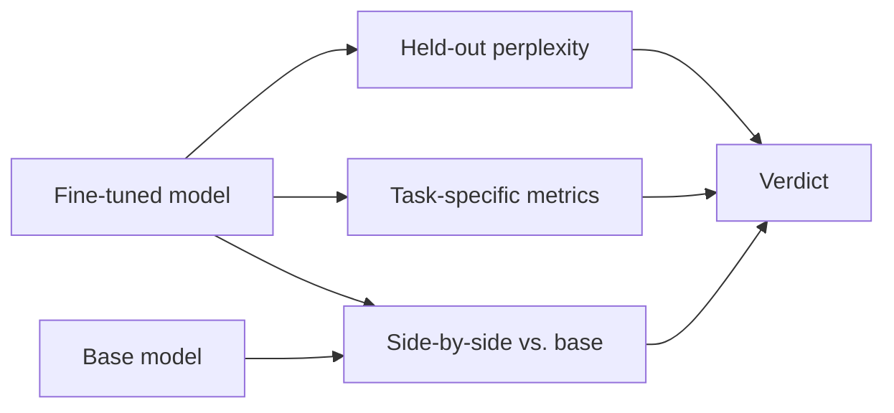

# 5. Evaluating the Fine-Tune

You ran training. Loss dropped. Now: did the fine-tune actually make the model better?

If you don't answer this question rigorously, you are flying blind. Loss going down on the training set is necessary but nowhere near sufficient. The model could be perfectly memorizing your 200 examples while losing all general capability — and the loss curve looks great either way.

This page is about the three eval surfaces that catch real-world fine-tune problems, and how to wire them together.

## Three eval surfaces



### 1. Loss / perplexity on a held-out split

Cheap, automatic, mechanical. Split your data 95/5 (or 90/10) before training and never let the eval split touch the trainer. Compute loss on the eval split after each epoch.

What it catches: blatant overfitting (training loss ↓ while eval loss ↑) and "did training even do anything" questions.

What it misses: everything that matters about quality. Perplexity is a loose proxy. A model that learns to be slightly more confident about the same answers will look better on perplexity without producing better outputs. Don't ship on perplexity alone.

`SFTTrainer` handles this automatically if you pass `eval_dataset`:

```python
training_args = SFTConfig(
    # ... other args
    eval_strategy="epoch",
    per_device_eval_batch_size=2,
)
trainer = SFTTrainer(
    model=model,
    args=training_args,
    train_dataset=train_ds,
    eval_dataset=eval_ds,    # add this
    tokenizer=tokenizer,
)
```

You'll get an `eval_loss` column alongside `loss` in the training log.

### 2. Task-specific metrics

Whatever metric actually fits your task. Examples:

| Task | Metric |
|---|---|
| Classification | Accuracy, F1, per-class precision/recall |
| Structured extraction | Field-level exact match, schema validity rate |
| SQL generation | Query parse rate, execution match (does the query return the same rows as the gold query?) |
| Tool-call fine-tuning | Valid-JSON rate, function-name accuracy, argument-shape accuracy |
| Summarization | ROUGE (rough), but pair with a judge LLM |
| Open-ended generation | Win-rate vs. base in a head-to-head judge eval (see #3) |

The frontend-developer instinct here is right: **you can't refactor what you can't measure**. Fine-tuning is iterative — you'll do it 5–10 times to converge on a good model — and the only signal you have between iterations is your task metric on a fixed eval set. Build the eval first.

### 3. Side-by-side vs. base — the most important one

This is the eval that matters: **on the prompts you actually care about, does your fine-tune produce better outputs than the base model?**

The mechanical pattern: pick 50–200 prompts, generate from both base and fine-tune, then have a stronger model (a frontier API) act as a judge to pick a winner per prompt. Aggregate as **win-rate**.

A judge prompt can be coerced into structured output ([Chapter 2 §5](../llm-apis-and-prompts/structured-output)) so you get back a clean JSON like `{"winner": "A" | "B" | "tie", "reason": "..."}`. To control for position bias, randomize which model is "A" vs. "B" per example.

Why this is the most important eval:
- It directly answers the question "should I ship this?" — perplexity and even task metrics don't.
- It catches behaviors that no automated metric will (tone, format compliance, hedging, etc.).
- It scales: 200 prompts with a judge LLM costs cents and runs in minutes.

## Always compare against three things

A fine-tune is only worth shipping if it beats all three of these baselines on your eval set:

| Baseline | The question it answers |
|---|---|
| **The base model** | Did fine-tuning help at all? |
| **A prompt-engineering-only version of the base** | Could a better system prompt have gotten you here without the training? |
| **A larger / better instruction model** (e.g., a frontier API) | Did you fine-tune your way into being worse than just calling GPT/Claude? |

Skip baseline #2 and you'll occasionally fine-tune for two weeks to replace what a 100-token system prompt would have done. Skip baseline #3 and you'll ship a custom 3B model that's genuinely worse than just calling a frontier API for $0.001 a request.

## Catastrophic forgetting check

Fine-tuning shifts the weights. If you push too hard, you can shift them away from the general capabilities the base model had — the model becomes great at your task but forgets how to do basic reasoning, factual QA, or even tool calling.

Add a small "general capability" set to your eval — 20–50 prompts that cover:

- Basic factual QA ("What's the capital of Brazil?")
- Simple reasoning ("If A is taller than B and B is taller than C, who is shortest?")
- Tool calling, if your model needs it (a few representative function-call prompts)
- Refusal behavior on a couple of clearly-harmful prompts (you don't want fine-tuning to have removed safety guardrails by accident)

Run these on **both** the base and the fine-tune. If the fine-tune fails generic capabilities the base passed, you have catastrophic forgetting. Mitigations:

- Lower the learning rate (try `1e-4` instead of `2e-4`).
- Train for fewer epochs.
- Reduce `r` (lower-rank delta, less capacity to overwrite).
- Mix general-purpose data into your fine-tune set — even 10–20% generic instruction-following examples interspersed helps a lot ([Chapter 12 §2](../post-training) covers this as PPO-ptx).

## A minimal `eval.py`

Reference script that loads both models, runs them on a JSONL of `(prompt, optional gold)`, and emits a head-to-head report. Schematic — adapt the judge call to whatever provider you use.

```python
# eval.py
import json
import torch
import random
from transformers import AutoModelForCausalLM, AutoTokenizer, BitsAndBytesConfig
from peft import PeftModel
# from openai import OpenAI   # judge model; swap for any provider you prefer

BASE = "Qwen/Qwen2.5-3B-Instruct"
ADAPTER = "./qwen3b-myftune-final"
EVAL_JSONL = "eval.jsonl"        # lines of {"prompt": str, "gold": optional str}

bnb = BitsAndBytesConfig(load_in_4bit=True, bnb_4bit_quant_type="nf4",
                         bnb_4bit_compute_dtype=torch.float16)
tok = AutoTokenizer.from_pretrained(BASE)
base = AutoModelForCausalLM.from_pretrained(BASE, quantization_config=bnb, device_map="auto")
ft = PeftModel.from_pretrained(
    AutoModelForCausalLM.from_pretrained(BASE, quantization_config=bnb, device_map="auto"),
    ADAPTER,
)

def gen(model, prompt: str) -> str:
    msgs = [{"role": "user", "content": prompt}]
    text = tok.apply_chat_template(msgs, tokenize=False, add_generation_prompt=True)
    inp = tok(text, return_tensors="pt").to(model.device)
    with torch.no_grad():
        out = model.generate(**inp, max_new_tokens=512, do_sample=False)
    return tok.decode(out[0][inp["input_ids"].shape[1]:], skip_special_tokens=True)

def judge(prompt: str, ans_a: str, ans_b: str) -> str:
    """Ask a judge model to pick a winner. Returns 'A', 'B', or 'tie'.
    Schematic — replace with your provider's structured-output call."""
    # client = OpenAI()
    # resp = client.chat.completions.create(model="gpt-4o-mini", ...)
    # return resp.choices[0].message.parsed["winner"]
    raise NotImplementedError("wire to your judge LLM")

results = {"base_win": 0, "ft_win": 0, "tie": 0}
records = []
with open(EVAL_JSONL) as f:
    for line in f:
        ex = json.loads(line)
        a_base = gen(base, ex["prompt"])
        a_ft   = gen(ft,   ex["prompt"])
        # randomize position to avoid judge bias
        if random.random() < 0.5:
            verdict = judge(ex["prompt"], a_base, a_ft)  # A=base, B=ft
            ft_won = verdict == "B"; base_won = verdict == "A"
        else:
            verdict = judge(ex["prompt"], a_ft, a_base)  # A=ft, B=base
            ft_won = verdict == "A"; base_won = verdict == "B"
        if ft_won:   results["ft_win"]   += 1
        elif base_won: results["base_win"] += 1
        else:        results["tie"]      += 1
        records.append({"prompt": ex["prompt"], "base": a_base, "ft": a_ft, "verdict": verdict})

print(results)
# Print example disagreements for manual review:
for r in records[:5]:
    print(r["prompt"][:80], "->", r["verdict"])
```

Save the per-example records to disk every run so you can spot-check the judge's calls. **Always read at least 20 head-to-head examples by hand before trusting the win-rate.** Judge LLMs have biases (longer answers, more confident answers, the position-A answer); you want to see them yourself before believing the aggregate.

## What "good" looks like

For a real fine-tune on a real task:

- **Win-rate vs. base ≥ 60% on your eval set** — otherwise the fine-tune isn't worth the operational complexity.
- **Win-rate vs. prompt-engineered base ≥ 55%** — if a better system prompt closes 90% of the gap, just ship the system prompt.
- **General-capability set: no regressions** vs. base. If you regressed, retrain with lower lr or fewer epochs.
- **Task metric: clearly better than base.** If your task metric is exact-match SQL execution and the base scored 40% while the fine-tune scores 55%, that's a real win.

## Forward link

This page is the fine-tune-specific instance of a much bigger topic. **Chapter 13 (Evaluation and Observability)** covers eval as a discipline: golden sets, judge-model calibration, regression-rate tracking, the difference between offline benchmarks and online metrics. Read that next if you're shipping fine-tuned models to real users.

Next: [Serving Fine-Tuned Models →](./serving-finetuned-models)
