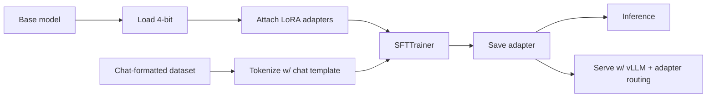

# Fine-Tuning in Practice

In [Chapter 3](../embeddings-and-rag/why-rag) we drew the line: **fine-tune for behavior, RAG for knowledge.** This chapter is the engineering half of that — how to actually fine-tune a model, end to end, on hardware you already have access to.

The companion chapter ([Chapter 10](../post-training)) covers the *theory* of post-training — SFT, DPO, RLHF, GRPO — at the level of "why these algorithms exist." This one stays in the engineer's seat: load a base model, attach LoRA adapters, format chat data, run training on a single GPU, evaluate, and serve. The locked example is **QLoRA on Qwen-3B**, which fits on a free Colab T4. Same code scales to bigger models on bigger GPUs.

## The whole pipeline at a glance

Every box in this diagram is a sub-page below. None of it is conceptually novel — but every box has at least one foot-gun that quietly destroys your training run, and that's what this chapter is about.

## By the end you'll be able to

- Decide whether fine-tuning is the right fix at all (vs. RAG, prompt engineering, or just switching models).
- Explain LoRA and QLoRA well enough to pick `r`, `alpha`, and `target_modules` without copy-pasting blindly.
- Prepare a chat-formatted SFT dataset that matches the base model's chat template.
- Run a QLoRA fine-tune of Qwen-3B end-to-end on a free Colab T4, save the adapter, and load it for inference.
- Evaluate the fine-tune against the base model and detect catastrophic forgetting.
- Serve a fine-tuned model in production, including the "many adapters, one base" multi-tenant pattern.
- Recognize the eight production pitfalls that will eat your fine-tune if you ship without checking for them.

## What's in this chapter

1. [When to Fine-Tune](./when-to-fine-tune) — the decision tree: RAG vs. prompting vs. switching models vs. fine-tuning.
2. [LoRA & QLoRA](./lora-and-qlora) — the math intuition for low-rank adapters and 4-bit base-model quantization.
3. [Data Preparation](./data-preparation) — chat templates, loss masking, packing, and the data pitfalls that dominate everything else.
4. [Hands-On: Qwen-3B + QLoRA](./qwen-qlora-colab) — the runnable centerpiece. Six Colab cells, free T4.
5. [Evaluating the Fine-Tune](./evaluating-the-finetune) — perplexity, task metrics, and head-to-head against the base model.
6. [Serving Fine-Tuned Models](./serving-finetuned-models) — merging vs. adapter-aware serving; many LoRAs on one base.
7. [Production Pitfalls](./production-pitfalls) — the failure modes you will hit, and how to avoid each.

A note on scope: this chapter is engineering. [Chapter 10](../post-training) is the theoretical companion — read it for *why* SFT works, what DPO and GRPO are, and how human-preference data flows through training. We won't re-derive any of that here.

Next: [When to Fine-Tune →](./when-to-fine-tune)
