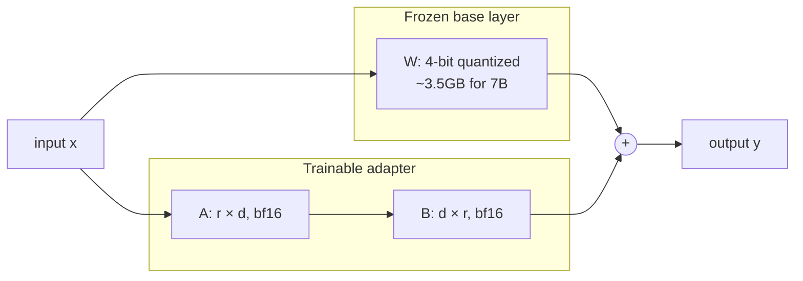

# 2. LoRA & QLoRA

Full fine-tuning a 7B model in fp16 needs ~14GB of VRAM just for the weights, plus another ~28GB for optimizer state in Adam (`m` and `v` buffers, each fp32), plus gradients, plus activations. The realistic floor is ~80GB ([Chapter 5](../gpu-and-model-sizing) walks through the math). That's an A100 minimum, two H100s for 13B, and a small cluster for anything bigger. Out of reach for most.

LoRA and QLoRA are the two tricks that drag this down to a single consumer GPU.

## LoRA: train a low-rank delta, not the whole weight

The empirical observation behind LoRA: when you fine-tune a pretrained model on a new task, the *change* in any given weight matrix is approximately **low-rank**. You don't need to learn a full `d × d` update — you can learn a much smaller decomposition `B @ A` and add it to the frozen base weights.

```
full FT:  W_new = W + ΔW                 (ΔW: full d × d matrix)
LoRA:     W_new = W + B @ A              (A: r × d, B: d × r,  r << d)
                  ^^^^^^^^^
                  freeze W, train only A and B
```

Concrete numbers, for a single attention projection in a 7B model where `d ≈ 4096`:

```
full ΔW:   4096 × 4096 = 16.8 M params  (per matrix, in fp16: 33 MB)
LoRA r=16: 16 × 4096 + 4096 × 16 = 131 K params  (in bf16: 0.26 MB)
                                   ^ a 128x reduction
```

Repeat across every attention layer of a 7B model and the trainable parameter count drops from billions to single-digit millions. The base weights are **frozen** — gradients don't flow through them, optimizer state doesn't track them, and at inference you can either keep `B@A` separate (for adapter swapping) or merge it back into `W`.

### The four knobs you actually tune

| Knob | Meaning | Default to start with |
|---|---|---|
| `r` | Rank of the decomposition. Higher r = more capacity = more parameters. | `16` for most tasks; `8` for small / `32+` for hard tasks. |
| `alpha` | Scaling factor. The delta is applied as `(alpha / r) * B @ A`. Effective learning rate scales with this. | Usually set to `2 * r`, so `alpha = 32` when `r = 16`. |
| `dropout` | Dropout on the LoRA path. Helps generalization on small datasets. | `0.05`. |
| `target_modules` | Which weight matrices get an adapter. Almost always the attention projections. | `["q_proj", "k_proj", "v_proj", "o_proj"]` for LLaMA-family / Qwen. Also adding `["gate_proj", "up_proj", "down_proj"]` (the MLP) helps for harder tasks at ~2x the params. |

A useful frontend-developer mental model: `r` is the "compression rank" of the diff. Low r = you're saying "this fine-tune is a small tweak"; high r = you're saying "this is a big behavioral shift, give it more capacity."

## QLoRA: quantize the frozen base to 4 bits

LoRA solves the *trainable parameter* problem. But the base model weights still have to live in VRAM at full precision during training — you have to forward-prop through them. For a 7B model that's still 14GB of frozen weights you can't avoid carrying.

QLoRA's trick: quantize the frozen base weights to **4 bits** using a format called **NF4** (Normal Float 4), keep them frozen in 4-bit form, and dequantize them on the fly inside each matmul. The LoRA adapters themselves train at higher precision (bf16 or fp16). The quantization error on the base hurts accuracy by ~1% on most benchmarks (per the QLoRA paper) — far less than the gain from fine-tuning at all.

The memory math, for a 7B model:

```
fp16 base weights:      7B × 2 bytes = 14.0 GB
NF4 base weights:       7B × 0.5 bytes ≈ 3.5 GB    (4x reduction)

Plus, regardless of base format:
LoRA adapters (bf16, ~0.5% of params):              ~70 MB
Adam optimizer state for adapters (fp32, 2x):       ~280 MB
Activations during forward + backward:              ~3-8 GB (depends on seq len, batch size)
KV cache + framework overhead:                      ~1-2 GB

Total fp16 base + LoRA training: ~25 GB  -> needs A100
Total NF4 base + LoRA training:  ~10-14 GB -> fits on a 16GB T4
```

For a **3B model**, NF4 weights are ~1.5GB, leaving plenty of headroom on a 16GB T4 even at longer sequence lengths. This is why the Qwen-3B + QLoRA combo is the chapter's canonical example — it's the most permissive setup that actually trains a useful model.



The forward pass is `y = x @ W + (x @ A.T @ B.T) * (alpha/r)`. The `x @ W` half dequantizes 4-bit weights to fp16 just-in-time for the matmul, then discards the dequantized form. Memory stays low; compute is similar to plain LoRA.

## Trade-off table

| Method | VRAM (7B training) | Trainable params | Quality vs. full FT | Notes |
|---|---|---|---|---|
| Full fine-tuning | 80GB+ (A100 / multi-GPU) | 100% (~7B) | baseline | Optimal but rarely necessary. |
| LoRA | ~25GB (single A100) | ~0.1–1% (~5–70M) | within 1–2% on most tasks | Standard choice when VRAM allows. |
| QLoRA | ~10–14GB (T4 / RTX 4090) | ~0.1–1% | within ~1% of LoRA | The democratizer. |
| 8-bit LoRA | ~17GB | same as LoRA | basically equal to LoRA | Less common since QLoRA. |

The headline: **on most fine-tuning tasks, QLoRA gets you to within ~2% of full fine-tuning at <20% of the VRAM**. The remaining 2% almost never matters compared to the data-quality gap (next page).

## Other PEFT methods you'll see

PEFT (parameter-efficient fine-tuning) is a small zoo. LoRA is by far the most common, but you'll bump into:

| Method | One-line summary |
|---|---|
| **DoRA** | Decomposes weights into magnitude and direction; trains LoRA on direction only. Slightly better than LoRA at similar param count, slightly slower. |
| **GaLore** | Projects gradients into a low-rank subspace instead of the weights. Lets you full-fine-tune at LoRA-like memory. Newer, less battle-tested. |
| **AdaLoRA** | LoRA with a budget — learns which layers need higher rank. Marginal wins; rarely worth the complexity. |
| **Prefix / prompt tuning** | Train a small "soft prompt" prepended to inputs. Cheap but capped quality on harder tasks. Out of fashion. |

For 95% of cases in 2026, **the answer is LoRA or QLoRA**. Start there.

## Why this matters for the rest of the chapter

QLoRA is the reason a developer with a Google account can fine-tune a real LLM. Without it, this chapter would be an essay about renting a cloud GPU. With it, the next four pages are runnable on a free Colab T4. [Chapter 5](../gpu-and-model-sizing) has the broader memory math; the takeaway here is that 4-bit base + LoRA adapters is the configuration that fits.

Next: [Data Preparation →](./data-preparation)
