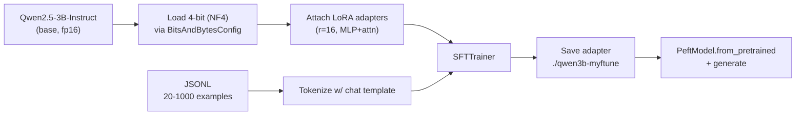

# 4. Hands-On: Qwen-3B + QLoRA on a Free Colab T4

This is the page everything else has been pointing at. By the end you'll have run a real QLoRA fine-tune end to end — load base, attach adapters, format data, train, save, infer — on a free Colab T4. Roughly 250 lines of Python total, six cells, ~15–25 minutes of training on a small toy dataset.

If you want to do it for real on a bigger task, swap the dataset for yours and bump epochs / training steps. Everything else stays the same.

## What we're building



## The stack (no version pins; the API has been stable since mid-2024)

- `transformers` — model loading, tokenizer, training loop primitives.
- `peft` — LoRA adapter implementation (`LoraConfig`, `get_peft_model`, `PeftModel`).
- `trl` — `SFTTrainer`, the high-level wrapper around the training loop with chat-data support.
- `bitsandbytes` — 4-bit / 8-bit quantization kernels.
- `accelerate` — device placement, mixed precision, distributed training (`SFTTrainer` uses this internally).
- `datasets` — Hugging Face dataset format.
- `torch` — the underlying framework.

Base model: `Qwen/Qwen2.5-3B-Instruct`. Substitutable for any LLaMA-architecture instruct model.

## Memory budget on a T4

A free Colab T4 has **16 GB of VRAM**. Approximate breakdown during this fine-tune:

```
Qwen-3B in NF4:                            ~1.7 GB
LoRA adapters + Adam optimizer state:      ~0.5 GB
Activations (seq=2048, batch=2):           ~6-8 GB
Framework / KV cache / scratch:            ~1-2 GB
                                          ----------
Total:                                     ~10-12 GB    ← fits comfortably
```

[Chapter 5](../gpu-and-model-sizing) has the broader memory math; for a 3B model in 4-bit you have plenty of headroom. If you tried 7B + QLoRA you'd be tighter (~14GB) but it still fits.

## CELL 1 — Install dependencies

```python
# CELL 1: install
!pip install -q -U transformers peft trl bitsandbytes accelerate datasets
!pip install -q -U "torch>=2.1"  # T4 wants a recent torch w/ CUDA 12.1+ matched bnb
```

After this, restart the Colab runtime once if prompted. Subsequent cells assume a fresh Python process.

## CELL 2 — Load the base model in 4-bit

```python
# CELL 2: load 4-bit base + tokenizer
import torch
from transformers import AutoModelForCausalLM, AutoTokenizer, BitsAndBytesConfig

BASE_MODEL = "Qwen/Qwen2.5-3B-Instruct"

# T4 does NOT support bfloat16. Use float16 throughout.
bnb_config = BitsAndBytesConfig(
    load_in_4bit=True,
    bnb_4bit_quant_type="nf4",          # NF4 is the QLoRA-paper default; better than fp4 on most tasks
    bnb_4bit_compute_dtype=torch.float16,  # dtype during the on-the-fly dequant matmul
    bnb_4bit_use_double_quant=True,     # quantize the quantization constants too; saves ~0.4 bits/param
)

tokenizer = AutoTokenizer.from_pretrained(BASE_MODEL)
if tokenizer.pad_token is None:
    tokenizer.pad_token = tokenizer.eos_token  # Qwen ships without one; needed for batched training

model = AutoModelForCausalLM.from_pretrained(
    BASE_MODEL,
    quantization_config=bnb_config,
    device_map="auto",
    torch_dtype=torch.float16,
)
model.config.use_cache = False  # incompatible with gradient checkpointing during training
print(f"Loaded {BASE_MODEL} in 4-bit.")
```

Two things to watch:

- **bf16 vs fp16.** T4 is pre-Ampere; it doesn't have bf16 hardware. Use fp16 everywhere. Newer GPUs (A100, RTX 30/40 series, H100) support bf16 and you should prefer it — wider dynamic range, fewer NaN issues during training. If you swap GPU, swap both `bnb_4bit_compute_dtype` and the trainer args together.
- **`use_cache = False`.** The KV cache (Chapter 7) is for inference. During training with gradient checkpointing it conflicts; turn it off here, turn it back on after saving.

## CELL 3 — Attach LoRA adapters

```python
# CELL 3: PEFT / LoRA config
from peft import LoraConfig, get_peft_model, prepare_model_for_kbit_training

# Required for QLoRA: cast layer norms / lm_head to fp32, enable input grad on embeddings
model = prepare_model_for_kbit_training(model)

lora_config = LoraConfig(
    r=16,
    lora_alpha=32,
    lora_dropout=0.05,
    bias="none",
    task_type="CAUSAL_LM",
    target_modules=[
        # attention projections — always
        "q_proj", "k_proj", "v_proj", "o_proj",
        # MLP — adds ~2x params but materially better on harder tasks
        "gate_proj", "up_proj", "down_proj",
    ],
)

model = get_peft_model(model, lora_config)
model.print_trainable_parameters()
# expect: trainable: ~30M / total: ~3B  ->  ~1.0% trainable
```

`print_trainable_parameters()` is your gut-check — if it prints "100% trainable" something is wrong (the base wasn't frozen). For Qwen-3B with the config above, you should see ~25–35M trainable parameters out of ~3B total.

## CELL 4 — Build the dataset

For demonstration we'll inline a tiny JSONL (~20 examples) so the cell is self-contained. In practice, replace with `datasets.load_dataset("your-dataset")` or load your own JSONL from disk.

```python
# CELL 4: dataset
import json
from datasets import Dataset

# Toy task: turn a casual question into a polite SQL-assistant response.
# Replace this with your own JSONL of {"messages": [...]} for real fine-tuning.
RAW = [
    {"messages": [
        {"role": "system", "content": "You are a SQL assistant. Reply with only valid PostgreSQL."},
        {"role": "user", "content": "give me the 5 newest users"},
        {"role": "assistant", "content": "SELECT id, email, created_at FROM users ORDER BY created_at DESC LIMIT 5;"},
    ]},
    {"messages": [
        {"role": "system", "content": "You are a SQL assistant. Reply with only valid PostgreSQL."},
        {"role": "user", "content": "count orders this month"},
        {"role": "assistant", "content": "SELECT COUNT(*) FROM orders WHERE created_at >= date_trunc('month', now());"},
    ]},
    # ... (in real use, paste 200-2000 examples here, or load from file)
]
# For this notebook, repeat to get a non-trivial number of steps:
RAW = RAW * 10  # 20 examples; enough to see loss decrease

def render(example):
    return {"text": tokenizer.apply_chat_template(example["messages"], tokenize=False)}

dataset = Dataset.from_list(RAW).map(render)
print(dataset[0]["text"][:300])
```

The `text` column is what `SFTTrainer` will consume. If you give it `messages` directly via `formatting_func`, it'll do the same render internally — both work.

## CELL 5 — Train with SFTTrainer

```python
# CELL 5: train
from trl import SFTTrainer, SFTConfig

training_args = SFTConfig(
    output_dir="./qwen3b-myftune",
    num_train_epochs=3,
    per_device_train_batch_size=2,
    gradient_accumulation_steps=4,    # effective batch = 2 * 4 = 8
    learning_rate=2e-4,               # higher than full-FT lr; LoRA tolerates it
    lr_scheduler_type="cosine",
    warmup_ratio=0.03,
    logging_steps=5,
    save_strategy="epoch",
    fp16=True,                        # T4: fp16. On A100/H100 use bf16=True instead
    bf16=False,
    optim="paged_adamw_8bit",         # bnb 8-bit Adam; saves ~2GB optimizer state
    gradient_checkpointing=True,
    max_seq_length=1024,
    packing=False,                    # set True for big datasets w/ many short examples
    report_to="none",
)

trainer = SFTTrainer(
    model=model,
    args=training_args,
    train_dataset=dataset,
    tokenizer=tokenizer,
    dataset_text_field="text",        # the column we built in CELL 4
)

trainer.train()
# Watch the loss column. On this toy dataset, loss should drop from ~2.0 -> ~0.3 over 3 epochs.
# On real data with hundreds of examples, expect ~2.0 -> ~0.5-0.8.
```

A few of these args reward attention:

- `learning_rate=2e-4` is roughly 100x larger than what you'd use for full fine-tuning (`1e-5`–`5e-5`). LoRA's small parameter set tolerates it; using a full-FT learning rate here would underfit.
- `paged_adamw_8bit` keeps optimizer state in 8-bit and pages it to CPU RAM under VRAM pressure — the difference between OOM and not on a T4.
- `gradient_checkpointing=True` trades compute for memory by recomputing activations on the backward pass. ~30% slower, ~40% less VRAM. On a T4 this is the difference between fitting and not.
- `max_seq_length=1024` is plenty for short SQL tasks. Bump to 2048 for longer assistant outputs at the cost of more activation memory.

## CELL 6 — Save the adapter, load it, run inference

```python
# CELL 6: save + reload + generate
from peft import PeftModel

ADAPTER_DIR = "./qwen3b-myftune-final"
trainer.save_model(ADAPTER_DIR)
# This saves ONLY the LoRA weights (~50-100 MB), not the base model.

# --- reload from scratch in inference mode ---
del model, trainer
torch.cuda.empty_cache()

base = AutoModelForCausalLM.from_pretrained(
    BASE_MODEL,
    quantization_config=bnb_config,
    device_map="auto",
    torch_dtype=torch.float16,
)
ft = PeftModel.from_pretrained(base, ADAPTER_DIR)
ft.eval()

prompt_messages = [
    {"role": "system", "content": "You are a SQL assistant. Reply with only valid PostgreSQL."},
    {"role": "user", "content": "list users who signed up in the last 7 days"},
]
prompt = tokenizer.apply_chat_template(prompt_messages, tokenize=False, add_generation_prompt=True)
inputs = tokenizer(prompt, return_tensors="pt").to(ft.device)

with torch.no_grad():
    out = ft.generate(**inputs, max_new_tokens=200, do_sample=False, temperature=0.0)
print(tokenizer.decode(out[0][inputs["input_ids"].shape[1]:], skip_special_tokens=True))
# expected: SELECT ... FROM users WHERE created_at >= now() - interval '7 days';
```

`add_generation_prompt=True` is critical at inference — it appends the empty `<|im_start|>assistant\n` so the model continues from there ([Chapter 0 §3](../how-llms-work/completion-to-conversation)). Forget it and the model will keep generating user turns instead of answering.

## What "good" looks like

| Symptom | Probably means |
|---|---|
| Loss starts ~2.0, drops to 0.3–0.8, plateaus | Healthy. Stop training. |
| Loss starts ~2.0, drops to 0.05 in one epoch | Overfitting on a tiny dataset; eval will be terrible. Reduce epochs, add data, lower lr, lower r. |
| Loss bounces wildly, NaNs appear | Wrong dtype for your GPU (e.g., bf16 on T4), or lr too high. Halve the lr. |
| Loss never moves | Optimizer didn't see trainable params, or LoRA wasn't attached. Re-run `print_trainable_parameters`. |
| Loss decreases but inference outputs garbage | Chat template mismatch between train and inference. Check that `apply_chat_template` is used in both places. |

## Troubleshooting mini-table

| Error | Likely cause | Fix |
|---|---|---|
| `CUDA out of memory` mid-training | seq_length too long or batch too big | `max_seq_length=512`, `per_device_train_batch_size=1`, more grad accum steps |
| `loss = nan` after a few steps | bf16 on a T4, or numerical instability | Use fp16, lower lr, ensure `prepare_model_for_kbit_training` was called |
| Model outputs garbage tokens at inference | Forgot `add_generation_prompt=True`, or loaded base in different dtype than trained | Re-render the prompt; load base with same `bnb_config` |
| `PeftModel.from_pretrained` errors | Base model architecture changed, or saved a different PEFT type | Confirm same `BASE_MODEL` string, regenerate the adapter |
| Training works, inference outputs `<|im_start|>` literally | Tokenizer mismatch (used a different model's tokenizer at train time) | Always load tokenizer from the SAME `BASE_MODEL` string |

## Scaling up

This entire notebook is the same code you'd use for 7B, 13B, or 70B — just swap the model name and rent a GPU big enough:

| Model | NF4 size | Recommended GPU |
|---|---|---|
| Qwen2.5-3B-Instruct | ~1.7 GB | T4 (free Colab) |
| Qwen2.5-7B-Instruct | ~3.8 GB | T4 (tight, seq=1024) or A10 |
| Llama-3.1-8B-Instruct | ~4.5 GB | A10, RTX 4090 |
| Qwen2.5-32B-Instruct | ~16 GB | A100 40GB |
| Llama-3.1-70B-Instruct | ~35 GB | A100 80GB or 2x A100 40GB |

The script doesn't change. The hardware does.

Next: [Evaluating the Fine-Tune →](./evaluating-the-finetune)
