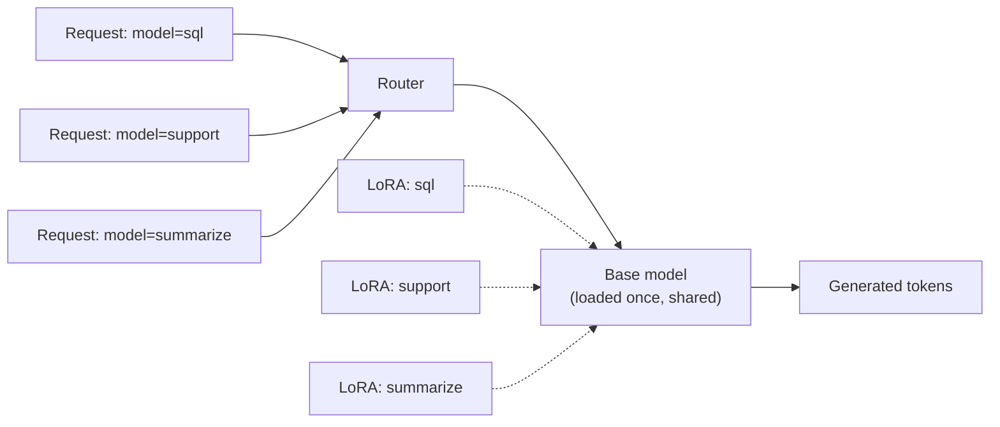

# 6. Serving Fine-Tuned Models

A LoRA adapter on disk is not a deployable model. You still need to actually serve it — turn `<HTTP request>` into `<generated text>` with reasonable throughput and latency. There are three patterns, and the choice depends on how many adapters you have and how dynamically you need to switch between them.

## Three serving patterns

| Pattern | When to use | Trade-off |
|---|---|---|
| **Merge LoRA into base** | One adapter, one model, simple deployment | Loses adapter-swap capability; adapter is "baked in" |
| **Adapter-aware serving (vLLM, SGLang)** | Many adapters on one base model — multi-tenant SaaS, A/B testing, per-customer models | Slightly more complex serving; pays off above ~3 adapters |
| **Hosted fine-tuning APIs** (Together, Modal, Fireworks) | You don't want to run GPUs yourself | Less control; can be cost-ineffective at scale; vendor lock-in on artifacts |

## Pattern 1: merge and serve as a normal model

The simplest option. Take the base model + LoRA adapter, fold the adapter math (`W' = W + B @ A`) into the base weights, and save the result as a normal full-precision model. From the inference engine's perspective, this is just any other model.

```python
# merge.py — schematic
import torch
from transformers import AutoModelForCausalLM, AutoTokenizer
from peft import PeftModel

BASE = "Qwen/Qwen2.5-3B-Instruct"
ADAPTER = "./qwen3b-myftune-final"
OUT = "./qwen3b-myftune-merged"

# Note: merging a LoRA into a 4-bit base produces a 4-bit merged model with weight quality
# loss from the dequant+merge+requant cycle. For best quality, load the base in fp16 here.
base = AutoModelForCausalLM.from_pretrained(BASE, torch_dtype=torch.float16, device_map="auto")
peft_model = PeftModel.from_pretrained(base, ADAPTER)
merged = peft_model.merge_and_unload()
merged.save_pretrained(OUT, safe_serialization=True)
AutoTokenizer.from_pretrained(BASE).save_pretrained(OUT)
```

Then serve with vLLM as you would any HF model:

```bash
vllm serve ./qwen3b-myftune-merged --max-model-len 4096 --gpu-memory-utilization 0.9
```

When this is the right choice:
- You have **one** fine-tuned model in production.
- You don't need to swap adapters at runtime.
- You want the simplest possible serving topology.

When it's the wrong choice: more than ~3 adapters. You'll be loading multiple full copies of the same base model into VRAM, which is wasteful when LoRA was specifically designed to avoid that.

## Pattern 2: adapter-aware serving (vLLM, SGLang)

Both vLLM and SGLang support **multi-LoRA** serving: one base model loaded once, plus N LoRA adapters that can be selected per request via a header or `model` field in the request. The base weights are shared across all requests; only the small adapters are swapped.

```bash
# vLLM (schematic — flag names may vary by version):
vllm serve Qwen/Qwen2.5-3B-Instruct \
    --enable-lora \
    --lora-modules sql=./qwen3b-sql-adapter \
                   support=./qwen3b-support-adapter \
                   summarize=./qwen3b-summarize-adapter \
    --max-loras 4 --max-lora-rank 32
```

Then on the client:

```python
# point requests at a specific adapter via the model name:
client.chat.completions.create(model="sql", messages=[...])
client.chat.completions.create(model="support", messages=[...])
```



Internally the inference engine batches requests and applies the right adapter's `B@A` to each request's hidden states. The throughput cost of an adapter is small — a few percent overhead per active LoRA — and the memory cost is just the adapter size (tens of MB each).

This is the pattern for SaaS multi-tenancy, A/B testing, and per-customer models. See [Chapter 8](../inference-concurrency) for how the underlying batching works.

### The "many adapters, one base" cost story

Consider a SaaS product where 30 customers want their own fine-tuned variant of a 7B model. Naive serving:

```
30 merged 7B models in fp16 = 30 × 14 GB = 420 GB of VRAM
                            -> a small GPU cluster, $$$$
```

With multi-LoRA:

```
1 base 7B in fp16 = 14 GB
30 adapters × ~50 MB = 1.5 GB
                            -> fits on one A100 80GB with room to spare
```

This 100x VRAM efficiency is what makes per-customer fine-tuning economically viable.

### Cold-start latency

When a request comes in for an adapter that isn't currently in VRAM, it has to be loaded from disk. Typical cost:

- Adapter on local SSD: 10–50 ms
- Adapter on remote object storage (S3, GCS): 200–500 ms

Engines like vLLM keep an LRU cache of recently-used adapters in VRAM (`--max-loras N`). Tune `N` based on how many active adapters your traffic hits in a typical minute; cold-start hits are fine for occasional adapters but unacceptable for hot ones.

## Pattern 3: hosted fine-tuning APIs

Several providers offer "upload your dataset, get back a model endpoint" services: **Together**, **Modal**, **Fireworks**, **Replicate**, plus the closed-API providers' own fine-tuning offerings (OpenAI, Anthropic in beta).

When this is the right call:
- Experimenting with fine-tuning, not yet committed to running infra.
- Low volume — you don't want to keep a GPU warm.
- You want pay-per-token billing, not pay-per-GPU-hour.

When it isn't:
- High volume — at >1M requests/month per fine-tune, hosting your own is usually cheaper.
- Strict data residency / privacy (you don't want training data leaving your infrastructure).
- You want full control over the inference stack (custom samplers, special quantization, multi-LoRA topology).

A reasonable progression for a team: prototype on a hosted API → evaluate quality → if it works and volume justifies it, port to self-hosted multi-LoRA serving.

## What about prompt caching for fine-tunes?

Fine-tuned models still benefit from prompt caching ([Chapter 7](../kv-cache) covers KV cache mechanics). The KV cache is a function of (model weights, input tokens) — different LoRAs on the same base produce different KV caches per adapter, but within one adapter, the same shared system prompt across requests is still cacheable. Most multi-LoRA serving stacks key the cache on `(adapter_id, prompt_prefix)`.

## A summary table

| Pattern | VRAM (per fine-tune beyond base) | Adapter swap | Right for |
|---|---|---|---|
| Merged base | full base size again | none (re-load model) | 1 fine-tune |
| Multi-LoRA (vLLM / SGLang) | adapter size (~50 MB) | per-request, ~ms | 2–100 fine-tunes |
| Hosted API | provider's problem | provider's problem | early experiments, low volume |

One last note on **versioning**. Treat your adapter artifacts like Docker images: tag them, version them, store them in object storage, and write down which base model version each adapter was trained against. This becomes critical the first time the upstream base model gets a new release — see the next page.

Next: [Production Pitfalls →](./production-pitfalls)
