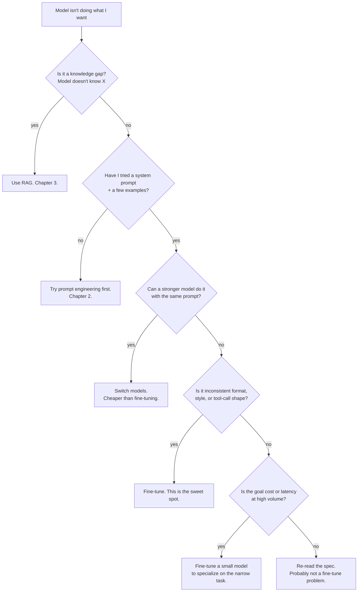

# 1. When to Fine-Tune

Fine-tuning is the most over-prescribed tool in the LLM toolbox. Most "we need to fine-tune" requests are either a knowledge problem (RAG), a prompting problem, or a model-selection problem. Walk through the decision tree before you book any GPU time.

## The decision tree



The hierarchy is **knowledge > prompting > model > fine-tune**. Every step up is roughly 10x more expensive in engineering time than the step below it. Spend the time at the cheap step before escalating.

## The "behavior vs. knowledge" rule, re-stated

[Chapter 3 §1](../embeddings-and-rag/why-rag) put it in a table. The short version, internalized:

- **Knowledge problem**: the model doesn't have the facts. → RAG. Indexing is hours, updates are minutes, citations come for free.
- **Behavior problem**: the model has the facts but produces them in the wrong shape, tone, or with the wrong reliability. → Prompt engineering, then fine-tuning if prompting can't get there.

Fine-tuning *can* embed knowledge, but lossily and unauditably — the facts are entangled in billions of weights, you can't update one of them without re-training, and the model can't cite where it learned them. RAG is strictly better for facts.

## Where fine-tuning actually wins

| Task type | Fine-tune helps because... |
|---|---|
| Style / tone / persona | Behavior is consistent across the entire output distribution, not just the first sentence. |
| Output format compliance | Schema-constrained generation handles JSON; fine-tuning handles weirder formats (custom DSLs, structured prose, fixed templates). |
| Narrow classification | A fine-tuned 3B can match a frontier model on a specific task at <1% of the inference cost. |
| Tool-use format compliance | If your tool protocol is unusual (custom JSON shapes, project-specific function signatures), fine-tuning bakes the format in. See [Chapter 2 §6](../llm-apis-and-prompts/tool-use). |
| Refusal-policy adjustment | Some legitimate domains (security research, medical, legal) trip refusals on stock models; fine-tuning shifts the boundary. See [Chapter 2 §9](../llm-apis-and-prompts/failure-modes). |
| Domain reasoning style | Legal-memo voice, doctor's-note voice, internal-Slack voice. Hard to capture in a prompt; easy to learn from 500 examples. |

## Where fine-tuning loses

| Task type | Fine-tune fails because... |
|---|---|
| Open-domain knowledge QA | Facts go stale; you can't cite; updates require re-training. RAG wins. |
| Freshness | A model fine-tuned in March is wrong about April. Re-fine-tuning is expensive; re-indexing isn't. |
| General reasoning | If the base model can't reason about your domain at all, no amount of SFT will produce real capability — you're trying to teach the violin to a fish. Pick a stronger base model. |
| Tasks with <100 good examples | Overfit risk dwarfs any signal. |
| You don't have an eval set | You won't know if fine-tuning helped, hurt, or did nothing. Build the eval first. |

## The cost trade-off

Fine-tuning has fixed up-front cost (training compute + engineering time) and ~free per inference if you self-host. Frontier-API inference has near-zero up-front cost and per-request cost forever. The break-even is roughly:

```
fine-tune cost per month  ≈  training amortization + GPU hours for serving + eng time
frontier API cost per month  ≈  requests × (input + output) × per-token price
```

A real-world rule of thumb: **at ~1M+ requests per month on a narrow task**, a fine-tuned small open model (3B, 7B) usually beats a frontier API on total cost. Below that, the engineering time isn't paid back. Above it, fine-tuning wins decisively.

This is also why **vertical SaaS** companies fine-tune and consumer chat apps usually don't: vertical SaaS has a narrow, high-volume task; consumer chat apps have an open task where frontier-model breadth still matters.

## When you should NOT fine-tune

A short list of "stop and reconsider" signs:

- **You have fewer than 100 high-quality labeled examples.** The model will memorize them, not generalize.
- **The goal is freshness or factual coverage.** That's RAG.
- **You don't have a held-out eval set.** Build the eval first; otherwise "did fine-tuning help?" is unanswerable.
- **You can't ship the model anywhere yet** (no inference infra, no GPU budget, no serving plan). Fine-tuning produces a model artifact; if you have nowhere to serve it, the artifact is decoration.
- **Prompting + a stronger base model gets you 90% of the way.** That last 10% is rarely worth a multi-week fine-tuning project.

## Forward link

If after this you still want to fine-tune — good. The next page covers the algorithm that makes it cheap enough to do on consumer hardware: LoRA and its 4-bit cousin QLoRA.

Next: [LoRA & QLoRA →](./lora-and-qlora)
