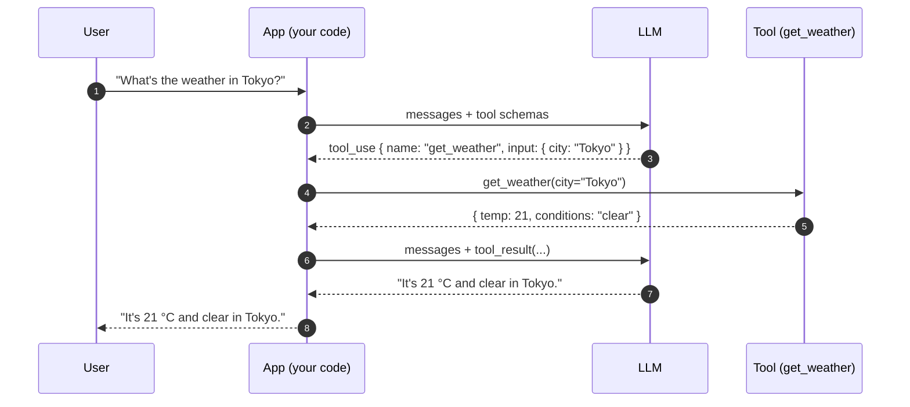
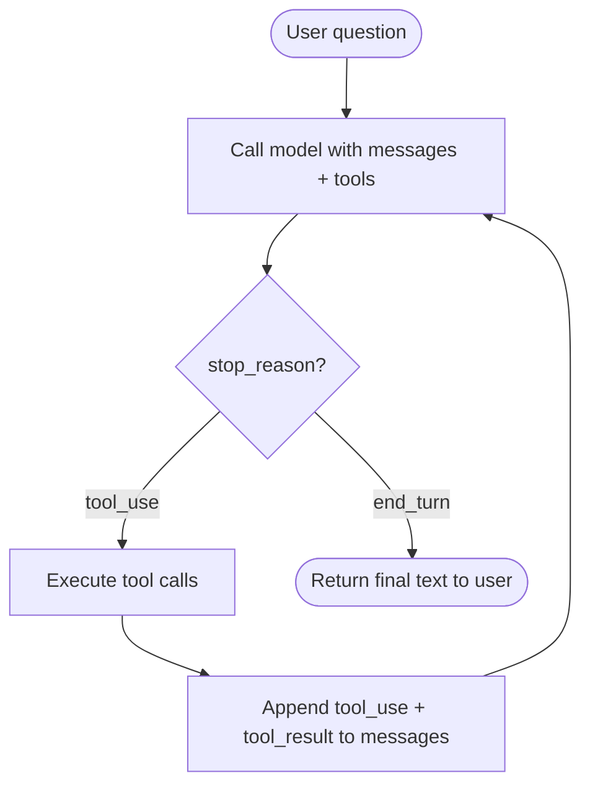

# 6. Function Calling / Tool Use

A model that only emits text is sealed off from the world. It cannot read your database, hit your API, run a calculator, or check the current time. Tool use — also called function calling — is the protocol by which you let the model interact with code you control.

This section sets up Chapter 4 (Agents). Pay attention.

## The Protocol

Tool use is a turn-based dance:

1. You declare a set of tools (functions) along with their input schemas.
2. The model, when it decides it needs one, emits a structured `tool_use` block: "I want to call `get_weather` with `{"city": "Tokyo"}`."
3. **You** — your code, not the model — execute that function with those arguments.
4. You append the function's result to the messages array as a `tool_result` message.
5. You call the model again with the updated messages.
6. The model continues, either calling another tool or producing a final text answer.

The model never executes anything itself. It only proposes calls. **Your client is the one with hands.**

## One Full Lifecycle

A tool that returns the current weather for a city.

```python
import json
import anthropic

client = anthropic.Anthropic()

# 1. Declare the tool.
tools = [{
    "name": "get_weather",
    "description": "Get the current weather for a city.",
    "input_schema": {
        "type": "object",
        "properties": {
            "city": {"type": "string", "description": "City name, e.g. 'Tokyo'"},
            "unit": {"type": "string", "enum": ["c", "f"], "default": "c"},
        },
        "required": ["city"],
    },
}]

# 2. The actual function the tool resolves to (model never sees this).
def get_weather(city: str, unit: str = "c") -> dict:
    # Pretend this hits an API.
    return {"city": city, "unit": unit, "temp": 21, "conditions": "clear"}

# 3. First call — user asks a question.
messages = [
    {"role": "user", "content": "What's the weather in Tokyo right now?"},
]

resp = client.messages.create(
    model="claude-sonnet-4-6",
    max_tokens=512,
    tools=tools,
    messages=messages,
)

# 4. Inspect the response. If stop_reason == "tool_use", we have work to do.
print(resp.stop_reason)  # "tool_use"
for block in resp.content:
    if block.type == "tool_use":
        print(block.name, block.input)
        # -> "get_weather" {"city": "Tokyo"}
```

At this point your messages array, conceptually, looks like this:

```python
[
    {"role": "user",      "content": "What's the weather in Tokyo right now?"},
    {"role": "assistant", "content": [
        {"type": "tool_use", "id": "toolu_01ABC", "name": "get_weather",
         "input": {"city": "Tokyo"}},
    ]},
]
```

Now you execute the tool and feed the result back:

```python
# 5. Append the assistant's tool_use to history (replaying it next call).
messages.append({"role": "assistant", "content": resp.content})

# 6. Execute the tool yourself.
tool_use = next(b for b in resp.content if b.type == "tool_use")
result = get_weather(**tool_use.input)

# 7. Append the result as a tool_result message.
messages.append({
    "role": "user",
    "content": [{
        "type": "tool_result",
        "tool_use_id": tool_use.id,
        "content": json.dumps(result),
    }],
})

# 8. Call the model again. It now has the result and produces a final answer.
final = client.messages.create(
    model="claude-sonnet-4-6",
    max_tokens=512,
    tools=tools,
    messages=messages,
)
print(final.content[0].text)
# -> "It's currently 21 °C and clear in Tokyo."
```

The full messages array at the end:

```python
[
    {"role": "user",      "content": "What's the weather in Tokyo right now?"},
    {"role": "assistant", "content": [TextBlock?, ToolUseBlock("get_weather", {city: "Tokyo"})]},
    {"role": "user",      "content": [ToolResultBlock(tool_use_id, '{"temp": 21, ...}')]},
    {"role": "assistant", "content": "It's currently 21 °C and clear in Tokyo."},
]
```

Two model calls. One tool execution in between. The model never touched your weather API — your code did, and the model just got the JSON back.

## The Lifecycle as a Sequence Diagram



Every arrow is data on the wire (or a function call in your process). The model sits passive in the middle — it cannot reach across the diagram on its own. It can only propose tool calls and the app dispatches them.

## From One Call to a Loop

What if the model wants to call a second tool after seeing the first result? It just emits another `tool_use` block. What if it wants to call three tools in parallel? Some providers support that natively (the response contains multiple `tool_use` blocks). What if it wants to keep going until the task is done?

You wrap the whole thing in a `while` loop:



That is an agent.

An agent is just a while-loop around the tool-use protocol. The model proposes tool calls, your code executes them, the results go back into the messages array, and you iterate until the model says "I'm done" (`stop_reason: "end_turn"`) or you hit a safety budget (max iterations, max wall time, max cost).

We'll go deep on agents — orchestration patterns, parallelism, error recovery, planning loops, multi-agent systems — in **Chapter 4**. The protocol you just learned is the entire foundation. Everything else is engineering on top.

Next: [Streaming →](./streaming)
