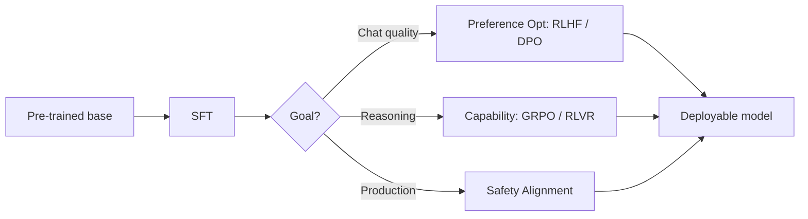

# 1. The Post-Training Landscape

From pre-training to deployment at a glance.

## Definition and boundaries of post-training

Post-training refers to all techniques that give a model specific capabilities through additional training steps after pre-training is complete. Pre-training teaches the model "what language is"; post-training teaches it "how to use language."

A common misconception is equating post-training with "fine-tuning." In reality, fine-tuning is just a subset of post-training. Modern post-training is a multi-stage, composable technology stack where different stages solve different problems.

## The four-stage modular stack

The industry's post-training pipeline has matured into a relatively standard modular architecture:

| Stage | Goal | Typical Methods | Problem Solved |
| --- | --- | --- | --- |
| Supervised Fine-Tuning (SFT) | Instruction following | Instruction data + supervised training | Model can't hold conversations or follow formats |
| Preference Optimization | Value alignment | RLHF / DPO / KTO | Inconsistent response quality, misaligned with human preferences |
| Capability Enhancement | Reasoning & planning | GRPO / RLVR | Weak at deep thinking, fragile reasoning chains |
| Safety Alignment | Harmlessness & controllability | Red-teaming + safety RLHF + rule constraints | Model may generate harmful, false, or biased content |

These four stages don't all need to be executed, nor do they have to follow a strict order. A lightweight chat assistant might only need SFT + DPO; a reasoning model might need SFT + GRPO + Safety Alignment. Which modules to pick and how to combine them depends on your goals.

## Why post-training determines the final user experience

InstructGPT's experiments produced a stunning number: a post-trained 1.3B parameter model outperformed the un-post-trained 175B parameter GPT-3 in human evaluations. This shows that the marginal returns of post-training far exceed simply scaling up pre-training.

By 2025-2026, the industry consensus has shifted from "who has the bigger model" to "who has better post-training." DeepSeek-R1 used GRPO to train reasoning capabilities approaching o1-level, and Meta's Llama series has focused core improvements on post-training in every generation.

> **Checkpoint**: Can you name what problem each of the four post-training stages solves? If not, go back and review the table above.

Next: [Supervised Fine-Tuning (SFT)](./sft)
