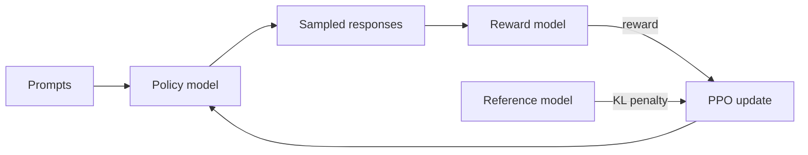

# 3. RLHF

Training models with human preferences.

## The ceiling of SFT

[SFT](./sft) can teach a model to converse, but it has a fundamental limitation: for the same question, there may be multiple answers of varying quality, and SFT can only teach the model to imitate the "example answer" -- it can't tell the model "this answer is better than that one."

RLHF (Reinforcement Learning from Human Feedback) introduces the dimension of "comparison" -- rather than showing the model the correct answer, human annotators rank multiple responses, and reinforcement learning trains the model to generate responses that "humans prefer."

## InstructGPT's three-stage method

OpenAI's 2022 InstructGPT paper established the industrial foundation for RLHF. Its three-stage pipeline remains the best starting point for understanding post-training:

**Stage 1: SFT**. Fine-tune GPT-3 with approximately 13,000 human-written, high-quality instruction-response data points.

**Stage 2: Train a Reward Model (RM)**. Have the model generate multiple responses to the same question, then have human annotators rank them. Use the ranking data to train a reward model whose output is a scalar score representing "how good this answer is."

**Stage 3: PPO Optimization**. Treat the reward model as the "environment" and use PPO (Proximal Policy Optimization) to make the language model generate higher-reward responses. A KL divergence penalty prevents the model from drifting too far.



## The core mechanism of PPO

PPO is the most commonly used reinforcement learning algorithm in RLHF. Its core idea is "small-step updates": each time the policy is updated, the gap between the old and new policies is constrained to avoid catastrophic large shifts.

PPO-CLIP's objective function achieves this by clipping the probability ratio: when the new policy's change relative to the old policy exceeds a threshold (typically epsilon=0.2), the gradient is truncated. This makes the training process much more stable.

```
ratio_t        = pi_new(a_t | s_t) / pi_old(a_t | s_t)
clipped_ratio  = clip(ratio_t, 1 - epsilon, 1 + epsilon)
L_PPO          = -E[ min(ratio_t * A_t, clipped_ratio * A_t) ]

Total objective (RLHF):
L = L_PPO  -  beta * KL(pi_new || pi_ref)
```

The KL term is what keeps the post-trained model from forgetting how to write coherent text -- it stays close to the SFT reference.

## Engineering challenges of RLHF

RLHF is elegant in theory but extremely difficult in engineering practice:

- **Multiple models running simultaneously**: The language model, reward model, reference model, and value network demand massive GPU memory
- **Training instability**: Biases in the reward model get amplified by the RL process, leading to "Reward Hacking" -- the model finds high-reward but low-quality shortcuts
- **Hyperparameter sensitivity**: KL penalty coefficient, learning rate, sampling temperature, and other parameters require careful tuning
- **High annotation costs**: High-quality preference ranking data requires trained annotators

These challenges gave rise to simpler methods, like [DPO](./dpo).

> **Checkpoint**: What is the role of the reward model? What happens if the reward model itself is inaccurate?

Next: [DPO and Its Variants](./dpo)
