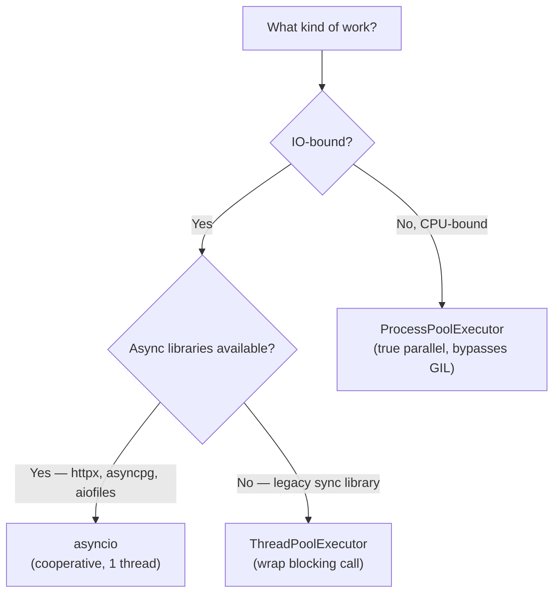

# 4. Concurrency

Chapter 3 showed you `async`/`await` syntax. This chapter explains *why* Python's concurrency model looks the way it does — and how to pick the right tool for each job.

The confusion for TS developers: Python has three concurrency primitives (`asyncio`, `threading`, `multiprocessing`), and the right choice depends on *what kind of work* you're doing. In Node.js you almost never need to think about this — the event loop handles IO, Worker Threads handle CPU, and that's mostly it. Python makes the same distinction, but exposes all three layers to you directly.

## 4.1 The Decision Tree

Before diving into mechanics, here is the rule you will apply every time:



## 4.2 GIL — The Root Cause

CPython (the reference Python interpreter) manages memory with reference counting: every object tracks how many places hold a reference to it; when the count hits zero, the object is freed.

If two threads modified the same object's reference count simultaneously, the count could corrupt — causing leaks or crashes. Two fixes exist:

1. **Fine-grained per-object locks** — safe, but enormous overhead on every attribute access.
2. **One big lock around the interpreter** — the Global Interpreter Lock (GIL). Simple, single-threaded performance stays excellent.

CPython chose option 2. The consequence:

```
Thread A executing Python bytecode ──────────────────────► runs
Thread B waiting for GIL           ── blocked by GIL ────► waiting

When Thread A hits a network/disk wait:
  Thread A releases GIL, suspends waiting for IO
  Thread B acquires GIL, executes Python code
  Thread A resumes after IO, re-acquires GIL when Thread B yields
```

**What this means in practice:**

| Workload | GIL impact |
|----------|------------|
| IO-bound (network, disk, DB) | Minimal — threads release GIL while waiting |
| CPU-bound (pure Python math/parsing) | Severe — threads can't run Python in parallel |
| C extension work (NumPy, PyTorch) | Usually fine — C code releases GIL during compute |

## 4.3 asyncio — The Event Loop

`asyncio` is the closest thing Python has to Node.js's event loop. It runs on a single thread using *cooperative* scheduling: a coroutine voluntarily hands back control at every `await` point, letting other coroutines run.

```python
import asyncio
import httpx

async def fetch(client: httpx.AsyncClient, url: str) -> str:
    response = await client.get(url)  # yields here — other coroutines run
    return response.text

async def main() -> None:
    urls = ["https://httpbin.org/delay/1"] * 5

    async with httpx.AsyncClient() as client:
        # asyncio.gather runs all 5 concurrently — total ~1 s, not ~5 s
        results = await asyncio.gather(*[fetch(client, url) for url in urls])

    print(f"Got {len(results)} responses")

asyncio.run(main())  # starts the event loop; equivalent of Node's implicit startup
```

**asyncio vs Node.js:**

| | Node.js | Python asyncio |
|--|---------|---------------|
| Start | Event loop always running | `asyncio.run()` required |
| Async function | `async function` → returns `Promise` | `async def` → returns coroutine |
| Run concurrently | `Promise.all([...])` | `asyncio.gather(...)` |
| Race | `Promise.race([...])` | `asyncio.wait(..., return_when=FIRST_COMPLETED)` |
| Background task | fire-and-forget `someAsync()` | `asyncio.create_task(coro())` |
| Timeout | `AbortController` / `Promise.race` | `asyncio.wait_for(coro(), timeout=5)` |

```python
# Background tasks — equivalent of fire-and-forget in Node.js
async def main() -> None:
    task = asyncio.create_task(slow_operation())  # starts immediately, doesn't block
    
    await asyncio.sleep(0)   # yield once so the task can start
    print("doing other work")
    
    result = await task      # wait for it when you need the result
```

**The sync/async boundary:**

You cannot call `await` outside an `async` function. `asyncio.run()` is the one bridge from synchronous code into the async world.

```python
# Wrong — calling an async function from sync context returns a coroutine object, not the result
result = fetch_user("1")           # coroutine object — nothing has run yet!

# Right — top-level entry point
result = asyncio.run(fetch_user("1"))

# Right — inside async context, always await
async def handler():
    result = await fetch_user("1")
```

## 4.4 threading — IO Parallelism With Sync Libraries

`threading` creates OS threads. Because of the GIL they can't execute Python bytecode in parallel, but the GIL *is released* during IO waits — so multiple threads waiting on the network run concurrently just fine.

Use threads when you need to call synchronous (non-async) libraries in parallel.

```python
from concurrent.futures import ThreadPoolExecutor
import httpx  # synchronous client

def fetch_sync(url: str) -> str:
    return httpx.get(url).text   # blocks this thread; GIL released during network wait

urls = ["https://httpbin.org/delay/1"] * 5

with ThreadPoolExecutor(max_workers=5) as pool:
    results = list(pool.map(fetch_sync, urls))  # ~1 s total, not ~5 s
```

`ThreadPoolExecutor` is the high-level API. Behind it, Python manages a pool of threads and feeds work items to them. Avoid spawning raw `threading.Thread` objects unless you need fine-grained control.

## 4.5 multiprocessing — True CPU Parallelism

`multiprocessing` spawns separate OS processes. Each has its own Python interpreter and its own GIL, so they can execute Python on separate CPU cores simultaneously. This is the only way to get true CPU parallelism in CPython today.

```python
from concurrent.futures import ProcessPoolExecutor
import os

def cpu_heavy(n: int) -> int:
    return sum(i * i for i in range(n))   # pure Python computation

chunks = [5_000_000] * os.cpu_count()

with ProcessPoolExecutor() as pool:
    results = list(pool.map(cpu_heavy, chunks))
```

**Costs you need to know:**

- Spawning a process takes ~100 ms — always use a pool, never spawn one process per task.
- Arguments and return values cross process boundaries via serialization (pickle). Objects must be picklable.
- Lambdas and locally-defined functions are **not** picklable — use module-level functions.

```python
# Wrong — lambda is not picklable
with ProcessPoolExecutor() as pool:
    results = pool.map(lambda x: x * 2, data)  # PicklingError!

# Right — top-level function
def double(x: int) -> int:
    return x * 2

with ProcessPoolExecutor() as pool:
    results = list(pool.map(double, data))
```

## 4.6 Bridging sync and async

A common situation: you're in an `async` function and need to call a blocking synchronous library without freezing the event loop.

```python
import asyncio
from concurrent.futures import ThreadPoolExecutor

_executor = ThreadPoolExecutor()

async def call_blocking_lib(arg: str) -> str:
    loop = asyncio.get_event_loop()
    # run_in_executor offloads the call to the thread pool
    # so the event loop stays responsive
    result = await loop.run_in_executor(_executor, blocking_library_call, arg)
    return result
```

Going the other direction — calling async code from sync — use `asyncio.run()`:

```python
def sync_entry_point() -> None:
    result = asyncio.run(async_function())   # blocks until done
```

## 4.7 Quick Reference

| | asyncio | ThreadPoolExecutor | ProcessPoolExecutor |
|--|---------|-------------------|---------------------|
| Parallelism | Cooperative (1 thread) | OS-scheduled (GIL limits Python code) | True parallel (N processes) |
| Best for | IO with async libraries | IO with sync/blocking libraries | CPU-bound computation |
| Startup overhead | Negligible | Low | High (~100 ms per process) |
| Shared state | Trivial (same thread) | Use `threading.Lock` | Needs IPC (`Queue`, pipes) |
| Pickling required | No | No | Yes (args + return values) |

## 4.8 Free-threaded Python (3.13+)

Python 3.13 (October 2024) shipped an experimental "free-threaded" build — CPython compiled without the GIL (PEP 703). Python 3.14 (October 2025) promoted it to officially supported, though still opt-in rather than the default.

In practice, production deployments still run with the GIL. The ecosystem (NumPy, Cython, extension modules) is adapting, but incompatibilities remain. A few years from now, `ThreadPoolExecutor` may genuinely give you CPU parallelism without `multiprocessing`. Until then, the decision tree in §4.1 still applies.

---

Next: [Modules & Standard Library →](./modules-and-stdlib)
