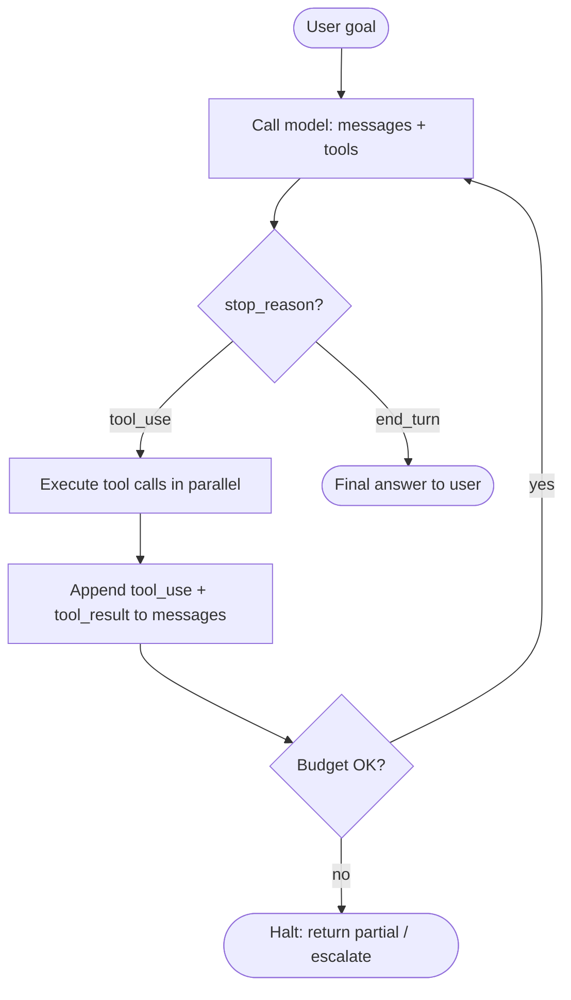

# Agent、工具调用与编排

[第 2 章 §6](../llm-apis-and-prompts/tool-use) 在结尾给过一个一句话定义：Agent 就是套在 tool use 协议外面的一个 `while` 循环。模型提议调用，你的代码执行调用，结果回写到 messages 数组里，然后一直迭代，直到模型说"我做完了"或者你撞到预算上限。

[第 3 章](../embeddings-and-rag) 里，开车的是应用本身。**你的代码**决定什么时候检索、检索什么、什么时候停。模型只消费你递过去的内容。这叫 **被动检索（passive retrieval）**。

本章把驾驶位换了人。模型决定调用哪个工具、传什么参数、什么时候算结束。你提供工具、预算和可观测性；模型提供控制流。

整章变化就这一句话。剩下的全是工程问题。

## 标准 Agent 循环

这张图上的每个方框，对应后面八个小节里的一个。循环本身是 §1。循环派发的工具是 §2。模型选择工具的几种模式是 §3。并行和子 Agent 是 §4。messages 数组作为内存是 §5。给循环把关的预算是 §6。要不要把这一切包进框架是 §7。怎么判断你最终做出来的 Agent 到底好不好是 §8。

## 什么算"Agent"，什么不算

| 模式 | 谁来开车 | 工具调用次数 | 算 Agent 吗？ |
|---|---|---|---|
| 普通 chat completion | 应用 | 0 | 不算 |
| RAG（第 3 章） | 应用 | 0（检索在你的代码里） | 不算 |
| 单次 tool use | 模型挑 1 个工具 | 1 | 边缘；有人叫这"tool use"而不是"agent" |
| 循环到 `end_turn` | 模型 | N | 算——这是最低门槛 |
| 规划 + 执行 + 子 Agent | 模型 + 子模型 | N + 委派 | 算 |

业界用"agent"这个词很随意。技术上的门槛是：**模型在循环里，由它决定下一步动作。** 低于这个门槛的是 pipeline；达到或高于这个门槛的才是 agent。

## 学完本章你能做什么

- 用纯 Python 不依赖任何框架写一个能跑的 ~100 行 Agent 循环。
- 设计模型真正能用的 tool schema、描述和错误返回。
- 给一个具体任务挑对控制模式（single-shot、ReAct、plan-and-execute）。
- 让工具并行执行，把任务拆给子 Agent 而不污染上下文。
- 管理长时间运行 Agent 的内存：working memory、scratchpad、摘要。
- 用 `max_iterations`、成本上限、wall-time 上限给每个循环设边界，并检测震荡。
- 判断什么时候框架能帮你，什么时候只是在给你套上锁。
- 从任务成功率、轨迹质量、预算合规度三个维度评估 Agent，而不是只看最终答案对不对。

## 本章结构

1. [Agent 循环](./the-agent-loop) —— 最小可运行的 ~100 行实现；后面所有内容的引擎。
2. [工具设计](./tool-design) —— 命名、schema、错误返回、副作用、最小权限。
3. [规划与控制](./planning-and-control) —— single-shot、ReAct、plan-and-execute、自我纠错。
4. [并行工具与子 Agent](./parallel-and-subagents) —— `asyncio.gather`、`Task` 风格的委派、什么时候该 spawn。
5. [内存与状态](./memory-and-state) —— messages 数组作为 working memory、scratchpad、摘要、上下文预算。
6. [安全与预算](./safety-budgets) —— 迭代次数 / 成本 / 时间上限、被 prompt 注入的工具输出、人审环节。
7. [框架生态](./frameworks) —— 三个具名框架，不做对比表。
8. [Agent 评估](./evaluating-agents) —— 任务成功率、轨迹质量、预算合规度、回归集。

下一节: [Agent 循环 →](./the-agent-loop)
