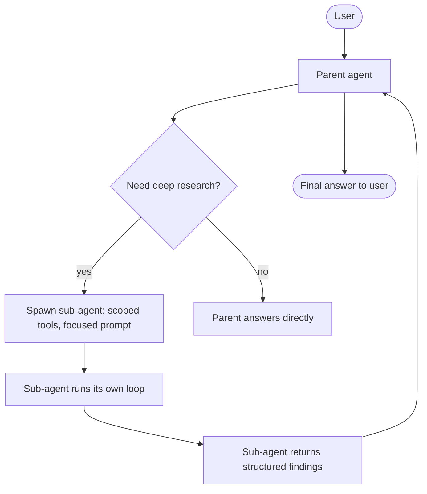

# 4. 并行工具与子 Agent

让 Agent 跑得更快或更聚焦的两条路：让相互独立的工具并发执行；或者把一块工作委派给一个有自己上下文的子 Agent。这两件事经常被混淆。它们解决的是不同的问题。

## 并行工具调用

现代 API（Anthropic、OpenAI、Gemini）都允许模型在同一个 assistant turn 里发出**多个** `tool_use` 块。我们在 [§1](./the-agent-loop) 的执行轨迹里见过：对一个明显可并行的 query，模型在同一轮里同时发出了 `get_time` 和 `search_kb`。

§1 里的最小循环是串行派发这些工具的。要真正利用并行性，就得让工具派发并发跑。用 `anyio` / `asyncio` 异步：

```python
import asyncio
import json

async def dispatch_one(block, dispatch):
    fn = dispatch.get(block.name)
    try:
        if fn is None:
            raise ValueError(f"unknown tool: {block.name}")
        # asyncio.to_thread runs sync tools off the event loop;
        # for native-async tools, just `await fn(**block.input)`.
        result = await asyncio.to_thread(fn, **block.input)
        return {"type": "tool_result", "tool_use_id": block.id,
                "content": json.dumps(result)}
    except Exception as e:
        return {"type": "tool_result", "tool_use_id": block.id,
                "content": f"{type(e).__name__}: {e}", "is_error": True}

async def dispatch_all(blocks, dispatch):
    tool_uses = [b for b in blocks if b.type == "tool_use"]
    return await asyncio.gather(*(dispatch_one(b, dispatch) for b in tool_uses))
```

这样，模型在同一轮里发出的五个工具调用，五个就一起跑。墙上时钟的耗时是 `max(t_i)`，不是 `sum(t_i)`。

**什么时候并行能赢：** 互相独立的读（搜 3 个不同的 KB、打 2 个不同的 API、抓 4 份不相关的文档）。无共享状态的幂等读。这种情况下模型通常自己就能想到要并行——不需要专门提示。

**什么时候并行帮不了忙（甚至帮倒忙）：**

- **顺序依赖。** "先找到这个用户的 manager，再去查 manager 的日历。" 第二个调用需要第一个的结果。别硬上并行。
- **资源竞争。** 8 个工具调用都打同一个限速 API，并行只是把限速错误提前。
- **顺序敏感的写操作。** 同一行上两个并发的 `update_user(...)` 会 race。并行的写工具通常就是 bug——见 [§2 规则 4](./tool-design)。

一个务实的上限：哪怕模型发出更多，也把并发限制在 ~4–8 之内。`asyncio.Semaphore` 就够用了。

## 子 Agent：为什么、什么时候

子 Agent 是单独实例化的一个 Agent——有自己的 messages 数组、自己（通常更窄）的工具集、自己的 `max_iterations` 上限——父 Agent 通过一次工具调用把任务派发给它。子 Agent 完成自己的工作，返回一个结构化结果，**它的消息历史不会污染父 Agent 的上下文**。

最后这一点就是子 Agent 存在的全部理由。看一眼没有子 Agent 的时候父 Agent 的上下文预算会变成什么样：

```
parent transcript = system + tools + user_goal
                  + research_step_1 (search_kb call + 8KB of chunks)
                  + research_step_2 (search_kb call + 6KB of chunks)
                  + research_step_3 (read_url call + 40KB of fetched HTML)
                  + research_step_4 (search_kb call + 7KB of chunks)
                  + ... 8 more steps ...
                  + final synthesis call    <- sees 200KB of intermediate junk
```

每轮迭代都把这一切重放一遍。到第 12 步时，父 Agent 每轮都在为 200KB 的中间垃圾付输入费——其中绝大多数它根本不需要再看一眼。模型也会被分散注意力（"lost in the middle"——[第 0 章 §5](../how-llms-work/context-window)）。

有了子 Agent：

```
parent transcript = system + tools + user_goal
                  + tool_use(delegate_research, {topic: "...", scope: "..."})
                  + tool_result("Findings: 1) ... 2) ... 3) ...")  <- 2KB summary
                  + final synthesis call    <- sees 2KB, not 200KB
```

那 200KB 活在子 Agent 的对话记录里，子 Agent 一返回就被回收了。



## 子 Agent 契约

子 Agent 本质上就是一个有这种签名的内部函数：

```python
def run_sub_agent(prompt: str, scoped_tools: list[dict]) -> dict:
    """Run a focused sub-task. Return a structured result."""
```

对父 Agent 而言，它就是一个工具。父 Agent 调它，看到一条 `tool_result`（结构化的发现），然后继续。子 Agent 内部的轨迹——可能几十次工具调用、几百 KB 的中间文本——对父 Agent 是不可见的。

**父 Agent 传给子 Agent 的：**
- 一段聚焦的提示词（最多一段话）：子 Agent 要完成什么、范围是什么、不在范围内的是什么。
- 一组收窄的工具集——通常是父 Agent 工具的严格子集，偶尔会多加一两个细分工具。
- 一个预算（`max_iterations`，可选地加成本上限）。

**子 Agent 返回的：**
- 一个结构化结果（Pydantic 或 schema 约束的工具调用）。**不要**返回原始对话记录的 dump。
- 可选的 `confidence` 或 `unresolved_questions` 列表，让父 Agent 决定要不要重新派发或上交人审。

## 一个走完整的例子：父 Agent + 研究子 Agent

```python
# subagent.py
import json
from pydantic import BaseModel
import anthropic

client = anthropic.Anthropic()

class ResearchFindings(BaseModel):
    summary: str               # 2-4 sentence answer
    key_facts: list[str]       # 3-7 bullet facts with implicit citations
    unresolved: list[str] = [] # questions that couldn't be answered

# Sub-agent's tools — narrow, just what's needed for research.
SUBAGENT_TOOLS = [
    {"name": "search_kb", "description": "...", "input_schema": {...}},
    {
        "name": "submit_findings",
        "description": "Submit structured research findings. Call this when done.",
        "input_schema": ResearchFindings.model_json_schema(),
    },
]

def run_research_subagent(topic: str, scope: str, max_iter: int = 6) -> dict:
    """Focused research sub-agent. Returns a ResearchFindings dict."""
    sys_prompt = (
        "You are a focused research sub-agent. Your job: research a single "
        "topic deeply, then call `submit_findings` with structured results. "
        "Do not hedge; call submit_findings as soon as you have enough."
    )
    messages = [{
        "role": "user",
        "content": f"Topic: {topic}\nScope: {scope}\n\nResearch and submit findings."
    }]

    for _ in range(max_iter):
        resp = client.messages.create(
            model="claude-sonnet-4-6", max_tokens=2048,
            system=sys_prompt, tools=SUBAGENT_TOOLS, messages=messages,
        )
        messages.append({"role": "assistant", "content": resp.content})

        # Has the sub-agent submitted final findings?
        for b in resp.content:
            if b.type == "tool_use" and b.name == "submit_findings":
                return ResearchFindings.model_validate(b.input).model_dump()

        # Otherwise dispatch search_kb (or other narrow tools), feed results back.
        tool_results = []
        for b in resp.content:
            if b.type != "tool_use":
                continue
            # ... dispatch search_kb here, append results ...
        messages.append({"role": "user", "content": tool_results})

    return {"summary": "[sub-agent budget exhausted]", "key_facts": [], "unresolved": [topic]}


# Parent's tool — to the parent, the sub-agent IS just a tool.
PARENT_TOOLS = [
    {
        "name": "delegate_research",
        "description": (
            "Delegate a focused research task to a sub-agent. Use for any topic "
            "that needs more than 1-2 KB searches to nail down. The sub-agent "
            "will return structured findings without polluting your context."
        ),
        "input_schema": {
            "type": "object",
            "properties": {
                "topic": {"type": "string", "description": "What to research, 5-15 words."},
                "scope": {"type": "string", "description": "What's in/out of scope."},
            },
            "required": ["topic", "scope"],
        },
    },
    # ... other parent tools ...
]

# In the parent's dispatch:
def dispatch_parent_tool(name, args):
    if name == "delegate_research":
        return run_research_subagent(args["topic"], args["scope"])
    # ... other tools ...
```

父 Agent 的循环结构和 [§1](./the-agent-loop) 没有区别。它只不过有一个工具，这个工具的实现刚好会启动另一个 Agent。这种组合在原理上是递归的——子 Agent 可以再启动一个子-子 Agent——但实际工作里要克制住。

## 并行工具调用 vs. 子 Agent

| | 并行工具调用 | 子 Agent |
|---|---|---|
| 并行的是什么 | 同**一**个模型 turn 里互相独立的工具执行 | 一整个带自己循环的子任务 |
| 对父 Agent 上下文的影响 | 完整工具结果落进父 Agent 的对话记录 | 只有结构化摘要落进来 |
| 用错的时候 | 顺序依赖；写操作；限速 API | 不到 3 次工具调用的任务（开销 > 收益） |
| 失败隔离 | 单个工具的错误返回 | 整个子 Agent 有自己的预算和退出 |
| 延迟收益 | 缩短一次往返 | 缩短一个**任务**（同时避免上下文膨胀） |
| 正确性收益 | 没有 | 子 Agent 保持聚焦；父 Agent 保持干净 |

## 别搞分形

多 Agent 架构图看着气派。2026 年绝大多数生产环境里的"多 Agent 系统"是 1 个主 Agent + 1–3 个子 Agent，就这样。有些甚至是 1 个主 + 1 个子。一个 swarm 里第 5 个 Agent 的边际价值约等于零，但调试成本是陡峭的非线性。

针对过度 Agent 化有两个特定的失败模式：

- **子 Agent 自己抖。** 一个研究子 Agent 重新跑了一遍父 Agent 已经做过的 KB 搜索，因为父 Agent 没把已知的内容告诉它。
- **协调死锁。** 两个对等 Agent 互相等对方的信号。（不要建对等 Agent。永远保持清晰的父-子层级。）

如果你在考虑一个系统里超过两层、或者超过四个 Agent，正确的动作几乎一定是**拍扁**：一个父 Agent，一小撮聚焦的子 Agent，每个都有窄工具集和紧预算。

下一节: [内存与状态 →](./memory-and-state)
