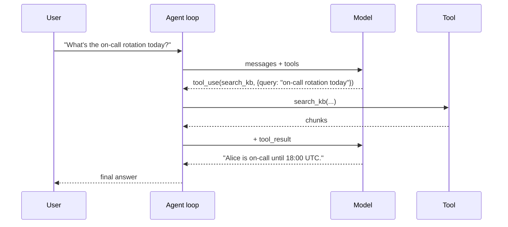
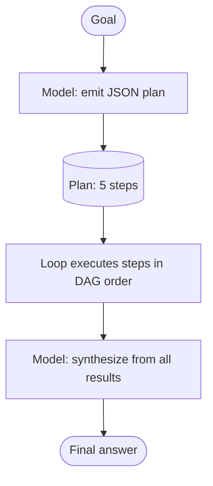

# 3. 规划与控制模式

[§1](./the-agent-loop) 里的循环不关心模型**怎么**挑工具——它只是把模型发出的工具调用派发出去。但要求模型在工具调用之间怎么思考，会大幅改变它的行为。三种模式覆盖了几乎所有真实 agent。

先把结论摆在前面：**优先用最简单且能跑通的那个模式。** Anthropic 的 *Building effective agents* 一文说得直白——大多数生产环境里的"agent"，其实就是 single-shot tool use 加一两次重试。瓶颈很少在编排复杂度上；瓶颈在工具设计和 prompt 质量上。

## 模式 1：Single-shot tool use

最简单的情况：模型决定调一次工具，拿到结果，给出最终答案。两次模型调用，一次工具执行。



**什么时候用：** 任何能干净地走单工具路径的 query。大多数面向终端用户的助手 80%+ 的流量都在这个模式下。别过度设计。

**成本：** 两次 LLM 调用、一次工具调用、一次往返延迟。能造出来的最便宜的 agent。

## 模式 2：ReAct（Reason + Act）

模型把自然语言推理（"先得拿到 X，再去拿 Y"）和工具调用交错进行。"推理" token 在每个 assistant turn 里以普通文本的形式出现，跟 `tool_use` 块并排。

ReAct 是现代 chat 模型在拿到工具访问后**原生**就会做的事。你不需要专门的 prompt 模板（"Thought:", "Action:", "Observation:"——那是 2022 年原始论文针对老模型的写法）。Claude、GPT-4.1、Gemini 不用任何提示就会交错推理和工具调用。

一段示例对话记录（节选）：

```
[user]      Compare on-call rotation between team-A and team-B for next week.

[assistant] I'll need rotation data for both teams. Let me search.
            tool_use(search_kb, {query: "team-A rotation next week"})

[tool]      Alice (Mon-Wed), Bob (Thu-Sun)

[assistant] Got team-A. Now team-B.
            tool_use(search_kb, {query: "team-B rotation next week"})

[tool]      Carol (Mon-Sun, full week)

[assistant] Both teams retrieved. Team-A is split Alice/Bob; team-B has Carol full
            week. team-B has less context-switching but no backup.
```

**什么时候用：** 需要一连串顺序查询、每一步选择都依赖上一步结果的 query。多数"研究"型任务的默认选择。

**为什么要"交错推理"？** 两个原因。第一，在 tool_use 之前生成推理 token，让模型把计划写下来、做出承诺，经验上能减少选错工具。第二，推理文本在轨迹评估（[§8](./evaluating-agents)）里非常有价值——你能读出模型当时以为自己在做什么。

**成本：** N 次模型调用、N-1 次工具调用（N = 顺序依赖深度）。延迟是它最差的指标：每次工具往返都是串行的。

## 模式 3：Plan-and-Execute

模型先生成一个显式计划（一个 JSON 对象），然后循环按计划逐步执行。适用于回溯成本很高的长程任务——或者你想**在执行之前先把计划展示给用户**（"deep research"和编码 agent 里常见的 UX 模式）。

技巧是用 schema 约束输出（[第 2 章 §5](../llm-apis-and-prompts/structured-output)）来强制把计划塞成结构化形状：

```python
from pydantic import BaseModel
from typing import Literal

class Step(BaseModel):
    id: str
    tool: Literal["search_kb", "get_time", "compute"]
    args: dict
    depends_on: list[str] = []   # IDs of steps that must complete first

class Plan(BaseModel):
    goal: str
    steps: list[Step]

plan_tool = {
    "name": "submit_plan",
    "description": "Submit a plan as a list of steps with dependencies.",
    "input_schema": Plan.model_json_schema(),
}

# First call: force the model to emit a plan via tool_choice.
resp = client.messages.create(
    model="claude-sonnet-4-6",
    max_tokens=2048,
    tools=[plan_tool],
    tool_choice={"type": "tool", "name": "submit_plan"},
    messages=[{"role": "user", "content": user_goal}],
)
plan = Plan.model_validate(next(b for b in resp.content if b.type == "tool_use").input)
```

然后你的循环走一遍计划，按依赖顺序派发步骤（`depends_on` 允许的地方就并行——那是 [§4](./parallel-and-subagents)）。模型只在明确的同步点上被再次调用（"所有结果在这了，现在写最终答案"）。



**什么时候用：** 子任务很多且互相独立（可并行）；用户想在执行前审阅 / 修改计划；你需要预先估算成本。"针对 X 写一份 deep research 报告"——几乎一定要用 plan-and-execute。

**锋利的边角：** 模型可能给出一个糟糕的计划，糟糕的计划会被忠实执行、白白烧掉一堆 token。一定要用 `max_steps` 封顶。一定要允许综合那一步标注"计划没奏效，缺了什么东西"。一定要把**计划质量**和答案质量分开评估。

## 自我纠错：最小有用的模式

除了循环本身，你最常需要的一个控制流是：**当某个工具返回垃圾时，模型重写自己的 query。**

一个跟 RAG（[第 3 章](../embeddings-and-rag)）勾起来的例子。Agent 调 `search_kb`，拿到零个有用的 chunk，决定用不同的 query 重试：

```
[user]      How does our deployment pipeline handle failed health checks?

[assistant] tool_use(search_kb, {query: "deployment pipeline failed health checks"})

[tool]      [] (no chunks above similarity threshold)

[assistant] Empty results. Let me try a more specific query about the
            actual rollback mechanism.
            tool_use(search_kb, {query: "rollback on health check failure runbook"})

[tool]      <chunk id="rb-deploy-12">When health checks fail, the canary is held
            at 5% for 60s, then the deploy is reverted via `kubectl rollout undo`...

[assistant] Found it. When health checks fail, the canary holds at 5% for 60s before
            an automatic `kubectl rollout undo`...
```

让这件事成立的两个关键。第一，工具把空结果**作为数据**返回（一个空的 chunk 列表），而不是抛异常。第二，系统提示词或工具描述里明确告诉模型："如果 `search_kb` 没返回任何 chunk，先用换种说法的 query 重试一次再回答。"这是系统提示词里加一行的事，但经验上能接住很多"第一次尝试就糟"的失败。

同样的模式也处理工具错误（[§2](./tool-design) 规则 3）：错误字符串作为 `tool_result` 内容回写，模型读到，下一轮就调整。不需要任何特殊的控制流——只需要一条写得好的错误消息。

## 三种模式对比

| | Single-shot | ReAct | Plan-and-Execute |
|---|---|---|---|
| 模型调用次数 | 2 | N（串行） | 2 + （综合） |
| 延迟 | 最低 | 最差（串行往返） | 在并行子任务上最好 |
| Token 成本 | 低 | 中（每轮 turn 都重放历史） | 中-高（计划 + 每步 + 综合） |
| 复杂度 | 没有 | 基础循环就够 | 需要一个计划执行器 |
| 错误恢复 | 重新问用户 | 下一轮自我纠错 | 重新规划或重跑失败步骤 |
| 适合场景 | 大多数用户 query | 多步研究、串行依赖 | 长程、可并行、需要让用户审阅 |

## 经验默认值

如果你在写第一个 agent，不确定从哪个模式起步：**默认用基础循环，让模型想干嘛干嘛。** 现代前沿模型在简单任务上会自然落到 single-shot，在不简单时落到 ReAct。你不需要替它做模式选择。

只有在你有具体理由的时候才掏出 plan-and-execute：值得编排的并行子任务；UI 要求先展示计划再执行；要求预估成本上限。

绝大多数生产"agent"就是 single-shot tool use 加一小段自我纠错的提示。别因为架构图看上去很气派就给自己造一个 planner。

下一节: [并行工具与子 Agent →](./parallel-and-subagents)
