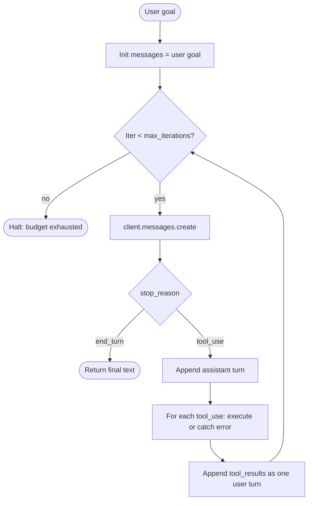

# 1. 最小 Agent 循环

[第 2 章 §6](../llm-apis-and-prompts/tool-use) 里，模型恰好提议了一次工具调用，我们执行了一次。这叫"tool use"。一旦把它放进循环里，让模型自己决定什么时候停，我们就有了一个 Agent。

## 心智模型：把 LLM 当成 reducer

写过 React 应用就用过 `useReducer`。reducer 是一个纯函数 `(state, action) -> state`。store 持有状态；dispatcher 把 action 喂进来；reducer 把每个 action 映射成新的状态。

Agent 是同一个形状。把这几样东西替换一下：

- **state** 换成 `messages` 数组（到目前为止整段对话记录），
- **action** 换成最近一次的 `tool_result`，
- **reducer** 换成 LLM（它读对话记录，输出下一个 assistant turn）。

```
new_messages = LLM(messages + tool_result)
```

LLM 是无状态的（[第 0 章 §4](../how-llms-work/multi-turn)）这一点正是这套机制能成立的全部原因：每轮迭代都把整段对话记录重放一遍。**对话记录就是状态。** 循环就是 dispatcher。

Agent 的本质就这些。本节剩下的内容是把它落成代码。

## 把循环画成流程图



三件事要注意：

1. **退出条件是显式的。** `end_turn` 是模型自己说"我做完了"；`max_iterations` 是你设的。除此之外没有别的退出路径。
2. **工具抛出的异常不会让循环崩。** 异常会被作为 `tool_result` 内容回写，并打上 `is_error: true`。模型看到失败信息，可以自我纠错（§3 会演示）。
3. **assistant 这一轮要整轮 append**，里面的所有 `tool_use` 块都要保留，**而且要在执行工具之前 append**。如果你只 append 文本、把 `tool_use` 块丢了，下一轮的 `tool_result` 就找不到对应的引用，API 会拒绝你的请求。

## ~100 行写一个完整的 Agent

三个小工具（演示就只放三个）：`get_time`、`search_kb`（[第 3 章 §5](../embeddings-and-rag/retrieval-pipeline) 里 RAG 工具的占位实现）和 `add`。

```python
# agent.py
import json
from datetime import datetime
from zoneinfo import ZoneInfo
import anthropic

client = anthropic.Anthropic()
MODEL = "claude-sonnet-4-6"
MAX_ITERATIONS = 8

# --- 1. Tool definitions (what the MODEL sees) ---------------------------
TOOLS = [
    {
        "name": "get_time",
        "description": "Get the current local time in a given IANA timezone.",
        "input_schema": {
            "type": "object",
            "properties": {
                "timezone": {
                    "type": "string",
                    "description": "IANA name, e.g. 'Asia/Tokyo', 'America/New_York'.",
                },
            },
            "required": ["timezone"],
        },
    },
    {
        "name": "search_kb",
        "description": (
            "Search the internal knowledge base for chunks relevant to a query. "
            "Use this for factual questions about HNSW, embeddings, RAG, or this codebase."
        ),
        "input_schema": {
            "type": "object",
            "properties": {
                "query": {"type": "string", "description": "Natural-language search query."},
                "k": {"type": "integer", "default": 5, "description": "Top-k chunks to return."},
            },
            "required": ["query"],
        },
    },
    {
        "name": "add",
        "description": "Add two numbers. Use this only when arithmetic precision matters.",
        "input_schema": {
            "type": "object",
            "properties": {
                "a": {"type": "number"},
                "b": {"type": "number"},
            },
            "required": ["a", "b"],
        },
    },
]

# --- 2. Tool implementations (what YOUR CODE actually runs) --------------
def tool_get_time(timezone: str) -> dict:
    now = datetime.now(ZoneInfo(timezone))
    return {"timezone": timezone, "iso": now.isoformat(timespec="seconds")}

def tool_search_kb(query: str, k: int = 5) -> dict:
    # Stand-in for the Chapter 3 RAG pipeline. Replace with collection.query(...).
    fake = [{"id": f"kb-{i}", "text": f"chunk about '{query}' #{i}"} for i in range(k)]
    return {"query": query, "chunks": fake}

def tool_add(a: float, b: float) -> dict:
    return {"sum": a + b}

DISPATCH = {
    "get_time": tool_get_time,
    "search_kb": tool_search_kb,
    "add": tool_add,
}

# --- 3. The loop ---------------------------------------------------------
def run_agent(user_goal: str) -> str:
    messages = [{"role": "user", "content": user_goal}]

    for iteration in range(MAX_ITERATIONS):
        resp = client.messages.create(
            model=MODEL,
            max_tokens=2048,
            tools=TOOLS,
            messages=messages,
        )

        # Persist the full assistant turn — text blocks AND tool_use blocks.
        messages.append({"role": "assistant", "content": resp.content})

        if resp.stop_reason == "end_turn":
            # Final answer. Pull the last text block.
            return next(b.text for b in resp.content if b.type == "text")

        if resp.stop_reason != "tool_use":
            # max_tokens, refusal, etc. — bail out cleanly.
            return f"[stopped: {resp.stop_reason}]"

        # Dispatch every tool_use block in this turn.
        tool_results = []
        for block in resp.content:
            if block.type != "tool_use":
                continue
            fn = DISPATCH.get(block.name)
            try:
                if fn is None:
                    raise ValueError(f"unknown tool: {block.name}")
                result = fn(**block.input)
                tool_results.append({
                    "type": "tool_result",
                    "tool_use_id": block.id,
                    "content": json.dumps(result),
                })
            except Exception as e:
                # Critical: surface the error AS a tool_result so the model can self-correct.
                tool_results.append({
                    "type": "tool_result",
                    "tool_use_id": block.id,
                    "content": f"{type(e).__name__}: {e}",
                    "is_error": True,
                })

        # All tool_results from this turn go back as one user message.
        messages.append({"role": "user", "content": tool_results})

    return "[stopped: max_iterations]"


if __name__ == "__main__":
    print(run_agent("What time is it in Tokyo, and how does HNSW work?"))
```

整个 Agent 就这么多。~100 行。没有任何框架。生产级别的脚手架（成本上限、wall-time 上限会在 [§6](./safety-budgets) 加上；这里先省略，让循环本身保持可读）。

## 跟着一次执行走一遍

跟着这个例子走一遍：*"What time is it in Tokyo, and how does HNSW work?"*

**第 1 轮迭代——模型发出并行工具调用。**

模型看到一条 user 消息和三个工具的描述。这个 query 包含两个互相独立的子问题，所以它在同一个 assistant turn 里发出两个工具调用：

```python
resp.content = [
    TextBlock("I'll look up the time and search the knowledge base in parallel."),
    ToolUseBlock(id="toolu_01A", name="get_time",
                 input={"timezone": "Asia/Tokyo"}),
    ToolUseBlock(id="toolu_01B", name="search_kb",
                 input={"query": "HNSW algorithm", "k": 3}),
]
resp.stop_reason = "tool_use"
```

循环把这一轮 assistant turn 整轮 append 进去，然后派发两个工具（在我们这份最小代码里是串行；并行版本在 [§4](./parallel-and-subagents)）。两个工具都成功。我们把两个 `tool_result` 块作为同一条 user turn append 回去。

**第 2 轮迭代——模型给出最终答案。**

现在对话记录里有用户目标、assistant 那轮 tool_use turn、以及工具结果。模型该看的都看到了：

```python
resp.content = [TextBlock("It's 14:32 in Tokyo (Asia/Tokyo). HNSW is...")]
resp.stop_reason = "end_turn"
```

循环返回。两次模型调用、两次工具执行、一个最终答案。这就是标准的 happy path。

## 哪些地方会出错（循环自身已经处理了哪些）

- **模型调用了一个不存在的工具。** 被 `DISPATCH.get` 捕获 → 作为 error `tool_result` 返回。下一轮迭代模型看到 `unknown tool: foo`，能自己恢复（通常会改用正确的工具）。
- **某个工具抛了异常**（时区不对、网络错误）。同一条路径：异常文本作为 error `tool_result` 回写。模型可以用纠正过的参数重试。
- **模型停不下来。** `max_iterations` 强行截断。调用方拿到 `[stopped: max_iterations]`，自己决定怎么办（这是一个信号：要么 prompt 有问题、要么工具有问题、要么任务本身有问题）。
- **`end_turn` 时模型没产出文本。** 罕见，但有可能。`next()` 那行会抛 `StopIteration`——生产代码里要包一个默认值。这里为了清晰省掉了。

循环目前**还没有**处理的事：
- 成本上限、wall-time 上限、震荡检测——见 [§6](./safety-budgets)。
- 流式输出——见 [第 2 章 §7](../llm-apis-and-prompts/streaming)。
- 给（稳定的）工具列表 + 系统提示词加上 prompt caching——见 [第 2 章 §8](../llm-apis-and-prompts/cost-and-latency)。在长 Agent 运行里，prompt caching 比在任何其他场景都更要紧，因为 prompt 是单调增长的，每轮迭代都要重新处理前面那一大段（[第 7 章](../kv-cache) 会深入讲为什么）。

从这里往后所有内容，都是叠在这 ~100 行之上的工程。

下一节: [工具设计 →](./tool-design)
