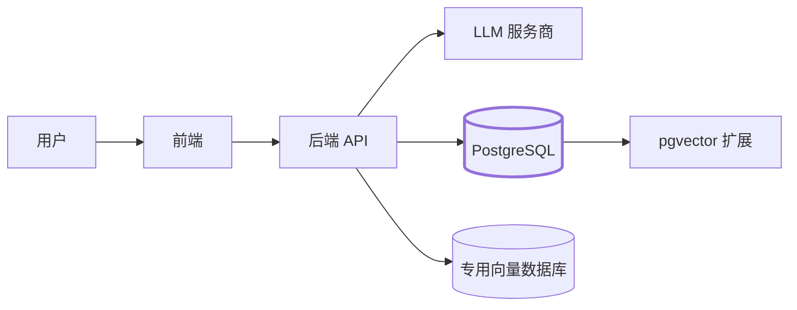

# AI 应用的后端与数据层

前面四章让你学会了调用 LLM、检索知识、构建 Agent。它们都默默假设了一件事：对话历史、用户文档、Embedding、工具输出在你需要的时候就*在那里*。这一章要做的，就是让这件事成真。

如果你过去几年一直在写 React 和 Next.js，大概率是通过 Prisma 或 Drizzle 来操作数据库，从没太关心底层是什么。AI 应用会把你推回数据库层——不是因为问题有多新奇，而是因为数据的形态变了：向量列、JSONB 格式的工具调用日志、多轮对话树、按租户隔离的检索。

学完本章，你将能够：

- 解释为什么 PostgreSQL 是 2026 年 AI 应用的默认数据库。
- 写出你真正会用到的 SQL：CRUD、JOIN、索引、EXPLAIN。
- 理解 PostgreSQL Schema（命名空间，不是表结构）并用 Alembic 执行迁移。
- 为并发 RAG 写入和对话写入选择合适的事务隔离级别。
- 使用 SQLAlchemy 作为 ORM，并知道什么时候该退回原生 SQL。
- 选定一种多租户隔离方案，并用 Row-Level Security 来强制执行。
- 判断 pgvector 够不够用，以及什么时候该迁移到专用向量数据库。

## 数据库在架构中的位置

所有数据流都经过后端。数据库存储的是 LLM 存不了的东西：历史记录、用户数据、Embedding，以及出问题时帮你复盘的审计日志。

## 本章内容

1. [为什么选 PostgreSQL](./why-postgresql) —— 为什么一个数据库就能覆盖大多数 AI 应用需求。
2. [SQL 速览](./sql-refresher) —— 你真正会写的那些查询，附 Prisma/Drizzle 对比。
3. [Schema 与迁移](./schemas-and-migrations) —— 命名空间、Alembic，以及和 Prisma Migrate 的对比。
4. [事务隔离](./transaction-isolation) —— 两个请求同时命中同一行时会发生什么。
5. [ORM：SQLAlchemy](./orm-sqlalchemy) —— 你日常会用的 Python ORM，对照 Prisma 概念讲解。
6. [多租户隔离](./multi-tenant-isolation) —— 共享表、Schema 隔离、RLS。
7. [从 pgvector 到专用向量数据库](./pgvector-graduation) —— 什么时候留，什么时候走，怎么迁移。

下一节：[为什么选 PostgreSQL →](./why-postgresql)
