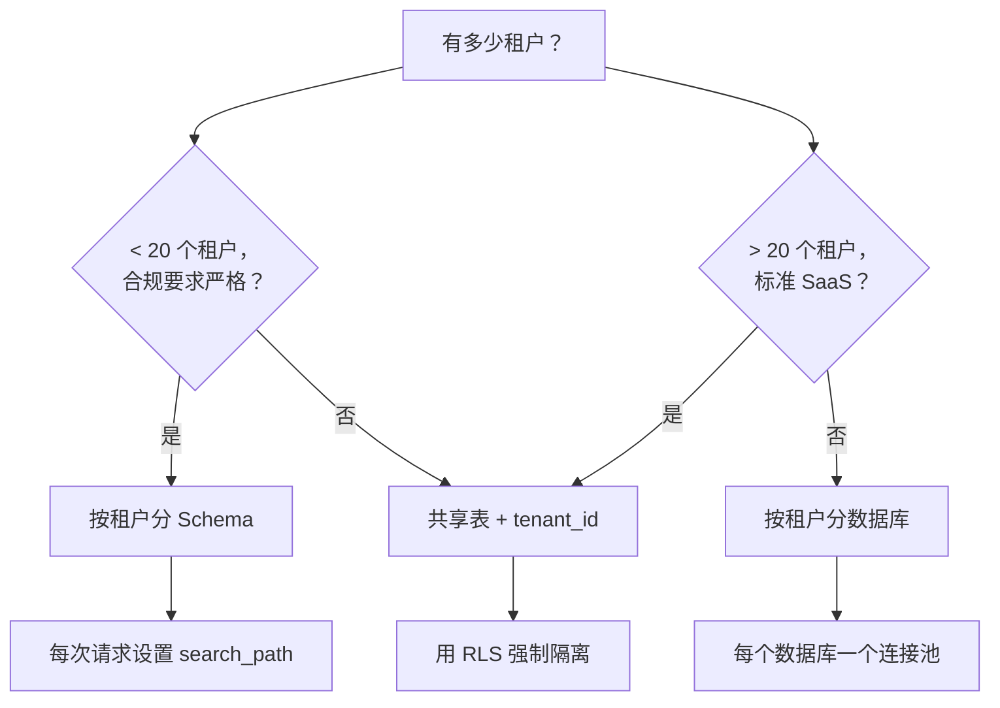

# 6. 多租户隔离

你的 AI 应用服务于多个用户、团队或组织。用户 A 绝不能看到用户 B 的对话、文档或 embedding。这就是多租户隔离——搞砸了就是数据泄露。

一共有三种模式，你需要选一种。

## 决策树



## 模式一：共享表 + tenant_id（大多数应用的默认选择）

每张表都有一个 `tenant_id` 列。每条查询都要带上 `WHERE tenant_id = :tid`。

```sql
CREATE TABLE conversations (
    id        UUID PRIMARY KEY DEFAULT gen_random_uuid(),
    tenant_id UUID NOT NULL,
    title     TEXT,
    created_at TIMESTAMPTZ DEFAULT now()
);

CREATE INDEX idx_conversations_tenant ON conversations (tenant_id);
```

**优点**：运维最简单，一个数据库，一条迁移路径，跨租户的聚合查询（分析、计费）也很方便。

**缺点**：漏掉一个 `WHERE tenant_id = ...` 就会泄露数据。每条查询都必须带上它。这就是 RLS 派上用场的地方。

### Row-Level Security (RLS)

RLS 是 PostgreSQL 内置的机制，用于在*数据库层面*强制租户边界。即使你的应用代码忘了写 `WHERE` 子句，数据库也不会返回当前租户不该看到的行。

**第一步 — 在表上启用 RLS：**

```sql
ALTER TABLE conversations ENABLE ROW LEVEL SECURITY;
```

**第二步 — 创建策略：**

```sql
CREATE POLICY tenant_isolation ON conversations
    USING (tenant_id = current_setting('app.current_tenant')::uuid);
```

**第三步 — 在每次请求中设置租户上下文：**

```python
from sqlalchemy import text, event

@event.listens_for(engine, "connect")
def set_search_path(dbapi_conn, connection_record):
    pass  # no-op; we set tenant per request, not per connection

def with_tenant(session: Session, tenant_id: str):
    session.execute(text("SET app.current_tenant = :tid"), {"tid": tenant_id})
```

然后在你的 API handler 里：

```python
@app.post("/conversations")
async def create_conversation(request: Request):
    tenant_id = request.state.tenant_id  # extracted from auth middleware

    with Session(engine) as session:
        with_tenant(session, str(tenant_id))
        # RLS now enforces: only this tenant's rows are visible
        conv = Conversation(tenant_id=tenant_id, title="New chat")
        session.add(conv)
        session.commit()
```

**RLS 能给你什么**：纵深防御。即使开发者写了 `session.query(Conversation).all()` 而没有加租户过滤，RLS 也能确保只返回当前租户的行。策略由 PostgreSQL 本身执行，不依赖你的应用代码。

**RLS 不能给你什么**：对遗漏 `SET app.current_tenant` 的保护。如果你忘了设置会话变量，策略比较会失败，返回零行（安全，但功能不正常）。用中间件来保证它一定会被设置。

## 模式二：按租户分 Schema

每个租户拥有自己的 PostgreSQL schema。所有租户共享同一个数据库和相同的表定义，但数据物理上分隔在不同的命名空间里。

```sql
CREATE SCHEMA tenant_acme;
CREATE TABLE tenant_acme.conversations ( ... );
CREATE TABLE tenant_acme.messages ( ... );

CREATE SCHEMA tenant_globex;
CREATE TABLE tenant_globex.conversations ( ... );
CREATE TABLE tenant_globex.messages ( ... );
```

在应用中，每次请求设置 `search_path`：

```python
def with_tenant_schema(session: Session, tenant_slug: str):
    schema = f"tenant_{tenant_slug}"
    session.execute(text(f"SET search_path TO {schema}, public"))
```

**优点**：无需 RLS 就能实现强隔离；每个租户的数据可以独立备份、恢复或删除；某些合规框架认可这种方式为"分离存储"。

**缺点**：迁移必须按 schema 逐个执行（N 个租户 = N 次迁移）；添加租户意味着创建 schema 和所有表；跨租户查询需要显式指定 schema；连接池不容易共享。

**适用场景**：受监管行业（医疗、金融），审计人员要求看到物理分离；或者你有少量高价值租户（< 20 个）。

## 模式三：按租户分数据库

最高级别的隔离。每个租户拥有自己的 PostgreSQL 数据库（甚至独立的 PostgreSQL 实例）。

**适用场景**：在 AI 应用中几乎不需要。这种模式适用于租户在合同中要求独立基础设施（政府、国防），或者租户工作负载差异极大、必须进行资源隔离的场景。

**为什么不推荐**：运维复杂度急剧上升。每个数据库需要自己的连接池、自己的迁移流程、自己的监控。跨租户分析变成了 ETL 任务。大多数觉得自己需要这种模式的团队，实际上只需要按租户分 Schema 就够了。

## AI 应用该选哪种模式

| 因素 | 共享表 + RLS | 按租户分 Schema | 按租户分数据库 |
|--------|:---:|:---:|:---:|
| 运维简易度 | 最佳 | 中等 | 最差 |
| 租户数量 | 无限制 | < 50 比较现实 | < 10 比较现实 |
| 跨租户分析 | 简单 | 可行 | 困难 |
| 合规说辞 | "逻辑隔离" | "独立 Schema" | "独立数据库" |
| pgvector 索引 | 一个索引，所有租户共用 | 每个 Schema 一个索引 | 每个数据库一个索引 |
| 迁移复杂度 | 执行一次 | 执行 N 次 | 执行 N 次 |

**默认选择**：共享表 + RLS。Supabase 用的就是这种方案，大多数 SaaS 平台也是，它可以扩展到数千个租户而不会带来运维负担。

**升级到按租户分 Schema** 的条件：你的租户少于 20 个，且合规要求物理分离，或者按租户独立备份/恢复是硬性需求。

**升级到按租户分数据库** 的条件：仅当合同明确要求时。

## 关于 pgvector 与租户隔离的说明

在共享表 + RLS 模式下，所有租户的 embedding 都在同一个 HNSW 索引中。这对搜索质量没有影响（HNSW 不关心租户边界——`WHERE tenant_id = :tid` 过滤是在 ANN 搜索之后执行的）。但这意味着：

- 索引大小与*所有*租户的 embedding 总量成正比。
- 你无法只删除某个租户的 embedding，除非先执行 `DELETE WHERE tenant_id = ...`，然后再 `REINDEX`。

如果不同租户的 embedding 量差异很大（一个租户有 5000 万向量，其他的只有 1 万），按租户分 Schema 可以让每个租户拥有合适大小的 HNSW 索引。

下一节：[从 pgvector 到专用向量数据库 →](./pgvector-graduation)
