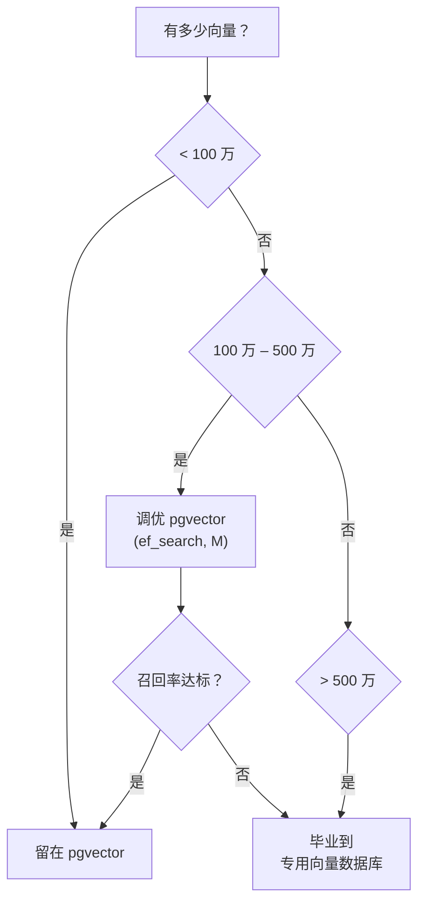

# 7. 从 pgvector 到专用向量数据库

在[第 3 章 §3](../embeddings-and-rag/vector-search) 中你选择了一个向量数据库。本节讲的是一条具体的迁移路径：从 pgvector 起步（因为你已经有 PostgreSQL 了），以及什么时候——以及怎样——毕业到专用向量数据库。

## pgvector：起点

如果你按照 [§1](./why-postgresql) 做了，你已经有 PostgreSQL。加上 pgvector 只需要一行：

```sql
CREATE EXTENSION IF NOT EXISTS vector;
```

一个 RAG 应用的最小化配置：

```sql
CREATE TABLE chunks (
    id         UUID PRIMARY KEY DEFAULT gen_random_uuid(),
    tenant_id  UUID NOT NULL,
    doc_id     UUID NOT NULL,
    content    TEXT NOT NULL,
    embedding  vector(1536),
    metadata   JSONB DEFAULT '{}',
    created_at TIMESTAMPTZ DEFAULT now()
);

-- HNSW index for cosine similarity
CREATE INDEX ON chunks
    USING hnsw (embedding vector_cosine_ops)
    WITH (m = 16, ef_construction = 64);

-- Tenant filter index
CREATE INDEX ON chunks (tenant_id);
```

**查询：**

```sql
SELECT id, content, 1 - (embedding <=> :query_vec) AS similarity
FROM chunks
WHERE tenant_id = :tid
ORDER BY embedding <=> :query_vec
LIMIT 10;
```

`<=>` 运算符是余弦距离。`<->` 是 L2 距离，`<#>` 是负内积。选跟你的 embedding 模型训练方式匹配的那个（通常是余弦距离）。

## pgvector 什么时候够用

pgvector 能处理的比大多数人以为的要多：

| 指标 | pgvector 的舒适区 |
|--------|-----------------------|
| 向量数量 | 使用 HNSW 可达约 500 万 |
| 维度 | 最高 2000（覆盖所有主流 embedding 模型） |
| QPS | 50–200，取决于硬件、索引调优和过滤复杂度 |
| 带过滤的搜索 | 可以工作，但过滤是在 ANN 搜索*之后*执行的，可能影响召回率 |

对于一个有 10 万到 100 万文档分块、中等查询流量的创业公司来说，pgvector 不是一种妥协——它就是正确的架构。你省掉了一整个服务（向量数据库），包括它的部署、监控和故障模式。

**调优参数：**

```sql
-- At query time: higher ef_search = better recall, more latency
SET hnsw.ef_search = 100;  -- default is 40

-- At build time: only affects future inserts
ALTER INDEX chunks_embedding_idx SET (ef_construction = 128);
```

对你的评估集（[第 3 章 §7](../embeddings-and-rag/evaluating-rag)）扫一遍 `ef_search`，从 40 到 256，选满足召回率目标的最小值。

## 什么时候该毕业

pgvector 开始成为瓶颈的信号：

1. **带过滤的召回率下降。** pgvector 在 HNSW 遍历*之后*才应用 `WHERE` 过滤。如果你的过滤非常严格（比如万分之一的租户），而你只要 `LIMIT 10`，ANN 搜索可能探索了 100 个候选项，其中 99 个因为属于其他租户而被丢弃。专用向量数据库（Qdrant、Weaviate）支持预过滤或集成过滤，能保持召回率。

2. **向量数量超过 500 万到 1000 万。** HNSW 索引的构建时间和内存占用持续增长。到了这个规模，专用向量数据库的优化（量化、磁盘分段、分片）开始体现价值。

3. **QPS 需求 > 200。** PostgreSQL 要和你的关系型工作负载共享资源。专用向量数据库可以独立扩展。

4. **你需要高级特性。** 多向量搜索、索引层的稀疏-稠密混合搜索，或内置的重排序。这些在 Qdrant 和 Weaviate 中有，但 pgvector 里没有。

## 迁移路径

好消息是：如果你的应用层通过一个干净的接口与向量数据库交互，迁移就是一个数据管道的活儿，不是重写。

**第一步 — 抽象向量操作：**

```python
from abc import ABC, abstractmethod

class VectorStore(ABC):
    @abstractmethod
    def upsert(self, id: str, embedding: list[float], metadata: dict) -> None: ...

    @abstractmethod
    def query(self, embedding: list[float], top_k: int, filter: dict) -> list[dict]: ...

class PgVectorStore(VectorStore):
    def __init__(self, session_factory):
        self.session_factory = session_factory

    def upsert(self, id, embedding, metadata):
        with self.session_factory() as session:
            session.execute(text("""
                INSERT INTO chunks (id, embedding, metadata)
                VALUES (:id, :emb, :meta)
                ON CONFLICT (id) DO UPDATE SET embedding = :emb, metadata = :meta
            """), {"id": id, "emb": str(embedding), "meta": json.dumps(metadata)})
            session.commit()

    def query(self, embedding, top_k, filter):
        with self.session_factory() as session:
            rows = session.execute(text("""
                SELECT id, content, metadata, 1 - (embedding <=> :q) AS score
                FROM chunks
                WHERE tenant_id = :tid
                ORDER BY embedding <=> :q
                LIMIT :k
            """), {"q": str(embedding), "tid": filter["tenant_id"], "k": top_k})
            return [dict(r._mapping) for r in rows]
```

**第二步 — 为新存储实现相同的接口：**

```python
from qdrant_client import QdrantClient, models

class QdrantVectorStore(VectorStore):
    def __init__(self, url: str, collection: str):
        self.client = QdrantClient(url=url)
        self.collection = collection

    def upsert(self, id, embedding, metadata):
        self.client.upsert(self.collection, [
            models.PointStruct(id=id, vector=embedding, payload=metadata)
        ])

    def query(self, embedding, top_k, filter):
        results = self.client.query_points(
            self.collection,
            query=embedding,
            query_filter=models.Filter(must=[
                models.FieldCondition(key="tenant_id", match=models.MatchValue(value=filter["tenant_id"]))
            ]),
            limit=top_k,
        )
        return [{"id": r.id, "score": r.score, **r.payload} for r in results.points]
```

**第三步 — 在配置层切换：**

```python
if settings.vector_backend == "pgvector":
    store = PgVectorStore(session_factory)
else:
    store = QdrantVectorStore(settings.qdrant_url, "chunks")
```

**第四步 — 回填数据。** 跑一次一次性迁移，从 pgvector 读出所有向量，upsert 到新存储中。用你的评估集验证召回率持平或更好，然后切换流量。

## 诚实的建议



大多数 AI 应用永远不会离开"< 100 万向量"这个框。先用 pgvector 构建，用评估集来衡量，只在数据告诉你该迁移的时候才迁移——而不是看了一篇博客就迁移。

---

这一章给了你整个数据层。你现在可以存储对话、embedding、租户隔离的数据，以及你的 AI 应用需要的一切。下一章讲的是另一端的事情——前端如何消费后端的流式响应并在浏览器中渲染。

下一节：[构建聊天前端 →](../chat-frontend)
