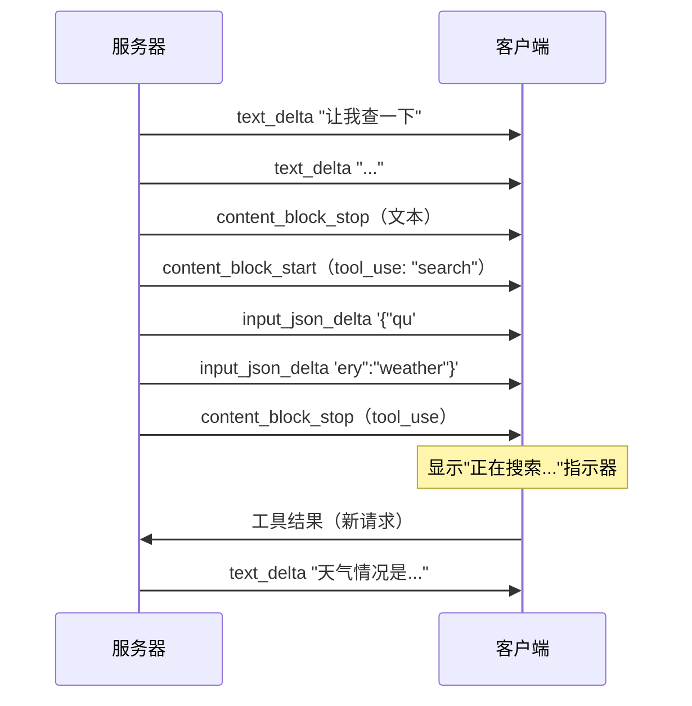

# 2. 消费流式响应

上一节给了你一个原始的 SSE 读取器。现在你需要理解每行 `data:` 里面装的是什么，并把它转化为 React 可以渲染的内容。这意味着解析各服务商特定的事件结构、累积文本 delta、处理流中途的 tool use 块，以及将这一切接入一个 Hook。

## 服务商事件结构

### Anthropic

Anthropic 的流式 API 发出类型化的事件。你需要关注的是这些：

```
data: {"type":"message_start","message":{"id":"msg_01X","role":"assistant","content":[],"model":"claude-sonnet-4-6","usage":{"input_tokens":25}}}
data: {"type":"content_block_start","index":0,"content_block":{"type":"text","text":""}}
data: {"type":"content_block_delta","index":0,"delta":{"type":"text_delta","text":"Hello"}}
data: {"type":"content_block_delta","index":0,"delta":{"type":"text_delta","text":" world"}}
data: {"type":"content_block_stop","index":0}
data: {"type":"message_delta","delta":{"stop_reason":"end_turn"},"usage":{"output_tokens":12}}
data: {"type":"message_stop"}
```

### OpenAI

OpenAI 使用不同的结构——一个 `choices` 数组，包含 `delta` 对象：

```
data: {"id":"chatcmpl-abc","object":"chat.completion.chunk","choices":[{"index":0,"delta":{"role":"assistant","content":""},"finish_reason":null}]}
data: {"id":"chatcmpl-abc","choices":[{"index":0,"delta":{"content":"Hello"},"finish_reason":null}]}
data: {"id":"chatcmpl-abc","choices":[{"index":0,"delta":{"content":" world"},"finish_reason":null}]}
data: {"id":"chatcmpl-abc","choices":[{"index":0,"delta":{},"finish_reason":"stop"}]}
data: [DONE]
```

尽管结构不同，模式是一样的：**找到文本 delta 字段，拼接到一个持续增长的字符串上。**

## 类型化的流读取器

```typescript
type StreamEvent =
  | { type: "text"; content: string }
  | { type: "tool_use_start"; id: string; name: string }
  | { type: "tool_use_delta"; json: string }
  | { type: "tool_use_end" }
  | { type: "done"; stopReason: string }
  | { type: "error"; message: string };

function parseAnthropicEvent(raw: string): StreamEvent | null {
  try {
    const e = JSON.parse(raw);
    switch (e.type) {
      case "content_block_delta":
        if (e.delta.type === "text_delta") {
          return { type: "text", content: e.delta.text };
        }
        if (e.delta.type === "input_json_delta") {
          return { type: "tool_use_delta", json: e.delta.partial_json };
        }
        return null;
      case "content_block_start":
        if (e.content_block.type === "tool_use") {
          return { type: "tool_use_start", id: e.content_block.id, name: e.content_block.name };
        }
        return null;
      case "content_block_stop":
        return { type: "tool_use_end" };
      case "message_delta":
        return { type: "done", stopReason: e.delta.stop_reason };
      default:
        return null;
    }
  } catch {
    return { type: "error", message: `Failed to parse: ${raw.slice(0, 100)}` };
  }
}
```

你可以为 OpenAI 的结构写一个等价的 `parseOpenAIEvent`。实际项目中，如果你的后端代理了 LLM 并把流归一化为统一格式，那么你只需要写一个解析器。这是推荐的做法。

## 处理流中途的 Tool Use

当模型决定调用工具时，流的内容会发生变化。你收到的不再是文本 delta，而是一个 `tool_use` 内容块：



你的 UI 应该：

1. 正常渲染到达的文本 delta。
2. 当收到 `tool_use_start` 事件时，显示状态指示器（"正在搜索..."、"正在运行代码..."）。
3. 缓存 `input_json_delta` 分块——**不要**尝试解析不完整的 JSON。
4. 当工具块完成后，将 tool call 分发到后端，然后开始一轮新的流式传输。

## 使用 AbortController 优雅取消

用户会点击"停止生成"。你需要中止 fetch 并做好清理：

```typescript
const controller = new AbortController();

const response = await fetch("/api/chat", {
  method: "POST",
  body: JSON.stringify({ messages }),
  signal: controller.signal,
});

// Later, when the user clicks stop:
controller.abort();
```

`reader.read()` 调用会抛出 `AbortError`。捕获它，并将当前已累积的文本作为最终消息保留——不要丢弃用户已经看到的内容。

## 完整 Hook：`useStreamingChat()`

```typescript
import { useState, useCallback, useRef } from "react";

interface Message {
  role: "user" | "assistant";
  content: string;
  isStreaming?: boolean;
  toolCall?: { name: string; status: "running" | "done" };
}

export function useStreamingChat() {
  const [messages, setMessages] = useState<Message[]>([]);
  const [isLoading, setIsLoading] = useState(false);
  const controllerRef = useRef<AbortController | null>(null);

  const send = useCallback(async (userMessage: string) => {
    const userMsg: Message = { role: "user", content: userMessage };
    setMessages((prev) => [...prev, userMsg]);
    setIsLoading(true);

    const controller = new AbortController();
    controllerRef.current = controller;

    // Add an empty assistant message that we'll stream into
    setMessages((prev) => [...prev, { role: "assistant", content: "", isStreaming: true }]);

    try {
      const response = await fetch("/api/chat", {
        method: "POST",
        headers: { "Content-Type": "application/json" },
        body: JSON.stringify({ messages: [...messages, userMsg].map(({ role, content }) => ({ role, content })) }),
        signal: controller.signal,
      });

      if (!response.ok) throw new Error(`HTTP ${response.status}`);
      const reader = response.body!.getReader();
      const decoder = new TextDecoder();
      let buffer = "";

      while (true) {
        const { done, value } = await reader.read();
        if (done) break;

        buffer += decoder.decode(value, { stream: true });
        const lines = buffer.split("\n");
        buffer = lines.pop()!;

        for (const line of lines) {
          if (!line.startsWith("data: ")) continue;
          const payload = line.slice(6);
          if (payload === "[DONE]") break;

          const event = parseAnthropicEvent(payload);
          if (event?.type === "text") {
            setMessages((prev) => {
              const updated = [...prev];
              const last = updated[updated.length - 1];
              updated[updated.length - 1] = { ...last, content: last.content + event.content };
              return updated;
            });
          }
        }
      }
    } catch (err: unknown) {
      if (err instanceof DOMException && err.name === "AbortError") {
        // User cancelled — keep what we have
      } else {
        setMessages((prev) => {
          const updated = [...prev];
          updated[updated.length - 1] = {
            ...updated[updated.length - 1],
            content: updated[updated.length - 1].content || "Sorry, something went wrong. Please try again.",
          };
          return updated;
        });
      }
    } finally {
      setMessages((prev) => {
        const updated = [...prev];
        updated[updated.length - 1] = { ...updated[updated.length - 1], isStreaming: false };
        return updated;
      });
      setIsLoading(false);
      controllerRef.current = null;
    }
  }, [messages]);

  const stop = useCallback(() => {
    controllerRef.current?.abort();
  }, []);

  return { messages, isLoading, send, stop };
}
```

## 错误处理

在生产环境中你会遇到三种故障模式：

1. **流传输过程中网络断开。** `reader.read()` 会 reject。保留已累积的文本，将消息标记为不完整，并提供一个"重试"按钮，重新发送最后一条用户消息。

2. **事件中的 JSON 不完整。** 一行 `data:` 被分成两个 chunk 到达。[§1](./streaming-contract)中的 buffer 方案已经处理了这个问题——你只处理完整的行。

3. **流式传输开始后后端返回错误。** 模型可能已经输出了 200 个 token，然后触发了上下文长度限制。你的流读取器应该检查流负载中的错误事件，而不仅仅是 HTTP 状态码。

关于重试策略：保持简单。不要自动重试流式请求——用户正在看着屏幕。显示一个"重试"按钮，重新发送对话。如果遇到了速率限制，如实地展示错误信息，而不是默默转圈。

---

现在你已经能够将 LLM 响应流式传入 React state、处理流中途的 tool call 并从错误中恢复了。下一节将讲解如何把那个持续增长的 Markdown 字符串渲染为格式正确的 HTML，同时避免页面跳动。

下一节：[Markdown 渲染 →](./markdown-rendering)
