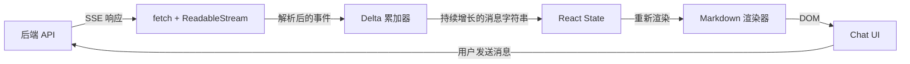

# 构建 Chat 前端

上一章介绍了 PostgreSQL、SQLAlchemy 和数据层，让你能够存储会话、Embedding 以及租户隔离的记录。你的后端已经可以调用 LLM 并持久化返回结果。现在你需要另一半：一个在浏览器中将这些响应实时流式展示给用户的 UI。

如果你已经写了几年 React，这一章的大部分内容会很熟悉——状态管理、Hooks、组件组合。真正陌生的部分是**流式管道**：后端以 Server-Sent Events 的形式发送 token，前端需要增量解析它们，逐步拼接内容，处理 tool use 中断，在 Markdown 到达时即时渲染，而且整个过程不能让滚动卡顿或丢失用户当前的阅读位置。

学完本章后，你将能够：

- 解释 LLM API 为什么选择 SSE 而不是 WebSocket，以及什么场景下 WebSocket 才是正确选择。
- 使用 `fetch()` + `ReadableStream` 消费 SSE 流（而不是 `EventSource`——你会看到原因）。
- 解析 Anthropic 和 OpenAI 流式事件结构，并将 delta 累积为完整消息。
- 处理流中途的 tool call、通过 `AbortController` 取消请求以及网络错误。
- 构建一个 `useStreamingChat()` React Hook，管理完整的消息生命周期。
- 渲染流式 Markdown 并支持语法高亮，同时避免布局抖动。
- 构建消息列表，实现滚动锚定、乐观更新和加载状态。
- 应用主题系统和暗色模式，并防止页面加载时的白屏闪烁。

## 各部分如何协作

后端发出一系列 SSE 事件。前端通过 `ReadableStream` 读取它们，将每一行 `data:` 解析为类型化的事件，然后把内容 delta 累积到 React state 中持续增长的字符串里。每次 state 更新都会触发重新渲染，将部分 Markdown 传入渲染器。用户看到的效果是文字逐 token 出现。

这个循环——**流式传输、解析、累积、渲染**——是所有 Chat 前端的主干。下面的五个小节将逐一讲解每个部分。

## 本章内容

1. [流式传输协议](./streaming-contract) — SSE vs WebSocket，协议细节，以及如何在浏览器中读取流。
2. [消费流式响应](./consuming-the-stream) — 解析各服务商的事件结构，构建流读取器，处理 tool call 和取消。
3. [Markdown 渲染](./markdown-rendering) — 渲染流式 Markdown，支持代码高亮、数学公式和表格，同时避免布局抖动。
4. [消息列表模式](./message-list-patterns) — 滚动锚定、乐观更新、加载骨架屏以及消息数据模型。
5. [主题与暗色模式](./theming-and-dark-mode) — CSS 变量、系统偏好检测以及防止白屏闪烁。

下一节：[流式传输协议 →](./streaming-contract)
