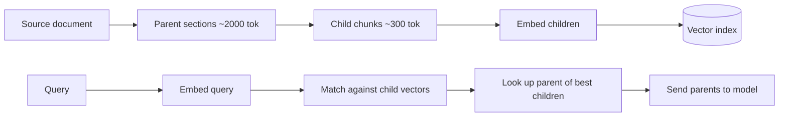

# 4. 切块（Chunking）

你没法把一篇 200 页的 PDF embed 成单个向量——embedding 模型自己有上下文限制（通常 512 到 8192 token），即使没有，把 200 页变成一个向量也太粗了，检索不到任何具体的东西。你得把文档**切块**成更小的片段，每段单独 embed。

切块是 **RAG 系统里杠杆最大的旋钮**。这一步弄错了，再好的 embedding 模型、再花哨的 reranker 都救不了你。

## 根本性的张力

| 块大小 | 问题 |
|---|---|
| 太小（100 token） | 丢上下文。query "团队修了什么 bug？" 命中一个写着 "we fixed the bug" 的块，但周边细节没带过来。检索变嘈杂。 |
| 太大（4,000 token） | 丢精度。一个块里讲了五个话题；它的 embedding 是一个模糊的平均；相关 query 没法干净地匹配上去。 |

英文散文的甜区通常是**每块 300–800 token**，**10–20% 的 overlap**。但正确答案取决于你的内容。**别**挑个数就发——挑个数然后用评估集（[§7](./evaluating-rag)）*量出来*。

## 三种切块策略

### 1. 定长 + overlap

最简单的方法。在文本上滑一个定长窗口，留一点 overlap，让跨边界的内容不丢。

```python
import tiktoken

enc = tiktoken.get_encoding("cl100k_base")

def fixed_chunks(text: str, size: int = 500, overlap: int = 50) -> list[str]:
    tokens = enc.encode(text)
    chunks = []
    step = size - overlap
    for start in range(0, len(tokens), step):
        chunk_tokens = tokens[start : start + size]
        if not chunk_tokens:
            break
        chunks.append(enc.decode(chunk_tokens))
    return chunks
```

优点：trivial、确定性、与语言无关。缺点：经常在句子和段落中间切断。但通常已经够用——从这里开始。

### 2. 递归结构化切分

更好的默认。先在最强的自然边界处切；如果一段还太大，就按下一级强边界递归。

```
priority order:  "\n\n"  →  "\n"  →  ". "  →  " "  →  ""
```

LangChain 的 `RecursiveCharacterTextSplitter` 是规范实现。算法的伪代码：

```python
def recursive_split(text, max_size, separators=["\n\n", "\n", ". ", " ", ""]):
    if len(text) <= max_size:
        return [text]
    for sep in separators:
        if sep in text:
            parts = text.split(sep)
            chunks = []
            buf = ""
            for p in parts:
                candidate = buf + sep + p if buf else p
                if len(candidate) <= max_size:
                    buf = candidate
                else:
                    if buf:
                        chunks.append(buf)
                    if len(p) > max_size:
                        chunks.extend(recursive_split(p, max_size, separators))
                        buf = ""
                    else:
                        buf = p
            if buf:
                chunks.append(buf)
            return chunks
    return [text]
```

优点：尽量尊重段落和句子；找不到时优雅降级。缺点：仍然对文档语义无感。

你不需要为了这个就把 `langchain` 当强依赖。要么把上面的递归逻辑抄过去，要么从 `langchain-text-splitters`（一个超小、依赖很少的包）里 import `RecursiveCharacterTextSplitter`。

### 3. 文档感知的切分

当你**有结构**时就利用它。Markdown 标题、代码符号、JSON 路径、HTML 段落、对话轮——这些都是比字符数更强的信号。

| 内容 | 信号 |
|---|---|
| Markdown 文档 | 在 `#`、`##`、`###` 标题处切；把标题路径作为 metadata |
| 代码 | 在函数/类边界处切（用 `tree-sitter` 或 `ast`） |
| 对话记录 | 按说话人切换或话题转移切 |
| HTML | 在 `<section>`、`<article>`、`<h*>` 处切 |
| PDF | 跑过 OCR/排版抽取后，按检测出的章节切 |

一个标题感知的 Markdown 切分器并不长：

```python
import re

def split_markdown_by_headers(md: str) -> list[dict]:
    sections = []
    current = {"path": [], "body": []}
    for line in md.splitlines():
        m = re.match(r"^(#{1,6})\s+(.*)", line)
        if m:
            if current["body"]:
                sections.append({"heading": " > ".join(current["path"]),
                                  "text": "\n".join(current["body"])})
                current["body"] = []
            level = len(m.group(1))
            current["path"] = current["path"][:level - 1] + [m.group(2)]
        else:
            current["body"].append(line)
    if current["body"]:
        sections.append({"heading": " > ".join(current["path"]),
                          "text": "\n".join(current["body"])})
    return sections
```

`heading` 既是可搜索的 metadata，又是一个很好的引用标签。

## 切块大小参考表

| 内容类型 | 推荐块大小 | Overlap | 备注 |
|---|---:|---:|---|
| FAQ 条目 | 100–300 token | 0 | 一个块一个 Q+A；结构化最佳 |
| 长技术文档 | 400–800 token | 50–100 | 默认用递归结构化 |
| 代码 | 一函数/一类一个块 | 0 | 用 AST 切；embed 签名 + 主体 |
| 会议记录 | 300–500 token | 50 | 保留说话人标签；考虑 2–3 轮一窗 |
| 法律/医疗、密集引用 | 200–400 token | 50 | 块小一点求精度 |
| 书籍/叙事散文 | 500–1000 token | 100 | 块大一点因为上下文更重要 |

这些是起点。**永远要用评估集再调一遍。**

## Parent-child 模式

一个常见的进阶：**用小块 embed 来追求检索精度，但在生成时把整段父级章节喂给模型当上下文**。



为什么有效：小的 child chunk 有锐利的 embedding（适合匹配 query），但大的 parent 段落带着模型真正回答所需的上下文。检索精度*和*生成上下文兼得。

实现：在每个 child chunk 的 metadata 里存 `parent_id`；检索后按 parent 去重，从另一个存储（Postgres、KV、S3 都行）里取 parent 文本。

## Token vs 字符

回想[第 0 章 §1](../how-llms-work/tokens)：中文、日文、韩文每字符的 token 数是英文的 2 到 3 倍。如果你按字符切，一个"1000 字符"的中日韩块可能是 2000+ token——超过 embedding 模型的上下文上限。

**永远按 token 切，不要按字符切。** 能用 embedding 模型的 tokenizer 就用，否则 `tiktoken.cl100k_base` 是个合理的代理。

```python
def is_within(text: str, max_tokens: int) -> bool:
    return len(enc.encode(text)) <= max_tokens
```

便宜、防御性、能挡掉一整类"为什么这个块没被索引"的 bug。

下一节: [检索流水线 →](./retrieval-pipeline)
