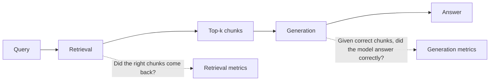

# 7. RAG 评估

你 RAG 的 demo 在 notebook 里能跑、生产里翻车的原因，是"我试了三个 query 看起来对"不是测量。RAG 有**两个失败面**，你必须分开评估它们。



如果你只看端到端的答案质量，你没法判断回归是在检索还是在生成，会花几周调错的旋钮。

## 失败面 1：检索质量

要回答的问题：**对 query Q，top-k chunk 里包含了 gold chunk 吗？**

要量这个，你需要一份带标注的 `(query, gold_chunk_ids)` 数据集。手工建、和用户一起建、或者让 LLM 给你语料样本里的每个 chunk 生成合理的问题然后人工 review。

### Recall@k

> 在所有 query 中，top-k 结果里至少包含一个 gold chunk 的比例是多少？

```python
def recall_at_k(eval_set: list[dict], retriever, k: int = 5) -> float:
    hits = 0
    for ex in eval_set:
        retrieved = retriever(ex["query"], k=k)
        retrieved_ids = {c["id"] for c in retrieved}
        if retrieved_ids & set(ex["gold_chunk_ids"]):
            hits += 1
    return hits / len(eval_set)
```

Recall@5 是最常报的数。如果 recall@5 低于 0.85 左右，流水线后段救不了你——LLM 没法引用它从未看到过的 chunk。

### MRR（Mean Reciprocal Rank）

> 在所有 query 中，*第一个* gold chunk 平均出现在多靠前的位置？

```python
def mrr(eval_set: list[dict], retriever, k: int = 10) -> float:
    total = 0.0
    for ex in eval_set:
        retrieved = retriever(ex["query"], k=k)
        gold = set(ex["gold_chunk_ids"])
        for rank, c in enumerate(retrieved, start=1):
            if c["id"] in gold:
                total += 1.0 / rank
                break
    return total / len(eval_set)
```

MRR 奖励把对的答案放到最靠前。一条 recall@10 = 1.0 但 MRR = 0.2 的流水线是在第 5 位以后才命中——这很糟，LLM 倾向于更关注靠前的 chunk（[第 0 章 §5](../how-llms-work/context-window) 里讲的 "lost in the middle"）。当 MRR 落后于 recall 时，重排（[§6](./reranking-and-hybrid)）就是修这个的。

**NDCG** 是一个更花哨的变体，处理分级相关性（chunk 评 0 到 3 而不是二元）。如果你有分级标签就用。否则 recall@k + MRR 就够了。

## 失败面 2：生成质量

给定正确的 chunk，模型答得对、答得**忠实**吗？

最重要的两个指标：

- **Faithfulness（忠实度）**：答案中的每一个 claim 都被 chunk 支持。反义是"模型自己编了点东西"。
- **Answer relevance（答案相关性）**：答案确实回答了问题。反义是"模型说了一句正确但无关的话"。

第三个常常值得跟踪的：**citation coverage** —— `answer.sources` 是不是真的指向了答案用到的那些 chunk？如果你用了结构化输出（[第 2 章 §5](../llm-apis-and-prompts/structured-output)），这件事可以机械地检查。

### LLM-as-judge 评 faithfulness

没有捷径。Faithfulness 没法降级成字符串匹配。标准做法：用另一个（或同一个）模型当 judge，加一个结构化 rubric。

```python
from pydantic import BaseModel
from typing import Literal

class FaithfulnessVerdict(BaseModel):
    verdict: Literal["faithful", "unfaithful"]
    unsupported_claim: str | None
    explanation: str

JUDGE_PROMPT = """You are a strict fact-checker. You will be given:
- a set of source chunks (the only ground truth)
- an answer generated using those chunks

Your job: decide whether EVERY claim in the answer is directly supported by the chunks.
- If yes, return verdict="faithful".
- If even one claim is unsupported or contradicted, return verdict="unfaithful" \
and quote the unsupported_claim verbatim.
Do not use any external knowledge."""

def judge_faithfulness(chunks: list[dict], answer: str) -> FaithfulnessVerdict:
    chunks_str = "\n\n".join(f'<chunk id="{c["id"]}">{c["text"]}</chunk>' for c in chunks)
    user = f"<chunks>\n{chunks_str}\n</chunks>\n\n<answer>{answer}</answer>"

    # ... structured output call (see Chapter 2 §5) returning FaithfulnessVerdict ...
```

Judge 用 temperature 0（[第 0 章 §6](../how-llms-work/sampling)）。用强模型。在一个随机子集上抽查 judge 和人工标注的差距——你的 judge 也有自己的错误率，你应该知道它是多少。

## 现成的评估库

两个值得知道：

| 库 | 备注 |
|---|---|
| **ragas** | Python 库，把规范的 RAG 指标（faithfulness、answer relevance、context precision、context recall）打包成 LLM-judge prompt。从零到"我手上有数字"最快的路径。 |
| **trulens** | 更通用的 LLM 可观测性工具，对 RAG 支持很好。如果你想在同一个工具里同时做评估和 tracing，它很有用。 |

两者底层都是带特定 prompt 的 LLM-as-judge。知道它们底下在做什么，等你长大之后就能自己滚一个。

## Golden test set

任何 LLM 项目里最有用的单一 artifact。建一次，做版本管理，每次改 prompt 或换模型时都跑。

里面有什么：

```python
golden_set = [
    {
        "id": "qa-001",
        "query": "How does HNSW index search work?",
        "gold_chunk_ids": ["vector-search-3", "vector-search-7"],
        "gold_answer_facts": [
            "HNSW is a multi-layer graph",
            "search has logarithmic complexity",
            "ef_search controls recall vs latency",
        ],
        "must_not_say": ["HNSW uses LSH"],   # known wrong-answer trap
    },
    # ... 50–200 more entries, drawn from real user queries when possible ...
]
```

起步 50 到 200 条。覆盖：

- 常见 query（你流量分布的头部）
- 边角 case（稀有实体、精确匹配的码、多跳问题）
- 对抗 query（答案*不*在语料里的问题——用来测"我不知道"的行为，见[§8](./production-patterns)）
- 回归测试（你修的每个 bug 都变成一条 entry）

任何 prompt 或模型改动上线前，在 golden set 上完整跑一遍。你看的数字：

- **Recall@5** —— 检索健康度。应 > 0.85。
- **MRR@10** —— 排序质量。应 > 0.6。
- **Faithfulness rate** —— 生成健康度。应 > 0.95。
- 对抗切片上的 **"I don't know" rate** —— 应接近 1.0。

任何一个回归时，你都有清晰的诊断：检索问题（recall、MRR）还是生成问题（faithfulness、refusal）。

## 前向引用

本节里的所有内容都是某种更通用纪律的实例。**第 13 章（评估与可观测性）**把 LLM 评估当作一等话题处理——输出的分布、judge 模型校准、回归追踪、在线 vs 离线评估。RAG 是最容易起步的地方，因为失败面定义清晰、指标具体；一旦你有了检索的 golden set，离任何东西都有 golden set 也就走完了 80%。

下一节: [生产实践 →](./production-patterns)
