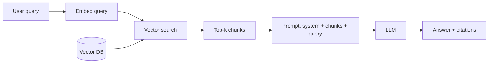

# Embeddings、向量检索与 RAG

本章是对前面建立的两个边界的架构层回答：受限的**上下文窗口**（[第 0 章 §5](../how-llms-work/context-window)）和**幻觉**（[第 2 章 §9](../llm-apis-and-prompts/failure-modes)）。模型读不到你的私有语料库，看不到训练截止日期之后发生的事情，并且无论它实际上是否知道答案，都会输出听起来很合理的文本。

RAG——**Retrieval-Augmented Generation（检索增强生成）**——用同一个技巧解决这三个问题：在查询时，把与用户问题相关的几段文本捞出来塞进 prompt。模型不再被要求*记住*，只被要求*阅读*。

读完本章你将能够：

- 解释 RAG 为什么存在、什么时候是合适的工具、什么时候应该用微调。
- 用托管 API 和开源模型分别生成 embedding，并手算语义相似度。
- 在 2026 年根据自己的规模和运维画像挑选向量数据库。
- 正确地切块——并知道哪个旋钮真正影响效果。
- 用大约 100 行 Python 搭一条端到端的检索流水线（ingest → embed → upsert → query → answer）。
- 当纯向量检索开始漏召时，加上混合检索和重排。
- 构建带标注的评估集，把检索质量（recall@k、MRR）和生成质量（faithfulness）分开度量。
- 识别每个新手 RAG 代码库里都会出现的那六七个反模式。

## 经典 RAG 流程

整个架构就是这张图。后面八节把每一个方框都讲具体。

## 本章目录

1. [为什么需要 RAG](./why-rag) —— 上下文窗口、时效性、幻觉的 grounding；为什么不直接微调？
2. [Embeddings 入门](./embeddings) —— `text -> vector`、cosine 相似度、维度、归一化、模态。
3. [向量检索与 ANN](./vector-search) —— 暴力检索 vs HNSW、recall/延迟旋钮、如何选 DB。
4. [切块（Chunking）](./chunking) —— 定长 vs 递归 vs 结构化；parent-child 模式。
5. [检索流水线](./retrieval-pipeline) —— 完整的端到端代码、prompt 模板、引用模式。
6. [重排与混合检索](./reranking-and-hybrid) —— BM25、RRF、cross-encoder 重排器。
7. [RAG 评估](./evaluating-rag) —— 检索指标、生成指标、golden set。
8. [生产实践](./production-patterns) —— 引用、无结果处理、时效性、prompt caching、反模式。

下一节: [为什么需要 RAG →](./why-rag)
