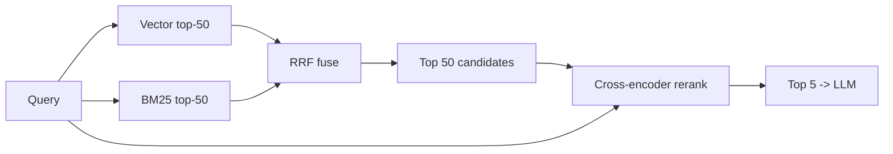

# 6. 重排与混合检索

纯向量检索会漏东西。两个原因。

## Embedding 失败的地方

**字面 / 精确匹配 query。** Embedding 捕获的是*语义*相似——它们被显式设计成忽略表面 token 差异。当你要搜的恰好就是表面 token 时，这就成了问题：

```
query: "ERR_CONNECTION_REFUSED"
top vector match: "the connection was refused by the server" (semantic match — wrong document)
top BM25 match:   "fix for ERR_CONNECTION_REFUSED in chrome 118" (exact match — right document)
```

向量检索还在以下场景表现挣扎：

- 商品 SKU（`SKU-A4F-22871`）
- 错误码（`E2BIG`、`OOM-killed`）
- 版本号（`Postgres 16.2`）
- 标识符精确性重要的代码片段
- embedding 模型表征薄弱的稀有专有名词

修复方法是**混合检索**：并行跑向量检索和字面检索，把结果合起来。

## BM25 —— 字面检索基线

**BM25** 是经典的全文检索打分函数，已经做了大约 25 年的工业标准。每个正经的搜索引擎（Elastic、Solr、Postgres FTS、Tantivy、Lucene）都自带它。你不用理解公式；你只需要知道 **BM25 按词项重叠打分，带边际递减和文档长度归一化**。精确匹配占主导。稀有词权重更高。

大多数生产栈里 BM25 是免费的：

- Postgres 有 `tsvector` / `ts_rank_cd`（一个 BM25 变体）。
- Elasticsearch / OpenSearch 默认就是 BM25。
- 很多向量 DB（Weaviate、Qdrant、Vespa）内置 BM25。
- 想要一个独立的快速 Python 实现：`rank_bm25`。

## Reciprocal Rank Fusion（RRF）

一旦你有两个排序列表（向量 top-50、BM25 top-50），怎么合并？**Reciprocal Rank Fusion** 是标准答案——简单、不用调参、效果一直不错。

对每个文档，跨所有排序列表求和：

```
RRF(d)  =  Σ over rankers r:  1 / (k + rank_r(d))
```

`k` 通常取 60。在*任何*一个列表里排名靠前的文档赢；在*两个*列表里都靠前的文档赢得更多。

```python
def rrf(rankings: list[list[str]], k: int = 60) -> list[tuple[str, float]]:
    """Each ranking is a list of doc_ids in rank order."""
    scores: dict[str, float] = {}
    for ranking in rankings:
        for rank, doc_id in enumerate(ranking):
            scores[doc_id] = scores.get(doc_id, 0.0) + 1.0 / (k + rank + 1)
    return sorted(scores.items(), key=lambda x: -x[1])

vector_top  = ["d3", "d1", "d7", "d2"]
bm25_top    = ["d1", "d9", "d3", "d4"]

print(rrf([vector_top, bm25_top]))
# -> [('d1', 0.0327...), ('d3', 0.0319...), ('d7', 0.0163...), ...]
```

二十行代码就能稳定胜过两个单独 retriever。RRF 是检索里信噪比最高的工具之一。

## Cross-encoder 重排器

向量检索用的是 **bi-encoder**：query 和 chunk 分别 embed，然后比较。它快（chunk 向量预先算好一次），但模型从来没机会在打分前*同时看到* query 和 chunk。

**cross-encoder** 是另一种模型，它把 `(query, chunk)` 作为一个整体输入，输出一个相关性分数。它对相关性的判断要好得多，因为它能在两边之间做 attention——但也慢得多（无法预计算：每对 (query, chunk) 都要一次 forward）。

标准模式：



便宜、recall 导向的检索拉宽候选。昂贵但精确的 reranker 只对 top 50 打分。模型只看到 top 5。

### 一次 reranker 调用

```python
# Cohere's hosted reranker — one HTTPS call.
import cohere
co = cohere.Client()

candidates = [c["text"] for c in chunks]  # 50 candidates from RRF fusion

resp = co.rerank(
    model="rerank-english-v3.0",
    query="how does HNSW index search work?",
    documents=candidates,
    top_n=5,
)
top5 = [chunks[r.index] for r in resp.results]
```

自部署的话，`BAAI/bge-reranker-v2-m3` 是开源默认：

```python
from sentence_transformers import CrossEncoder

reranker = CrossEncoder("BAAI/bge-reranker-v2-m3")
pairs = [[query, c["text"]] for c in chunks]
scores = reranker.predict(pairs)

ranked = [c for _, c in sorted(zip(scores, chunks), key=lambda x: -x[0])]
top5 = ranked[:5]
```

CPU 上 50 候选 rerank 加 **50–200 ms** 延迟；GPU 上几毫秒。Cohere 托管的 reranker 端到端约 100 ms。值不值得，取决于你的延迟预算——在评估集上量，不要凭感觉。

## 什么时候加什么——按顺序

你很少需要一开始就把这些都加上。等评估集（[§7](./evaluating-rag)）显示你在漏东西时再加。

| 阶段 | 什么时候加 |
|---|---|
| 1. 仅向量检索 | 第一天。永远从这里开始。 |
| 2. + 混合（BM25 + RRF） | 你看到精确匹配的 query 失败，或者你的语料里有码、SKU、标识符。 |
| 3. + Cross-encoder 重排 | top-5 大多数时候是对的，但*顺序*糟糕，或者真正命中的 chunk 排到了第 8。 |
| 4. + Query 改写 | 用户的提问方式和你语料的措辞对不上（比如对话代词、多跳问题）。 |

不要跳过第 2 步直接跳到第 3 步。BM25 + RRF 便宜，而且经常胜过一个只靠 rerank 的复杂流水线，因为它修的是另一种失败模式。

一个让新手意外的事实：**一条精心搭的 hybrid 流水线，没有 rerank，可以胜过带 rerank 的纯向量流水线。** 这两个阶段处理的是不同的 bug。把它们当作可组合的东西，不是替代品。

下一节: [RAG 评估 →](./evaluating-rag)
