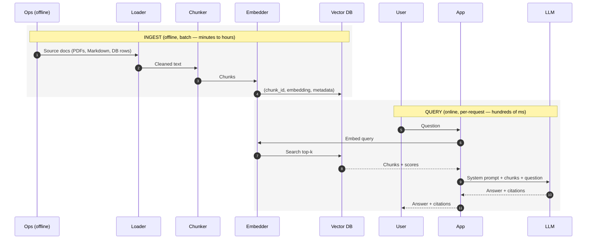

# 5. 检索流水线

零件你都见过了。现在把它们连起来。

一个 RAG 系统有两个完全不同节奏的阶段：



Ingest 是离线的，只在文档变化时重跑。Query 是在线的，每个用户请求都跑一次。把这两件事混起来，你就会在每次调用时实时 embed——一个[反模式](./production-patterns)。

下面的例子用 `sentence-transformers` + `chromadb` + Anthropic 的 Claude。同样的形状任何组合都适用——OpenAI embeddings + pgvector + GPT-4.1，Voyage + Pinecone + Claude，等等。

## 阶段 1：Ingest

```python
# ingest.py
import uuid
from pathlib import Path
import chromadb
from chromadb.utils import embedding_functions
from langchain_text_splitters import RecursiveCharacterTextSplitter

EMBED_MODEL = "BAAI/bge-large-en-v1.5"
COLLECTION = "kb"

client = chromadb.PersistentClient(path="./chroma_db")
embed_fn = embedding_functions.SentenceTransformerEmbeddingFunction(
    model_name=EMBED_MODEL
)
collection = client.get_or_create_collection(
    name=COLLECTION,
    embedding_function=embed_fn,
    metadata={"hnsw:space": "cosine"},
)

splitter = RecursiveCharacterTextSplitter(
    chunk_size=600,        # in characters; tune in tokens for production
    chunk_overlap=80,
    separators=["\n\n", "\n", ". ", " ", ""],
)

def ingest_directory(path: str) -> None:
    docs, ids, metas = [], [], []
    for md_file in Path(path).rglob("*.md"):
        text = md_file.read_text(encoding="utf-8")
        chunks = splitter.split_text(text)
        for i, chunk in enumerate(chunks):
            docs.append(chunk)
            ids.append(f"{md_file.stem}-{i}-{uuid.uuid4().hex[:8]}")
            metas.append({
                "source": str(md_file),
                "chunk_index": i,
                "title": md_file.stem,
            })

    # Batch upserts — vector DBs are much faster in batches.
    BATCH = 256
    for i in range(0, len(docs), BATCH):
        collection.upsert(
            documents=docs[i : i + BATCH],
            ids=ids[i : i + BATCH],
            metadatas=metas[i : i + BATCH],
        )
    print(f"Indexed {len(docs)} chunks.")

if __name__ == "__main__":
    ingest_directory("./docs")
```

两条生产经验已经内建在里面了：

- **持久化 client。** `chromadb.PersistentClient` 写到磁盘。没有它，进程一退索引就没了。
- **批量 upsert。** Embedding 和索引是吞吐瓶颈。256 元素一批是不错的默认；按硬件再调。

## 阶段 2：Query 与作答

```python
# query.py
import json
import anthropic
from ingest import collection  # reuse the same collection

llm = anthropic.Anthropic()
TOP_K = 5

SYSTEM_PROMPT = """You are a precise assistant that answers questions ONLY \
using the provided context. If the context does not contain the answer, \
respond exactly: "I don't know based on the provided context."

Always cite the chunk IDs you used in a `sources` array."""

def retrieve(query: str, k: int = TOP_K) -> list[dict]:
    res = collection.query(query_texts=[query], n_results=k)
    return [
        {
            "id": res["ids"][0][i],
            "text": res["documents"][0][i],
            "source": res["metadatas"][0][i].get("source"),
            "distance": res["distances"][0][i],
        }
        for i in range(len(res["ids"][0]))
    ]

def build_user_message(query: str, chunks: list[dict]) -> str:
    formatted = "\n\n".join(
        f'<chunk id="{c["id"]}" source="{c["source"]}">\n{c["text"]}\n</chunk>'
        for c in chunks
    )
    return f"<context>\n{formatted}\n</context>\n\nQuestion: {query}"

def answer(query: str) -> dict:
    chunks = retrieve(query)
    user_msg = build_user_message(query, chunks)

    resp = llm.messages.create(
        model="claude-sonnet-4-6",
        max_tokens=1024,
        system=SYSTEM_PROMPT,
        messages=[{"role": "user", "content": user_msg}],
    )
    return {
        "text": resp.content[0].text,
        "chunks": chunks,
        "usage": resp.usage.model_dump(),
    }

if __name__ == "__main__":
    out = answer("How does HNSW index search work?")
    print(out["text"])
    print("Used:", [c["id"] for c in out["chunks"]])
```

这就是一个能跑的 RAG 系统，约 80 行。在一个 Markdown 文件夹上跑起来，开始问问题。

## 为什么 chunk 放在 user 消息里

回想一下[第 0 章 §3](../how-llms-work/completion-to-conversation)里的 chat 模板：`system` / `user` / `assistant` 标签只是模型在训练中学会区别对待的文本而已。检索到的 chunk 之所以放在 **user 消息**里，原因有三：

1. 它们每次请求都不同——不应该污染可缓存的 system prompt（[第 2 章 §8](../llm-apis-and-prompts/cost-and-latency)）。
2. System prompt 是**稳定的契约**（"只基于上下文作答、引用来源"）。把上下文塞进去会模糊契约和数据的界线。
3. 用类 XML 的标签（`<context>...<chunk>...</chunk>...</context>`）把 context 包起来，给模型一个它在 post-training 中学过去尊重的明确边界。

完整请求在概念上长这样（[第 2 章 §1](../llm-apis-and-prompts/api-call-shape)）：

```python
messages = [
    {"role": "user", "content": """\
<context>
  <chunk id="hnsw-3" source="vector-search.md">
  HNSW is a multi-layer graph index. The top layers are sparse...
  </chunk>
  <chunk id="hnsw-7" source="vector-search.md">
  The recall/latency knob is ef_search...
  </chunk>
</context>

Question: How does HNSW index search work?"""}
]
```

System prompt——那条 "answer only from context" 的指令——通过 Anthropic 顶层的 `system=` 参数发送（OpenAI 里是一条 `role: "system"` 消息）。它在请求之间不变。这是 prompt caching 的完美候选（[第 2 章 §8](../llm-apis-and-prompts/cost-and-latency)）。

## 强制结构化引用

`text` 答案当 demo 没问题，但生产里你几乎总是想要把 citation 当作数据，而不是散文。用 schema 约束的输出（[第 2 章 §5](../llm-apis-and-prompts/structured-output)）：

```python
from pydantic import BaseModel
from typing import List

class GroundedAnswer(BaseModel):
    answer: str
    sources: List[str]                 # chunk IDs used
    confidence: float                  # 0..1

# Anthropic: force a tool call whose schema is GroundedAnswer.
answer_tool = {
    "name": "submit_answer",
    "description": "Submit the grounded answer.",
    "input_schema": GroundedAnswer.model_json_schema(),
}

resp = llm.messages.create(
    model="claude-sonnet-4-6",
    max_tokens=1024,
    system=SYSTEM_PROMPT,
    tools=[answer_tool],
    tool_choice={"type": "tool", "name": "submit_answer"},
    messages=[{"role": "user", "content": user_msg}],
)
tu = next(b for b in resp.content if b.type == "tool_use")
ans = GroundedAnswer.model_validate(tu.input)
print(ans.answer, ans.sources)
```

下游代码现在拿到一个有类型的对象。UI 可以渲染答案文本和一个可点击的 chunk ID 的 "Sources" 列表。评估（[§7](./evaluating-rag)）可以检查 `ans.sources` 是否对得上用户真正需要的 chunk。

## 成本提示：prompt caching

System prompt + 工具 schema + 任何样板内容**在调用之间是稳定的**。chunk 和用户 query 是**动态的**。如果你把稳定部分标为可缓存（[第 2 章 §8](../llm-apis-and-prompts/cost-and-latency)），每次请求只为动态尾部付完整输入价。对 RAG 来说，这通常是 50–80% 的输入成本下降。

```python
resp = llm.messages.create(
    model="claude-sonnet-4-6",
    max_tokens=1024,
    system=[
        {"type": "text", "text": SYSTEM_PROMPT,
         "cache_control": {"type": "ephemeral"}},
    ],
    messages=[{"role": "user", "content": user_msg}],
)
```

让这件事成立的 KV cache 会在**第 9 章**讲。

下一节: [重排与混合检索 →](./reranking-and-hybrid)
