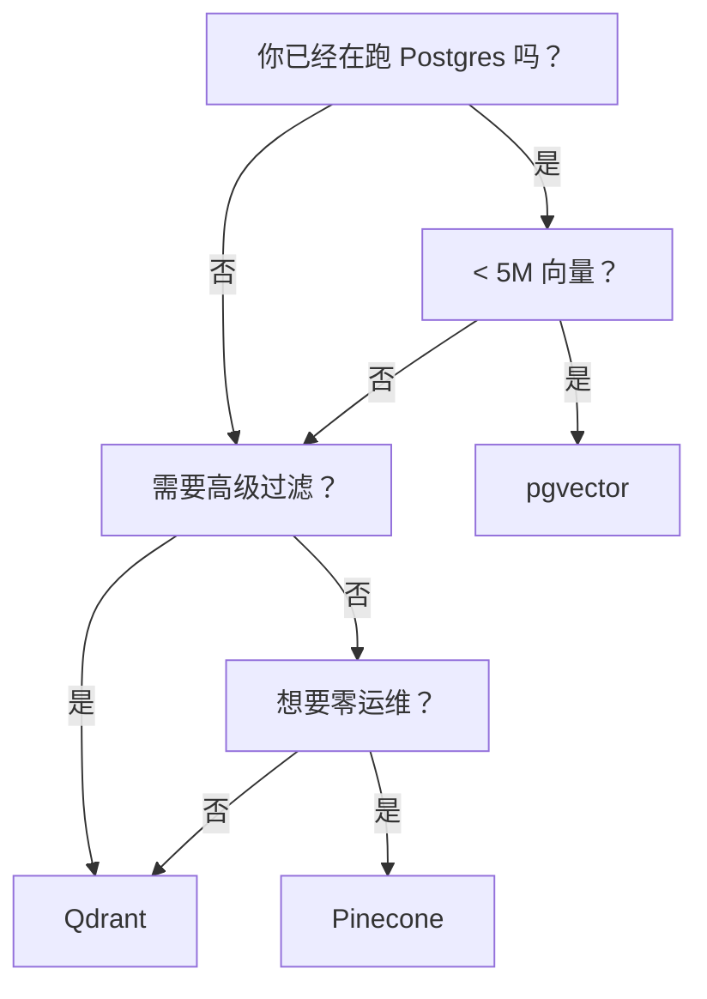

# 3. 向量检索与 ANN

你有 N 个 embedding。用户问了一个问题，你 embed 它，然后需要找出最近的 K 个向量。朴素做法在某个临界点之前都没问题。

## 暴力检索基线

```python
import numpy as np

def brute_force_topk(query: np.ndarray, corpus: np.ndarray, k: int) -> list[int]:
    # Both pre-normalized -> dot product == cosine.
    scores = corpus @ query           # shape: (N,)
    return np.argsort(-scores)[:k].tolist()
```

每次查询是 `O(N · d)`。10K 向量 × 1024 维 = 10M 次乘加——任何现代 CPU 上都是亚毫秒。**在你真正需要之前，不要急着用向量数据库。** 一个跑在进程内存里的 `numpy` 数组就是原型、评估和小规模生产语料（< 10K–100K 向量）的正确答案。

但到了 10M 向量、1024 维，暴力检索就是每次查询 10B 次操作——单线程下要几百毫秒。延迟变成你的问题。

## Approximate Nearest Neighbor（ANN）—— HNSW 的直觉

向量数据库用 **Approximate Nearest Neighbor** 索引解决这个问题——一种数据结构，用极小的 recall 损失换巨大的速度提升。2026 年的主流算法是 **HNSW**（Hierarchical Navigable Small World）。

直觉：HNSW 是一个**图的跳表**。最底层把每个向量连到它的邻居。越往上层向量越少，但边的跨度更大。一个 query 从顶层进入，贪心地跳向更近的邻居，掉一层，再跳几次，如此反复直到无法再改进。检索是 `O(log N)`，不是 `O(N)`。


你不用自己推导 HNSW。你只需要知道：

- 它是一个图索引。Build 是分摊到 insert 上的（比暴力 append 慢）。
- recall/延迟旋钮是 `ef_search`（Qdrant 里叫 `hnsw_ef`；pgvector 里叫 `hnsw.ef_search`）。值更高 = 探索更多候选 = recall 更高但更慢。
- 另一个图质量旋钮是 build 时的 `M`（每个节点的边数）。默认 16 没问题。

你还会看到另外两个算法：

- **IVF（inverted file index）**——把向量分到若干个 cluster；query 在 `nprobe` 个最近 cluster 里检索。在内存吃紧的超大语料场景更适合。
- **ScaNN**（Google）—— IVF + 积量化，针对十亿级优化。

对 95% 的团队，HNSW（通常配合量化）就是正确的默认。

## Recall vs 延迟

每个 ANN 索引都有一个旋钮：

| 旋钮 | 控制什么 | 调高意味着 |
|---|---|---|
| HNSW `ef_search` | 每次 query 检查的候选数 | recall ↑、延迟 ↑ |
| HNSW `M`（build） | 每个节点的边数 | recall ↑、索引更大、build 更慢 |
| IVF `nprobe` | 检索的 cluster 数 | recall ↑、延迟 ↑ |
| 量化（PQ/SQ） | 压缩激进程度 | 存储 ↓、recall 略 ↓ |

新建索引时，对照评估集（[§7](./evaluating-rag)）把 `ef_search` 从 32 扫到 256，挑能命中你 recall 目标的最低值。

## 2026 年怎么选向量 DB

实际上你只需要在三个里选：

| DB | 什么时候选 |
|---|---|
| **pgvector**（Postgres 扩展） | 你已经在跑 Postgres，规模 < 10M 向量。一个 DB，无新基础设施，和其他数据共享事务。大多数产品的默认选择。 |
| **Qdrant**（自部署，Rust） | 你需要在高 QPS 下做带过滤的检索（比如"只搜这个用户的文档"），或者想要完整的运维控制。过滤性能最好，默认值合理。 |
| **Pinecone**（托管） | 你不想运维任何东西，并且愿意付钱。可预测的托管定价，过滤和 metadata 体验过得去，没有服务器要管。 |

简短提一下：**Weaviate**（功能齐全，自带 hybrid；运维更重）、**Milvus**（超大规模，复杂）、**Chroma**（原型超棒——嵌入式、零配置；第一天就用它，以后再毕业）。很多团队在小语料的生产环境里一直跑 Chroma。

向量 DB 的选择对检索*质量*几乎没影响。它影响的是你的运维、过滤需求和规模。要优化质量，靠切块、embedding 和重排——不是靠换向量 DB。

### 对比矩阵

更详细地看看每个 DB 给你什么：

| DB | 部署模型 | 过滤 | Hybrid Search | 最大规模 | 计费模型 |
|---|---|---|---|---|---|
| **pgvector** | 自部署（你现有的 Postgres） | 基础（`WHERE` 子句，后置过滤） | 需要 `pg_search` / `ParadeDB` 插件 | 单实例 ~10M 向量 | 免费（OSS）；你只为 Postgres 实例付费 |
| **Qdrant** | 自部署或 Qdrant Cloud | 高级（payload 索引，前置过滤） | 内置 sparse+dense 融合 | 100M+ 向量（分片） | 免费（OSS 自部署）；Cloud：按向量用量计费 |
| **Pinecone** | 全托管 SaaS | Metadata 过滤（前置过滤） | 内置 sparse-dense | 1B+ 向量（serverless） | 按查询+存储计费；serverless 或 pod 两种模式 |
| **Weaviate** | 自部署或 Weaviate Cloud | GraphQL 风格过滤 | 内置 BM25 + 向量 | 100M+ 向量 | 免费（OSS 自部署）；Cloud：按用量计费 |
| **Chroma** | 嵌入式（进程内）或 client-server | `where` metadata 过滤 | 不内置 | ~1M 向量（单节点） | 免费（OSS） |

### 决策树

表格看不够，走一遍这个：



### pgvector 留在现有 Postgres 里：什么时候是对的

如果你已经在跑 Postgres，pgvector 几乎肯定是你的第一步。零新基础设施就能拿到向量检索——同一套备份、同一个连接池、同一个事务上下文。你的检索查询可以在一条 SQL 里 join 用户表、权限表和 metadata。对大多数 5M 向量以下的产品来说，这就是最甜的点：运维简单比向量检索的原始吞吐更重要。

该毕业的时刻是你撞到三面墙之一：(1) 带过滤的检索延迟很重要，而你的过滤条件复杂（pgvector 在 ANN scan 之后才做后置过滤，代价高）；(2) 你需要真正的 hybrid search（BM25 + dense），又不想再装一个插件；(3) 语料量增长到单个 Postgres 实例已经吃力。任何一条命中，就该迁移到 Qdrant 或 Pinecone——我们在 [Ch.5 §7：从 pgvector 到专用向量 DB](/backend-and-data/pgvector-graduation) 里详细讲迁移过程。

## 用 Chroma 写一个内存里跑的小例子

最快感受端到端的方式。`chromadb` 在进程内运行，不需要服务器。

```python
import chromadb
from chromadb.utils import embedding_functions

client = chromadb.Client()
embed_fn = embedding_functions.SentenceTransformerEmbeddingFunction(
    model_name="BAAI/bge-small-en-v1.5"
)

collection = client.create_collection(
    name="kb",
    embedding_function=embed_fn,
    metadata={"hnsw:space": "cosine"},
)

collection.add(
    documents=[
        "The Postgres MVCC mechanism uses transaction IDs to provide snapshot isolation.",
        "Cats are obligate carnivores and require taurine in their diet.",
        "HNSW builds a multi-layer graph for sub-linear nearest-neighbor search.",
    ],
    ids=["doc1", "doc2", "doc3"],
)

results = collection.query(
    query_texts=["how does ANN search work?"],
    n_results=2,
)
print(results["ids"])        # -> [['doc3', 'doc1']]
print(results["distances"])  # -> [[0.21, 0.78]]   (smaller = closer)
```

Add → query → results。向量 DB 把 embedding 调用、索引和数学全藏起来了。本章接下来要讲的，就是它的默认值什么时候不够用。

关于 `distances` 字段：大多数 DB 返回的是*距离*，不是相似度。对 cosine 来说，`distance = 1 - similarity`，所以越小越近。你 DB 的文档读一次就好，不要凭直觉假设。

下一节: [切块（Chunking）→](./chunking)
