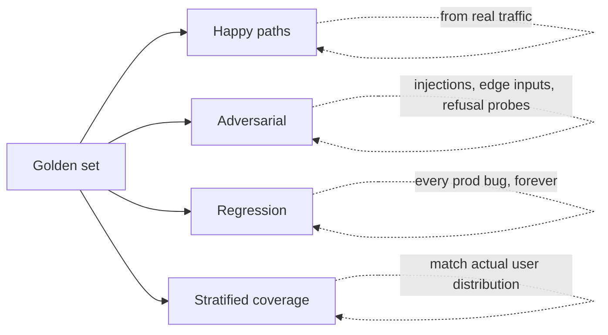

# 2. Golden Set

Golden set 是任何 LLM 项目里最有用的单一工件。它是一份带版本、带标注的 `(input, expected_output | rubric, metadata)` 元组集合，每次改动都要跑一遍。本章其他内容——指标、judge、线上评估——全是建立在你有这样一份东西之上的下游产物。

你已经在 [第 3 章 §7](../embeddings-and-rag/evaluating-rag) 见过这种模式（带 `gold_chunk_ids` 和 `gold_answer_facts` 的 RAG golden set）和 [第 4 章 §8](../agents-and-orchestration/evaluating-agents) 见过（带 `expected_outcome`、`allowed_tools`、`max_cost_usd` 的 agent golden set）。这一节把它们做一个一般化的总结。

## 一个 golden case 里放什么

一个最低可用的 case 有三个字段加几个辅助字段：

```python
from pydantic import BaseModel, Field
from typing import Literal, Optional

class EvalCase(BaseModel):
    id: str                              # stable, never reused — referenced in bug reports
    category: str                        # e.g. "billing", "shipping", "adversarial"
    difficulty: Literal["easy", "medium", "hard"] = "medium"

    input: dict                          # whatever your system takes — prompt, query, tool args
    expected: Optional[dict] = None      # programmatic-check expectations (gold answer, schema, etc.)
    rubric: Optional[str] = None         # for judge-graded cases

    must_say: list[str] = Field(default_factory=list)     # facts the answer must contain
    must_not_say: list[str] = Field(default_factory=list) # known wrong-answer traps
    notes: str = ""                                       # human context: why was this case added
```

注意这里没有的东西：单一的"期望输出字符串"。生成式输出没有这种东西。你要么有程序化的期望（schema、必须出现的事实、允许的工具调用），要么有 judge 用的 rubric。常常两者兼有。

把 case 存成 JSONL，这样它是 append-only 的，对 git diff 也友好：

```python
import json
from pathlib import Path

def write_golden_set(cases: list[EvalCase], path: Path) -> None:
    with path.open("w") as f:
        for c in cases:
            f.write(c.model_dump_json() + "\n")

def read_golden_set(path: Path) -> list[EvalCase]:
    return [EvalCase.model_validate_json(line) for line in path.read_text().splitlines() if line]
```

## 多大合适

别纠结。从小开始，随着用起来再长。

| 系统类型               | 起步规模    | 长到这么大     |
|---|---|---|
| 分类器 / 抽取器        | 100–300     | 1,000+         |
| 聊天 / 写作            | 50          | 200–500        |
| RAG                    | 100         | 300–1,000      |
| Agent                  | 30          | 100            |
| 微调 held-out 集合     | 200         | 1,000+         |

前 30 个 case 能抓住 70% 的回归。再加 100 个，能抓住剩下 25% 里的大部分。再往后就是边际收益递减——除非你做的是那种合规要求高、覆盖率比开发速度更重要的产品。

一条经验：如果最近 3 个真实的生产 bug，你的 golden set 都能抓到，那它就够大了。如果抓不到，把它们加进去。

## 该放什么进去（四个桶）

每个 golden set 都应该包含四类 case，对一个聊天类产品而言比例大致均衡：

**1. Happy path。**用户实际会问的东西。如果你有线上流量就从那里采样；没有的话就让 PM 列出他认为产品最该解决的 20 个用例。

**2. 对抗性 case。**已知的 prompt 注入尝试（"忽略之前的指令"）、边界输入（空字符串、50KB 的 emoji、混合语言）、以及系统应该拒答的内容。在这一切片上，**拒答即成功**。

**3. 失败模式 / regression test。**每一个生产 bug 都变成一个永久 case。你修 bug 的那天，把触发它的输入加进来。打上 `regression` 标签。它再也不会被移除。

**4. 分层覆盖。**匹配真实用户分布。如果 30% 的流量是西班牙语，你的 golden set 至少要有 20% 西班牙语。如果 5% 用户发 PDF，那 5% 的 case 是 PDF。这份集合得长得像用户种群，不是长得像你开发团队的习惯。



## 标签从哪里来

三个来源，按成本和质量从低到高：

**用更强的模型合成。**让一个前沿模型从你的语料或产品规格里生成貌似合理的 query 和"金"答案。快、便宜、可扩展。注意偏置：这些 case 会带着这个强模型的写作风格，反映的是它认为用户会问什么。真实用户更怪、更短、更暴躁。

**真实生产流量。**信号最好。采样 query（去掉 PII），标上期望行为，加进集合。要花力气，但 case 是真的。这也是闭合可观测性循环的方式（[§6](./observability)）——生产日志会变成下个季度的 golden set。

**人工标注。**对 rubric 评分的子集和给 judge 校准（[§4](./llm-as-judge)）来说，这是黄金标准。别想着用手工标 500 个 case。挑 30–50 个高价值 case 仔细标，把它们当作给 judge 模型校准的校准集。

一个好的 golden set 会把这三者混合起来。合成保证广度，生产保证真实，人工标注用来给 rubric 校准。

## 怎么维护

Golden set 是一个有生命的工件，不是一锤子买卖。

**用 git 做版本管理。**和用它的代码放同一个仓库。Set 的每一次 commit 都是可复现的。改动这份 set 的 PR 像代码一样被 review。

**给每个 case 标一个创建原因。**"因为 #4231 加的。""检索器重写时加的。""季度流量重采样加的。"这是你以后审计漂移的依据。

**每季度从生产环境重新采样。**用户行为会漂移。半年前用户问的问题不是今天用户问的问题。每季度采 20 个新的生产 case，标注，加进集合。淘汰那些再也反映不了任何东西的 case（很少；多数情况下你只在加）。

**审计分布。**每季度数一下 case 在各类别的数量。如果你 80% 的 case 是"happy path 英语"，但生产流量 40% 是西班牙语，你就有校准问题。重新平衡。

**regression 切片永远保留。**别因为模型变好了就删掉旧的失败 case。regression test 的全部意义就是当新系统重新引入旧 bug 时它能告诉你。

## PII 和"训练数据混进了测试集"这条规则

两条不可妥协的安全规则：

**1. PII 在任何 case 进入集合之前都要脱敏。**姓名、邮箱、电话号码、账户 ID、地址。用一个确定性的 redactor，让同一个输入永远脱敏成同样结果（否则 judge 调用会因为无关原因变成非确定性）。

**2. 评估集永远不进训练数据。**永远不。如果你做微调（[第 11 章](../fine-tuning)），你的 held-out 评估集必须和训练数据**密码学层面**地隔离——不同文件、做哈希校验、在训练流水线里作为显式的 deny-list 写入。在你的测试集上训练会让你的分数虚高，模型看起来比实际好，你以为是个改进，实际上你把更差的模型推到了生产。每个团队都要踩一次这个坑。别当那个团队。

实操上的隔离：把 golden set 放在 `golden/` 目录里，把训练数据生成到 `train/` 目录，跑一个 CI 检查断言两边输入哈希的交集为空。

```python
import hashlib

def case_hash(case: EvalCase) -> str:
    return hashlib.sha256(json.dumps(case.input, sort_keys=True).encode()).hexdigest()

def assert_disjoint(golden: list[EvalCase], train: list[dict]) -> None:
    g = {case_hash(c) for c in golden}
    t = {hashlib.sha256(json.dumps(x["input"], sort_keys=True).encode()).hexdigest() for x in train}
    leaked = g & t
    if leaked:
        raise RuntimeError(f"Training set leaks {len(leaked)} eval cases: {list(leaked)[:5]}")
```

把它接进微调流水线的 CI。

## 版本管理，无聊但关键的部分

每一个汇报出来的数字都是 `(metric, model_version, prompt_version, golden_set_version, timestamp)`。任何一个没钉死，这个数字就没意义。

要钉死的版本：

- Golden set：JSONL 文件的 git SHA。
- Prompt：渲染后的系统提示词 + 工具 schema 的哈希。
- 模型：供应商的 model ID，包括日期后缀（比如 `claude-sonnet-4-5-20260315`）。
- Judge：和模型同样规则——包括它的版本。
- Rubric：rubric prompt 的哈希。

把这些塞进一个 `RunMetadata` 对象，跟每个指标一起记下来：

```python
class RunMetadata(BaseModel):
    golden_set_sha: str
    prompt_hash: str
    model_id: str
    judge_id: str | None
    rubric_hash: str | None
    timestamp: str
```

当有人问"新 prompt 有没有帮助？"时，你不是凭记忆争辩。你是把两份 `RunMetadata` 和它们旁边的指标 diff 一下。

下一节: [指标 →](./metrics)
