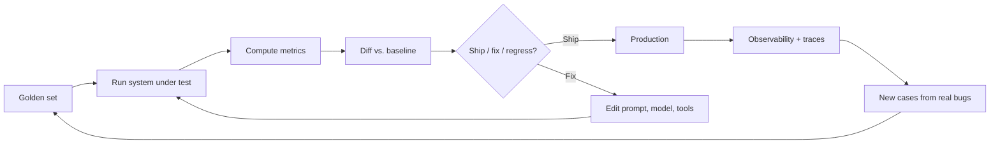

# 评估与可观测性

这一章是 [第 0 章 §6](../how-llms-work/sampling) 立下的那句承诺真正兑现的地方：**别再期待单元测试，开始期待分布。** 前面十章都向这一章做过前向引用，现在我们让它落地。

如果你读完了前面那些内容，你已经知道这个问题长什么样：

- LLM 是非确定性的。同一个 prompt，输出不一样（[第 0 章 §6](../how-llms-work/sampling)）。
- 幻觉率、注入成功率、拒答率都是分布，不是布尔值（[第 2 章 §9](../llm-apis-and-prompts/failure-modes)）。
- RAG 在两个面上失败：检索和生成，你要分别去衡量（[第 3 章 §7](../embeddings-and-rag/evaluating-rag)）。
- Agent 输出是轨迹。你要分别衡量成功率、轨迹质量和预算合规性（[第 4 章 §8](../agents-and-orchestration/evaluating-agents)）。
- 微调需要一个 held-out 的 regression set，不然你根本不知道这次微调到底是有帮助还是搞砸了（[第 11 章](../fine-tuning)）。

那些都是特例。本章给的是通用理论：chat、RAG、agent、微调、分类器——它们其实是同一个问题。非确定性输出，作为一个有标注集合上的分布来评估，配上 regression 纪律。

## 评估的飞轮

评估是一个循环。生产环境的可观测性反哺到 golden set。Golden set 驱动离线 regression test。每一次 prompt、模型或工具的变更，在合并之前都要跑一遍这个循环。这个飞轮就是你能安全地改动任何东西的前提。

## 读完本章你将能够

- 给你产品里任何一个由 LLM 驱动的功能搭出一个 golden set。
- 给一项任务挑出对的指标（程序化的、模型评分的、人工评分的）。
- 写一份能跟人类校准、不靠感觉的 LLM-as-judge prompt。
- 把离线评估接进 CI，把线上评估接进 shadow traffic 和 canary。
- 给每一次 LLM 调用记录正确的字段，让"为什么这次回归了？"不靠猜。
- 选一种工具姿态（托管平台 vs. 自己搭），同时不被锁死。
- 在交付 LLM 功能时，不再让"我试了三个 prompt，看着挺好"成为你的测试方案。

## 本章内容

1. [评估的心态](./the-eval-mindset)——分布优先于相等；为什么传统 QA 失效；和科学方法的类比。
2. [Golden Set](./golden-sets)——构建、规模、漂移、给你那份带标注的 regression 集做版本管理。
3. [指标](./metrics)——程序化的、模型评分的、按 rubric 评分的；按任务挑选；成本对信号的权衡。
4. [LLM 作为评判者](./llm-as-judge)——经典模式、各种偏置、跟人工的校准、prompt 模板。
5. [线上 vs. 离线评估](./online-vs-offline)——CI 评估、shadow traffic、canary、A/B test。
6. [可观测性](./observability)——tracing、日志、结构化事件、每次调用应该记什么。
7. [工具与平台](./tools)——有立场的、最多点名 3 个工具、面向 2026 的视角。
8. [结语](./closing)——本书的终点。

本章后面假设的读者，是读完了第 12 章的那个人：能调用模型、能搭 RAG、能上线 agent、能微调、能自部署。他们还做不到的，是**知道这些东西到底有没有真的在工作**。这一章就是为了解决这件事。

下一节: [评估的心态 →](./the-eval-mindset)
