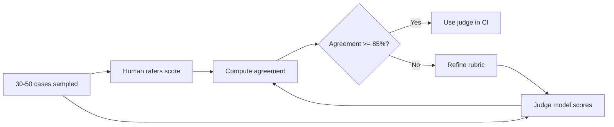

# 4. LLM 作为评判者

模式：用一次单独的 LLM 调用来评估被测系统的输出。judge 拿到 input、判定标准或 rubric、以及候选回复，输出一个结构化的判决。你把整个 golden set 上的判决聚合成一个比率。

你已经见过具体的实例：[第 3 章 §7](../embeddings-and-rag/evaluating-rag) 里的 faithfulness 评分、[第 4 章 §8](../agents-and-orchestration/evaluating-agents) 里的轨迹评分。这一节讲一般化的模式，并把失败模式点出来。

## 它为什么 work（以及哪儿不 work）

LLM-as-judge 之所以 work，是因为评判"这个答案是否满足这条 rubric"比一开始就生成那个答案要容易得多。一个 judge 能识别出好的摘要，哪怕它自己写不出多好的摘要。识别和生成之间的这种不对称是真实存在的，足够可靠到让你在它之上构建系统。

它不 work 的时候：

- rubric 需要 judge 没有的知识。judge 在它自己也答错的话题上，没法评判事实正确性。
- 输出质量超过了 judge 自己的天花板。一个小 judge 在评判前沿模型输出时，常常 miss 掉那些细微之处。
- rubric 模糊。rubric 含糊时，judge 会胡乱编出分数。要的是具体的、可检验的 rubric；不是"这个好不好"。

## 经典模式

永远把 judge 强制扔进结构化输出（[第 2 章 §5](../llm-apis-and-prompts/structured-output)），让判决是可解析的，不是自由文本。

```python
from pydantic import BaseModel, Field
from typing import Literal
from anthropic import Anthropic

client = Anthropic()

class JudgeVerdict(BaseModel):
    score: int = Field(ge=1, le=5, description="1=fails rubric, 5=fully satisfies")
    passes: bool = Field(description="True if score >= 4 and no rubric dimension is 1.")
    reasoning: str = Field(description="One paragraph. Cite specific text from the candidate.")

JUDGE_SYSTEM = """You are a strict evaluator. You will be given an input, a rubric, and a candidate response.
Score the candidate against the rubric on a 1-5 scale. Be specific in your reasoning and quote the candidate verbatim where relevant.
Do not reward verbosity. A short, complete answer is better than a long, padded one.
If you are unsure, score lower, not higher."""

def judge(input_text: str, rubric: str, candidate: str) -> JudgeVerdict:
    user = (
        f"<input>{input_text}</input>\n\n"
        f"<rubric>{rubric}</rubric>\n\n"
        f"<candidate>{candidate}</candidate>"
    )
    resp = client.messages.create(
        model="claude-haiku-4-5-20260201",
        max_tokens=512,
        temperature=0,
        system=JUDGE_SYSTEM,
        tools=[{
            "name": "submit_verdict",
            "description": "Submit a verdict against the rubric.",
            "input_schema": JudgeVerdict.model_json_schema(),
        }],
        tool_choice={"type": "tool", "name": "submit_verdict"},
        messages=[{"role": "user", "content": user}],
    )
    return JudgeVerdict.model_validate(resp.content[0].input)
```

注意几点：

- **温度 0。**评判应该尽可能确定性。
- **强制工具调用。**没有自由文本判决。judge 必须输出可解析的 JSON。
- 尽可能用**和被测系统不同的模型家族**（缓解 self-preference，见下文）。
- 多数 rubric 用**便宜的模型就够**。把前沿模型留给那些 judge 自身天花板会决定结果的精细 rubric。

## 两种模式

### 单输出评分

把候选答案对照一份绝对 rubric 来评分。打 1–5 分。适用：

- 你在追踪一个随时间变化的指标，需要一个可比较的绝对分数。
- 你没有可对比的 baseline（比如某个功能的第一版）。
- rubric 有清晰、可检验的维度。

缺点：绝对分数会跨次跑、跨模型版本飘移。每季度重新校准。

### Pairwise 比较

让 judge 比较候选 A 和候选 B。judge 选出胜者，并给出推理。

```python
class PairwiseVerdict(BaseModel):
    winner: Literal["A", "B", "tie"]
    margin: Literal["clear", "slight", "tie"]
    reasoning: str
```

Pairwise **比绝对评分更可靠**。人比起"这个 1-5 分多少分"更擅长"哪个更好"——judge 也继承了同样的特性。Pairwise 用于：

- A/B 风格的对比（新 prompt vs. 旧 prompt、新模型 vs. 旧模型、微调 vs. base——[第 9 章](../fine-tuning)）。
- 把胜率作为头部指标（"新 prompt 在对老 prompt 的 pairwise 比较中胜出 64%"）。

缺点：位置偏置很严重（见下文）。永远跑两种顺序。

## 已知的偏置

这些都是*真实的、可测量的*。要事先规划好。

| 偏置                            | 它做了什么                                                         | 应对                                                                                              |
|---|---|---|
| **Verbosity（啰嗦偏好）**        | judge 偏爱更长的答案，哪怕短的就够。                                | 在 rubric 里加上"够用前提下越短越好"。把输出 token 数作为单独指标追踪。                            |
| **Position（位置偏置，仅 pairwise）** | judge 偏爱排在前面的（有时是后面的——看模型）。                | 跑两种顺序：A-vs-B 和 B-vs-A，平均。如果两次结果不一致，记为平局。                                 |
| **Self-preference（自偏好）**    | 模型偏爱自己写作风格的输出。                                        | 用一个和被评模型不同家族的 judge。别让 GPT 永远评 GPT。                                            |
| **Sycophancy（迎合）**           | judge 会迎合 prompt 里的暗示（"这个候选好像比较弱……"）。            | 不要有暗示性语言。judge 只看到 rubric 和候选答案。                                                 |
| **Format bias（格式偏置）**      | Markdown / 列表 / 结构化输出比同等内容的散文得分高。                | 在 rubric 里明确写"不评判格式"。                                                                  |
| **Length-of-rubric bias（rubric 越长分越虚高）** | 长 rubric 让分数虚高（judge 在每个维度上都"找出点优点"）。 | rubric 维度三到五个，最多。保持紧凑。                                                              |

一个处理位置偏置的 pairwise 框架：

```python
def pairwise_robust(input_text: str, a: str, b: str, rubric: str) -> Literal["A", "B", "tie"]:
    v1 = judge_pairwise(input_text, rubric, candidate_first=a, candidate_second=b)
    v2 = judge_pairwise(input_text, rubric, candidate_first=b, candidate_second=a)

    # v1.winner is in terms of (a, b); v2.winner is in terms of (b, a) — flip it back
    w1 = v1.winner            # "A"=a, "B"=b
    w2 = "B" if v2.winner == "A" else "A" if v2.winner == "B" else "tie"

    if w1 == w2:
        return w1
    return "tie"
```

如果你想省钱跳过第二次调用：别。位置偏置可以在两个方向上各 10–20%，会无声扭曲你的数字。

## 跟人工校准

Judge 校准是"评估能用"和"数字在飘"之间的差别。最低限度的循环：



具体过程：

1. 从本季度的跑里随机抽 30–50 个 case。
2. 两个人各自独立按 judge 用的同一份 rubric 打分。
3. 丢掉两人意见不一致的 case（rubric 太模糊；修 rubric，不是修 judge）。
4. 比较 judge 分数和人工共识分数。算一致率（exact，或 1–5 分制下 ±1 以内）。
5. 如果一致率低于约 85%，**迭代 rubric** 直到达标。**不要**迭代 judge 模型。

为什么"迭代 rubric，不是 judge"？因为 rubric 质量会复利。一份锐利的 rubric 跨模型版本、跨 judge 模型替换、跨团队成员都能用。一份只因为 GPT-4o 有特定口味才 work 的 rubric 是脆的。

## 当 judge 跟你对着干

judge 结果不符合直觉时的三种诊断模式：

- **judge 说什么都好，人说就那样。**rubric 太宽容。加一句"必须满足以下全部"。加一个"这些失败模式只要出现一个就 1 分"的兜底。
- **judge 分数在不同跑之间剧烈波动。**温度不是 0，或者你的 prompt 在别处是非确定性的（比如里面塞了时间戳）。把所有东西都钉死。
- **judge 在同一个 case 上自己跟自己分歧。**位置偏置、格式偏置，或者你撞上了一个被悄悄更新的模型。把模型版本钉死（用 `claude-haiku-4-5-20260201`，不要用 `claude-haiku-4-5`）。

## 关于成本

粗略估算：

```
500 cases × $0.005 per judge call    = $2.50 per eval pass
3 eval passes per PR (programmatic + judge + slice breakdown) = $7.50 per PR
40 PRs/month                          = $300/month for one product
```

这是一个工程师工时的钱。比不跑评估便宜。要明确追踪它，不要让它意外蹦出来吓到人，但也不要过早优化——成本不会是你的瓶颈。

如果它真成了瓶颈（你在每次 commit 都对一个 5K 规模的 case 集合跑一个 $0.05 / 次的前沿 judge）：

- 内循环 CI 改用便宜的 judge；前沿 judge 留给夜间跑和发布前。
- 把 judge 判决以 `(input_hash, candidate_hash, rubric_hash, judge_model_id)` 为 key 缓存。多数 case 在不同跑之间没有变。
- 子采样。200 个 case 对多数 regression 信号已经够了；不需要每个 PR 都跑全部 5,000 个。

下一节: [线上 vs. 离线评估 →](./online-vs-offline)
