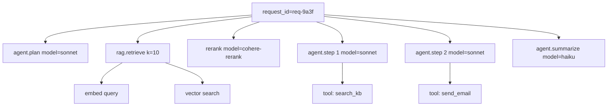

# 6. 可观测性

评估告诉你系统在你挑选的 case 上 work 没 work。可观测性告诉你系统在生产环境里实际做了什么——每一次调用、每一个 token、每一次工具调用。两者互补：离线评估是假设；可观测性是实验记录。

如果你之前交付过后端系统，这个心智模型很熟悉：结构化日志、trace、指标。形状一样。变的是*你记什么*。

## 每次 LLM 调用应该记什么

最低限度的生产字段集合，按调用：

| 字段                                          | 为什么                                                                                                |
|---|---|
| `request_id`                                  | 工单、调试、回放用的稳定 handle。                                                                     |
| `user_id`、`session_id`                       | 按用户 / 按会话聚合。                                                                                 |
| `parent_span_id`                              | 给嵌套调用用（agent、RAG、多步流水线）。                                                              |
| `model`、`temperature`、`top_p`、采样参数      | 可复现性。                                                                                            |
| `system_prompt_hash`                          | 钉住 prompt 版本。完整 prompt 太大不适合每次都记；哈希就够了。                                        |
| `tool_schema_hash`                            | 工具定义同理。                                                                                        |
| `input_messages`（或摘要）                    | 完整 messages，或 PII 敏感时只记哈希。见下面 PII 那节。                                               |
| `input_tokens`、`output_tokens`               | 算钱用。                                                                                              |
| `output_text`（或摘要）                       | 模型生成了什么。                                                                                      |
| `stop_reason`                                 | `end_turn`、`max_tokens`、`tool_use` 等等——区分"完成"和"截断"。                                       |
| `latency_ttft_ms`、`latency_total_ms`          | TTFT 和总延迟。两个都重要（[第 2 章 §8](../llm-apis-and-prompts/cost-and-latency)）。                 |
| `cost_usd`                                    | 由 token × 单百万价格算出。直接记下来，这样在 SQL 里能 SUM。                                          |
| `tool_calls`                                  | 每个工具名、参数（或摘要）、结果、耗时。                                                              |
| `cache_hit`                                   | prompt cache 是否命中？对成本分析很关键（[第 7 章](../kv-cache)）。                                   |
| `error_type`（如有）                          | 拒答、超时、限流、JSON 不合法、schema 校验失败。                                                      |

把这些记成结构化 JSON，每次调用一条事件。具体传输方式不重要——stdout 写 JSON，再发到 BigQuery / ClickHouse / OpenSearch / 你现有的日志系统都行。

```python
import json
import time
import hashlib
import structlog
from contextvars import ContextVar

log = structlog.get_logger()
request_id_var: ContextVar[str] = ContextVar("request_id")

def call_with_tracing(client, *, system: str, messages: list[dict], model: str) -> dict:
    span_id = hashlib.sha256(f"{time.time()}-{model}".encode()).hexdigest()[:16]
    started = time.perf_counter()
    ttft_ms = None

    resp = client.messages.create(
        model=model, system=system, messages=messages,
        max_tokens=1024, temperature=0,
    )
    total_ms = (time.perf_counter() - started) * 1000

    log.info(
        "llm_call",
        request_id=request_id_var.get("unknown"),
        span_id=span_id,
        model=model,
        system_prompt_hash=hashlib.sha256(system.encode()).hexdigest()[:12],
        input_tokens=resp.usage.input_tokens,
        output_tokens=resp.usage.output_tokens,
        stop_reason=resp.stop_reason,
        latency_total_ms=round(total_ms, 1),
        cache_hit=getattr(resp.usage, "cache_read_input_tokens", 0) > 0,
        cost_usd=cost_from_usage(model, resp.usage),
    )
    return resp
```

这就是最低可用的 trace 事件。`parent_span_id`、工具调用、TTFT 这些等你升级到一套 tracing 库再补（见下文）。

## 为什么要 parent / child span

一个用户请求很少只对应一次 LLM 调用。一次 agent run 是棵树：planner 调用、检索、reranker、模型调用、工具调用、模型调用、工具调用、汇总。日志里没有父子关系，你说不清 p99 延迟 12 秒是哪儿来的——是检索、rerank，还是某一次慢的工具调用？



Tracing 库（OpenTelemetry，加上 LLM 专用层比如 Langfuse 或 Phoenix）会给你这棵树。机制就是 `parent_span_id` 把每次调用挂到它的父节点上。嵌套的 LLM 调用继承上去；工具调用注册成子 span。你在生产流量里以火焰图 UI 浏览，能看到结构。

OpenTelemetry 的 `set_attribute` 模式，万一你不想用 vendor 想自己滚：

```python
from opentelemetry import trace

tracer = trace.get_tracer("llm")

def call_traced(client, system: str, messages: list[dict], model: str):
    with tracer.start_as_current_span("llm.call") as span:
        span.set_attribute("llm.model", model)
        span.set_attribute("llm.system_prompt_hash", hash_str(system))
        span.set_attribute("llm.input_messages_count", len(messages))
        resp = client.messages.create(model=model, system=system, messages=messages, max_tokens=1024)
        span.set_attribute("llm.input_tokens", resp.usage.input_tokens)
        span.set_attribute("llm.output_tokens", resp.usage.output_tokens)
        span.set_attribute("llm.stop_reason", resp.stop_reason)
        span.set_attribute("llm.cost_usd", cost_from_usage(model, resp.usage))
        return resp
```

OpenTelemetry "GenAI" 语义约定从 2025 年起就存在了；适合的时候直接用。供应商专用看板通常映射到同一套字段。

## 从这些日志能算出什么

每个团队都该有的看板短列表：

- **按用户、按功能、按模型的成本。**"功能 X 的单位经济学是什么样？"
- **p50 / p95 / p99 延迟。**按模型、按功能。盯 p95，不是 p50——平均值会藏东西。
- **拒答率。**按切片（对抗 vs. 良性）。突增意味着要么模型更新改了安全阈值，要么生产环境出现了新的攻击模式。
- **幻觉率。**按计划用一个离线 judge（[§4](./llm-as-judge)）抽样生产输出。把这个比率画出来。
- **cache 命中率。**按 system prompt 版本。这里掉了，通常是有人把时间戳塞进系统提示词、把前缀缓存搞坏了（[第 7 章](../kv-cache)）。
- **schema 校验失败率。**给结构化输出端点用。非零即 bug。
- **每请求 token 花销。**用它追踪上下文窗口蔓延。一个会话里持续增长的对话能在没人注意的情况下吃掉你的成本预算。
- **漂移指标。**输入长度、语言、意图随时间的分布。把本周和上季度对比。这里漂移就是去刷 golden set 的触发器（[§2](./golden-sets)）。

这些都是结构化日志上的 SQL。不需要供应商也能看到——你需要的是字段都在那儿。

## PII 和隐私

LLM 日志包含用户输入和模型输出。常常包含 PII：姓名、邮箱、账号、医疗或法律情况的自由描述。

实操规则：

1. **任何可能含 PII 的用户输入，存储前先哈希。**用确定性哈希，让同样的输入映射到同样的哈希；这就够你跨会话检测重复和去重，而不必存原文。
2. **完整对话保存在一个独立的、受限的 store**，保留期短（比如 7–30 天）、有访问审计。这是给客服工单和事故响应回放用的。
3. **写入时脱敏，不是读取时。**让 redactor 在日志离开应用之前就跑一次，可以避免那种"不小心把一张信用卡号写进 BigQuery"的事故。
4. **没脱敏过的生产对话不要直接进 golden set**，连内部评估也不要——你的 golden set 是入版本控制的工件，不该含 PII。

一个最小化的 redactor：

```python
import re

EMAIL = re.compile(r"\b[\w.\-]+@[\w.\-]+\.\w+\b")
PHONE = re.compile(r"\b\d{3}[-.]?\d{3}[-.]?\d{4}\b")
CC    = re.compile(r"\b(?:\d[ -]?){13,16}\b")

def redact(text: str) -> str:
    text = EMAIL.sub("[EMAIL]", text)
    text = PHONE.sub("[PHONE]", text)
    text = CC.sub("[CC]", text)
    return text
```

便宜，比什么都没有强多了。对更高风险的领域（医疗、法律），用一个真正的 PII 库——开源的有几个——挂到同一条写入路径上。

## 漂移检测

生产流量会漂。你的 golden set 是半年前用户当时问的问题搭起来的。现在 case 的分布可能就不一样了。

两个能从日志算出来的简单漂移信号：

- **长度分布漂移。**本周输入 token 数的直方图 vs. baseline。均值偏移 20%+，要么用户、要么客户端 app 变了。
- **类别分布漂移。**如果你有意图分类器（[第 4 章](../agents-and-orchestration)），按时间盯每个意图的比率。新出现且量不小的意图 = 一个你没设计过的用例。

漂移超过阈值时做两件事：(1) 从生产抽新鲜 case 加进 golden set；(2) 在新 set 上重跑离线评估。在过期 set 上的旧指标会无声地飘到失去意义。

## 关于日志量

LLM 流量很啰嗦。一个中等流量的聊天产品一天能产出几个 GB 的结构化日志。别什么都永久存：

- **热存**（可查询、有索引）：完整调用记录 7–30 天。
- **温存**（压缩、便宜）：90 天到 1 年，采样或聚合。
- **冷存**（对象存储上的 parquet）：1 年以上，给法律 / 合规用。

聚合（比率、分位数、成本）每晚预计算一次，便宜地永久存下来。明细事件按年龄淘汰。这跟 APM 是同一套打法，只是 payload 更大。

## 这些能让你做什么

可观测性到位之后，你能回答这种问题：

- "周二 p95 延迟为什么翻倍？"——火焰图显示是新工具有 8% 的概率超时。
- "哪个功能贡献了我们的 LLM 成本？"——按功能 label group by。
- "上周改的 prompt 让幻觉率回归了吗？"——按 `system_prompt_hash` 拆分拒答 / 幻觉率，按时间画出来。
- "有人在滥用 API 吗？"——按 `user_id` group by，看请求数和拒答率。
- "供应商是不是悄悄更新了模型？"——某个日期模型行为变了但代码没改。日志能证明。

这些都是你需要答案的问题。评估防止 bug 上线；可观测性发现那些还是上了线的 bug。两个都得有。

下一节: [工具与平台 →](./tools)
