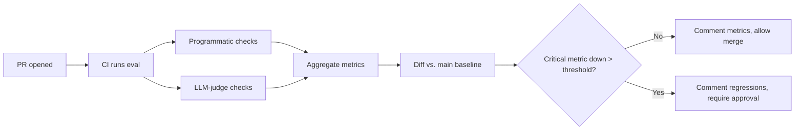
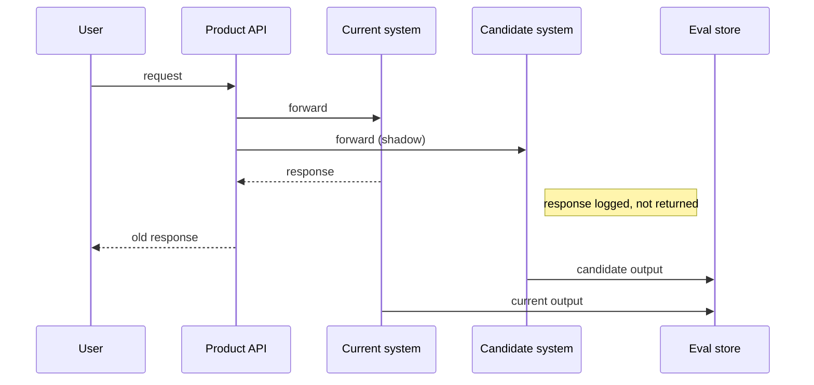
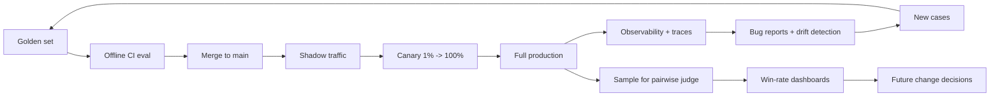

# 5. 线上 vs. 离线评估

两种评估模式。它们是互补的；谁也替代不了谁。

|              | 离线（offline）                          | 线上（online）                              |
|---|---|---|
| 在哪儿       | 开发机 / CI 上的 golden set              | 生产流量                                    |
| 速度         | 反馈快（分钟级）                         | 反馈慢（小时到天）                          |
| 覆盖         | 已知 case，精挑细选                      | 真实分布，无界                              |
| 成本         | 便宜                                     | 计算成本上免费，用户风险上昂贵              |
| 抓什么       | 已知场景上的回归                         | golden set 没预料到的情况                   |
| 阶段         | 合并前                                   | 合并后，渐进灰度                            |

只做离线，你会上线一些过得了测试但生产里翻车的东西。只做线上，你靠数客服工单来发现回归。**两个都跑。**

## 离线：CI 循环

离线评估是一个 CI job。每个动到 prompt、模型、工具、检索器或微调的 PR 都触发它。golden set 端到端跑一遍。指标对 `main` 做 diff。回归阻断合并或要求签字放行。



机械层面：

```python
import json, subprocess
from pathlib import Path

def run_eval(golden_set: Path, prompt_version: str, model_id: str) -> dict:
    cases = read_golden_set(golden_set)
    results = [run_one(c, prompt_version, model_id) for c in cases]
    return {
        "schema_valid_rate":  rate(r.metrics["schema_valid"] for r in results),
        "must_say_rate":      rate(r.metrics["must_say_all"] for r in results),
        "judge_pass_rate":    rate(r.metrics["judge_passes"]   for r in results),
        "p95_latency_ms":     percentile([r.latency_ms for r in results], 95),
        "avg_cost_usd":       sum(r.cost_usd for r in results) / len(results),
        "by_category":        slice_metrics(results, cases),
    }

def diff_vs_baseline(new: dict, baseline: dict) -> list[str]:
    regressions = []
    for k in ["schema_valid_rate", "must_say_rate", "judge_pass_rate"]:
        delta = new[k] - baseline[k]
        if delta < -0.02:    # 2pp regression threshold
            regressions.append(f"{k}: {baseline[k]:.3f} -> {new[k]:.3f} ({delta:+.3f})")
    return regressions
```

把 `diff_vs_baseline` 接进一个会在 PR 上评论的 bot。评论是空的，PR 就干净。评论里列了回归，作者要么修掉、要么显式签字放行。这是 prompt 和模型变更可以扩展的"代码评审"版本。

有些团队会再加一个"胜率" pairwise 比较（[§4](./llm-as-judge)），直接拿新版本对 baseline 评分。这个数字——"新 prompt 在对 main 的 pairwise 比较中胜出 58%"——往往比绝对分数更直观。

## 线上：渐进灰度

离线告诉你在你已知的 case 上有没有回归。线上告诉你那些你不知道的 case 上的事。

三种模式，按风险递增：

### Shadow traffic（零用户风险）

把进来的生产请求复制一份发给新系统。**不**把它的回复返回给用户；只记录。



现在你在真实流量上有了一串 `(input, current_output, candidate_output)` 三元组。在其中几千条上跑 LLM-judge 的 pairwise 比较（[§4](./llm-as-judge)）。"在真实分布上对当前系统的胜率"是离线风格指标里的黄金标准。

什么时候用 shadow：

- 候选是一次大改动（新模型、新 RAG 检索器、新微调）。
- 在 shadow 窗口期间付双倍流量的钱你能接受（不总是便宜）。
- 系统是无状态或接近无状态的。有状态系统（memory、session）需要小心处理——别向用户状态写两次。

### Canary（1% 用户风险）

把新系统灰度给 1% 的用户（或 1% 的请求）。盯指标。绿了就 ramp 到 5%、25%、100%。

canary 切片要看的：

- 硬信号：错误率、p95 延迟、拒答率、单请求成本。
- 用户向信号：thumbs-up / thumbs-down 比率、"重新生成"率、会话长度、完成率、留存。
- 一份 canary 输出样本上的 LLM-judge 信号（异步跑、推到看板）。

多数 prompt 改动应该走 canary，不应该直接合并到 100%。代价小，保护大。周一早上发 canary，让你有一周时间观察再到周末。

### A/B test（有控制的实验）

当变更大到对产品策略真有影响时，跑一次真正的 A/B。用一个稳定哈希把用户分到 A 和 B，保持分组两周，量用户向指标。统计显著性是适用的。

不那么显然的事：**模型评分指标常常和用户向指标不相关。**一个新 prompt 可能在 70% 的 pairwise judge 比较里胜出，但对用户留存零影响。或者反过来——一个"质量更低"的输出可能因为更简洁、或问了一个把用户拉进来的追问，反而拿到更高的用户参与。

两个都要量。judge 告诉你你定义的那些质量维度上的事。A/B 告诉你用户实际在乎什么。两者分歧本身就是信息——通常说明 rubric 有问题。

## 评估的飞轮，加上线上 + 离线



闭合循环的那些箭头最重要。生产环境的可观测性（[§6](./observability)）把新 case 反喂回 golden set。Bug 报告作为 regression case 反喂回去。漂移检测（这季度的流量长得不像上季度）会触发 golden set 刷新。

飞轮就是评估能扩展的原因。没有它，golden set 是个一次性的工件，会过期。有了它，你的测试集会跟踪它本来要代表的种群。

## 淘金规则

> 如果你的离线评估看起来很棒、但线上指标没动，那是你的离线指标错了。

这是本章里最重要的一句话。你会想跟它争辩（"但 judge 说新 prompt 更好啊！"）。别。用户行为是 ground truth。如果 judge 说 A 更好但用户行为没变，那 judge 在测一些用户不在乎的东西。**改 rubric，或者改 golden set，去捕捉用户真正看重的东西。**

推论：如果线上指标动了但离线没变，你的 golden set 缺了那些驱动这次变化的 case。把它们加进来。

## 微调走的是同一个循环

微调（[第 9 章](../fine-tuning)）就接到这同一个飞轮上：

- 离线：拿微调后的模型跑 golden set，对 base 模型 diff。如果它在关键切片上回归了，哪怕平均分上升也要拒绝它。（一个帮了一个切片、坑了另一个切片的 tune，常常*比* base *更差*。）
- Shadow：把真实流量 shadow 给微调模型。对 base 跑 pairwise judge。胜率 < 55% 就不值这次微调的钱。
- Canary：ramp 上去，盯用户向指标。

同一套 regression set 纪律。微调只是又一个待验证的候选改动。

## 关于"两周静默回归"

多数生产 LLM 回归发现得很晚。它们不是灾难性的——它们是缓慢的偏移。幻觉率从 4% 爬到 7%。拒答率往上点。每个任务的成本飘高 15%。没人注意到，因为没有任何单个用户投诉；只是客服量稍微变重一点。

线上评估——哪怕是廉价的那种，仅仅在生产日志上做几个看板——就是能抓住这种东西的方式。设阈值。回归就报警。把 faithfulness rate 跌 2pp 当成一次真正的事故，而不是一个新鲜事。

这是 [第 2 章 §9](../llm-apis-and-prompts/failure-modes) 那句话的运行版：幻觉率、注入率、拒答率都是分布。你管理它们的方式，是按时间追踪分布，不是看一个糟糕的输出。

下一节: [可观测性 →](./observability)
